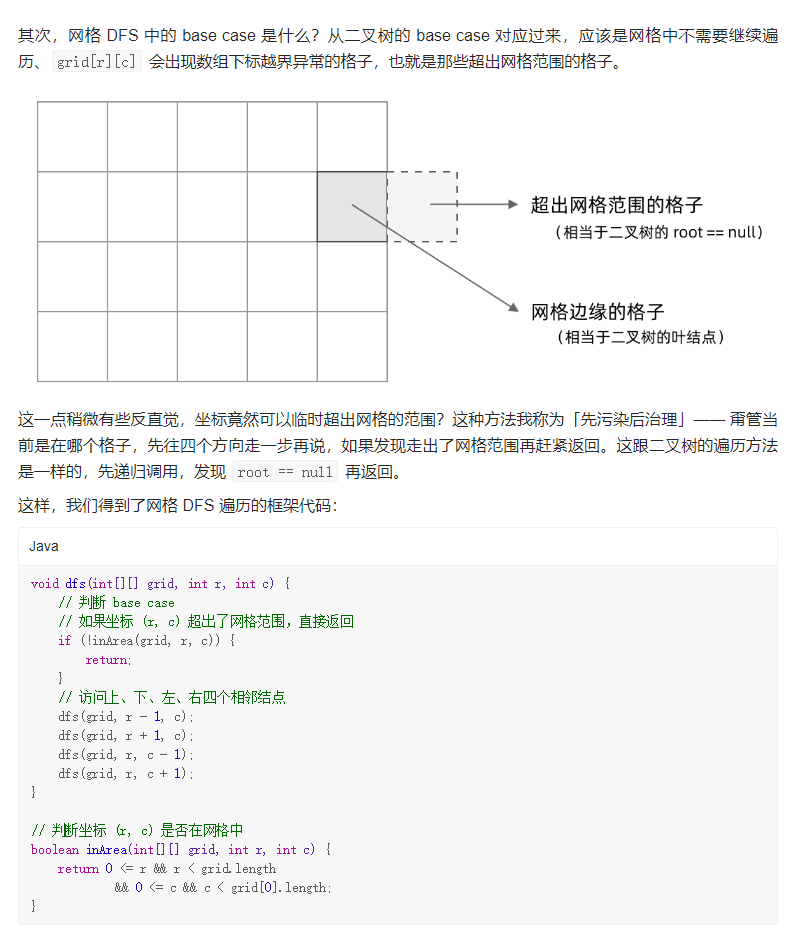
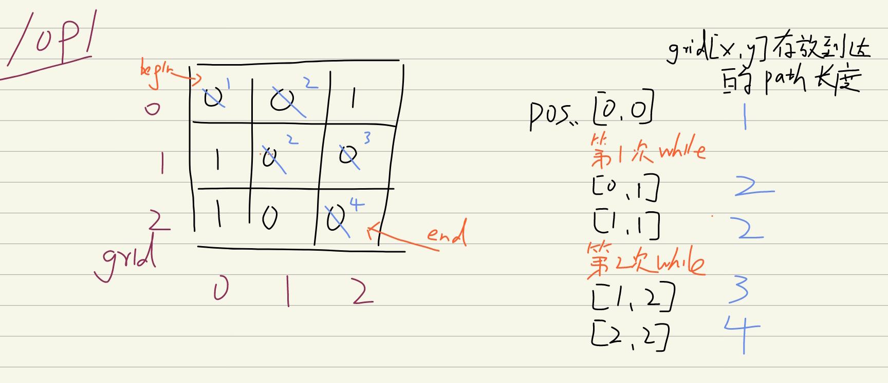
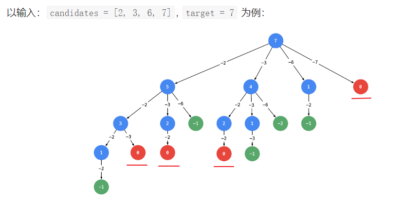
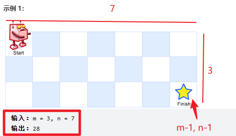
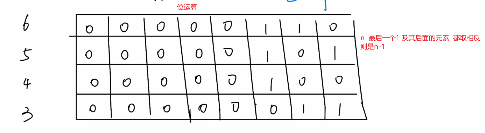
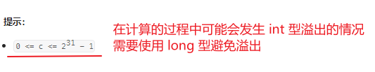

# LeetCode笔记

# 常用

## 正/负无穷

```
Integer.MIN_VALUE
```

## 哈希表

```
Map<Integer, Integer> map = new HashMap<Integer, Integer>();
插入键值 map.put(key, value);
获得值  map.get(i)
删除键值 map.remove(key)
获得map[i]的值，不存在则返回0：   map.getOrDefault(map[i], 0)
查看是否包含key    map.containsKey(key)
获得map所有的value   map.values()
```

```
Set<Integer> set = new HashSet<>();
查看是否包含元素   set.contains(...)
删除元素  set.remove(元素);
```

Java遍历Map集合：

```
// entries 实现 Map 的遍历
for (Map.Entry<String, String> entry : map.entrySet()) {
    String mapKey = entry.getKey();
    String mapValue = entry.getValue();
    System.out.println(mapKey + "：" + mapValue);
}

// for-each 循环遍历 key 或者 values，一般适用于只需要 Map 中的 key 或者 value 时使用
for (String key : map.keySet()) {
    System.out.println(key);
}
for (String value : map.values()) {
    System.out.println(value);
}
```

## 数组

```
// 数组
ArrayList<Integer> list = new ArrayList<>()
list.add(i)
list.remove(i)    // 数组移除索引i的元素

// 按照数组的第一个元素进行排序
Arrays.sort(数组, (v1, v2) -> v1[0] - v2[0])
// 复制int[]数组的元素
Arrays.copyOfRange(res, 0, 2)   //复制数组 开始索引0  结束索引2(不包含len)   因此其实是复制了0-1索引元素
// 数组反转
Collections.reverse(list)
// 打印int[] 
Arrays.toString(arr)
```

## StringBuilder

```
StringBuilder res = new StringBuilder()
添加    res.append()
删除    res.deleteCharAt()
变成string类型输出  res.toString()
```

## 字符串

```
字符串 s = 'abas'
s.charAt(i) - 'a'
返回的第i个字符，将字符'a'映射到索引0,将'b'映射到索引1,依此类推('z'映射到索引25)
即获得字符对应字母表a至z的索引
```

```
字符串 num1 = '123456'
num1.charAt(i) - '0'    
获得i位置的char并转换的int型
```

```
数组 int[] C
将数组中的int转换为char
char a = (char)(C[i] + '0')
```

## 链表

```
// LinkedList删除操作更方便   可以作为List类型插入到List<List<Integer>> res = new ArrayList<>();   例46
LinkedList<Integer> path = new LinkedList<>();
长度 path.size()
删除最后一个 path.removeLast();
添加 path.add(1);
```

## 集合

```
// 判重
Set<List<Integer>> set = new HashSet<>();
if(!set.contains(list))
```

## lambda排序

```php
升序排序
list.sort((a,b)->a.compareTo(b));
list.sort((a,b)->a-b);

降序
list.sort((a,b)->b.compareTo(a));
list.sort((a,b)->b-a);
```

# js常用

对num数组排序 ：num.sort()

正数最大值：Number.MAX_VALUE

正数最小值：Number.MIN_VALUE

正无穷：Infinity 

负无穷： -Infinity 


字母 转 数字

```js
'字母'.charCodeAt() - 'a'.charCodeAt()  // 输出字母对应索引：如 a 0, b 1
----- 原理 -----
'a'.charCodeAt()  // 97
'b'.charCodeAt()  // 98
如：
'b'.charCodeAt() - 'a'.charCodeAt()   // 98 -97 = 1
```


map初始化：大数组包裹小数组

```js
let map = new Map([[')', '('], ['}', '{'], [']', '[']]);
```


# -----------------------------------------------------------算法--------------------------------------------------------


# 一、二分查找

模板一、二用于：可能找不到元素，但可以得到如插入位置

模板三用于：要么找到true，要么找不到false

**左右边界：**

34题题解而得的左右边界解法


**模板二有时候会造成无限循环，如35题，只能用模板一**


**找一个精确值：**


## 34. 在排序数组中查找元素的第一个和最后一个位置

左边界 + 右边界

```
class Solution {
    public int[] searchRange(int[] nums, int target) {
        if(nums.length == 0){
            return new int[]{-1, -1};
        }

        // 一
        int left = 0; 
        int right = nums.length-1;
        // 寻找第一个出现的 左边界
        while(left < right){
            int mid = left + (right - left) / 2;
            // 如[2,3,3,5,8] target=3    若mid=3(索引2)，此时答案只能在mid及mid之前   所以 right = mid
            if(nums[mid] >= target){
                right = mid;
            }else{
                left = mid + 1;
            }
        }
        //遍历完没有找到
        if(nums[right] != target){           //二分查找优先取right
            return new int[]{-1, -1};
        }
        // 找到了
        int begin = right;


        // 二
        left = 0; 
        right = nums.length-1;
        // 寻找最后一个出现的
        while(left < right){
            int mid = (left + right + 1)/2;
            // 如[2,3,3,5,8] target=3    若mid=3(索引2)，此时答案只能在mid及mid后面   所以 left = mid
            if(nums[mid] <= target){
                left = mid;
            }else{
                right = mid - 1;
            }
        }
        int end = right;

        return new int[]{begin, end};
    }
}
```

```javascript
// 会超出时间限制
var searchRange = function(nums, target) {
    if(nums.length == 0){
        let returnRes = []
        return returnRes;
    }
    let begin;
    let end;

    let left = 0;
    let right = nums.length-1;
    while(left < right){
        let mid = Math.floor(left + (right - left) / 2);
        if(nums[mid] >= target){
            right = mid;
        }else{
            left = mid + 1;
        }
    }

    if(nums[right] != target){
        let returnRes = [0, -1];
        return returnRes;
    }
    begin = right;

    left = 0;
    right = nums.length-1;
    while(left < right){
        let mid = Math.floor(left + (right - left) / 2);
        if(nums[mid] <= target){
            left = mid;
        }else{
            right = mid - 1;
        }
    }
    end = right;

    let returnRes = [begin, end];
    return returnRes;
};
```


## 704 二分查找

两个解法

```
// 使用 模板一
class Solution {
    public int search(int[] nums, int target) {
        //初始化左指针右指针
        int left = 0;
        int right = nums.length - 1;

        while(left < right){		// 循环直至区间左右端点相同
            // 找到中点mid
            int mid = (right + left) / 2 ;      //或 (right - left) / 2 + left  防止计算时溢出
            if(nums[mid] >= target){
                right = mid;
            }else{
                left = mid + 1;
            }
        }
        if(nums[right] != target){
            return -1;
        }
        // // 此时有 left == right，区间缩为一个点，即为答案
        return right;	// 返回left也可以
    }
}
```

```
// 使用 找一个精确值：
class Solution {
    public int search(int[] nums, int target) {
        int left = 0, right = nums.length - 1;
        while(left<=right) {
            int mid = left + (right - left) / 2;
            if(nums[mid] == target) {
                return mid;
            } else if(nums[mid] > target) {
                right = mid - 1;
            } else {
                left = mid + 1;
            }
        }
        return -1;
    }
}
```


## 35. 搜索插入位置

若使用模板二会造成无限循环

模板一 + 改动

当元素不存在时 要寻找插入位置 甚至可能位于最后数组一个元素的后面 因此右指针设置为nums.length(超出原数组长度)


```
class Solution {
    public int searchInsert(int[] nums, int target) {
        //初始化指针
        // 模板一 加一点改动
        int left = 0;
        int right = nums.length;     // 当元素不存在时 要寻找插入位置 甚至可能位于最后数组一个元素的后面 因此右指针设置为nums.length(超出原数组长度)
        
        while (left < right) {
            int mid = (left + right) / 2;
            if (nums[mid] >= target){
                right = mid;
            } else {
                left = mid + 1;
            }
        }
        return right;


    }
}
```


## 278. 第一个错误的版本

属于左边界的问题

使用模板一

**关键信息：题目要我们找的是「第一个错误」**

**所以如果当前isBadVersion(mid) == true，说明错误 ，那么当前位置 mid，和当前位置之前的位置又可能是答案。（逻辑关键）**

**因此第一个if判断 赋值 right = mid;**

**这也是模板一的判断思路**

```
public class Solution extends VersionControl {
    public int firstBadVersion(int n) {
        // 左边界
        int left = 1;
        int right = n;

        while(left < right){
            int mid = left + (right - left) / 2;
            if(isBadVersion(mid)){
                right = mid;
            }else{
                left = mid +1 ;
            }
        }
        return right;
    }
}
```


## 74.搜索二维矩阵

同 240

```js
var searchMatrix = function(matrix, target) {

    if(matrix.length==0) return false // 判空
    let [left, up]=[matrix[0].length-1, 0]; // 初始化位置
    while(left>=0 && up<matrix.length){
        if(matrix[up][left]>target){
            left--;
        }else if(matrix[up][left]<target){
            up++;
        }else{
            return true;
        }
    }
    return false;


};
```


## 33. 搜索旋转排序数组

题解：[33. 搜索旋转排序数组 - 力扣（Leetcode）](https://leetcode.cn/problems/search-in-rotated-sorted-array/solutions/221435/duo-si-lu-wan-quan-gong-lue-bi-xu-miao-dong-by-swe/)

思路一的方法一：

利用153题，找到数组中最小的元素

如：

输入nums = [3,4,5,1,2]，最小值是1

就得到两个数组 `3，4，5` 和 `1，2`

在这两个数组中进行二分查找目标值（特别的：如果nums数组是升序的，就不必分开进行二分查找了）


但是超时：

```js
var search = function(nums, target) {
    // 153题 寻找最小数
    const findMin = function(nums) {
        let left = 0;
        let right = nums.length-1;
        while(left < right){
            let mid = Math.floor(left + (right - left) / 2);
            if(nums[mid] <= nums[right]){
                right = mid;
            }else{
                left = mid + 1; 
            }
        }
        return right;
    };
    // 二分
    const search = function(nums, left, right, target){
        let mid = Math.floor(left + (right - left) / 2);
        while(left < right){
            if(nums[mid] >= target){
                right = mid;
            }else{
                left = mid + 1;
            }
        }
        return nums[right];
    }

    let mixIndex = findMin(nums);

    if(nums[0] < nums[nums.length-1]){
        return nums[0];
    }

    let returnRes;
    if(target > nums[0]){
        returnRes = search(nums, 0, mixIndex, target);
    }else{
        returnRes = search(nums, mixIndex, nums.length-1, target);
    }
    
    return nums[returnRes] == target ? returnRes : -1;
};
```

**更优解法：**

思路更像153：**特别的二分题：并不是在一个完全升序的数组里进行查找，它可以在无序的数组切割，不断找出值**

[33. 搜索旋转排序数组 - 力扣（LeetCode）](https://leetcode.cn/problems/search-in-rotated-sorted-array/solutions/220083/sou-suo-xuan-zhuan-pai-xu-shu-zu-by-leetcode-solut/?envType=study-plan-v2&envId=top-100-liked)

**搞懂这个题的精髓在于三个定理**

定理一：只有在顺序区间内才可以通过区间两端的数值判断target是否在其中。

定理二：判断顺序区间还是乱序区间，只需要对比 left 和 right 是否是顺序对即可，left <= right，顺序区间，否则乱序区间。

定理三：每次二分都会至少存在一个顺序区间。（感谢[@Gifted VVilburgiX](https://leetcode.cn/u/gifted-vvilburgix)补充）

通过不断的用Mid二分，根据定理二，将整个数组划分成顺序区间和乱序区间，然后利用定理一判断target是否在顺序区间，如果在顺序区间，下次循环就直接取顺序区间，如果不在，那么下次循环就取乱序区间。

```js
var search = function(nums, target) {
    let len = nums.length;
    if(!nums.length){
      return -1;
    }

    let left = 0;
    let right = len-1;

    while(left <= right){
      let mid = Math.floor(left + (right-left)/2);
      // 不断切割后 找到target
      if(nums[mid] === target){
        return mid;
      }
      // 左半部分有序
      if(nums[0] <= nums[mid]){
        if(nums[0] <= target && target <= nums[mid]){
          // target在有序中
          right = mid-1;
        }else{
          // target不在有序中 在无序中继续切割
          left = mid+1;
        }
      }else{
        // 右半部分有序
        if(nums[mid] <= target && target <= nums[len-1]){
          left = mid+1;
        }else{
          right = mid-1;
        }
      }
    }

    return -1;
};
```


## 153. 寻找旋转排序数组中的最小值

**特别的二分题：并不是在一个完全升序的数组里进行查找，它可以在无序的数组切割，不断找出值**


题解：

[153. 寻找旋转排序数组中的最小值 - 力扣（LeetCode）](https://leetcode.cn/problems/find-minimum-in-rotated-sorted-array/solutions/698479/xun-zhao-xuan-zhuan-pai-xu-shu-zu-zhong-5irwp/?languageTags=java)

[153. 寻找旋转排序数组中的最小值 - 力扣（Leetcode）](https://leetcode.cn/problems/find-minimum-in-rotated-sorted-array/solutions/126635/er-fen-cha-zhao-wei-shi-yao-zuo-you-bu-dui-cheng-z/?languageTags=java)

要理解这个图：


**只对比 mid 和 right 的元素**

- 如果我们 mid 比较 right，因为是找最小值，如果mid < right，立即能判断出来mid到right之间都递增，最小值有可能是mid，因此移动right=mid，继续比较

举例：

```
输入nums = [3,4,5,1,2]   

(第一次while)
nums[mid] = 5
nums[mid] > nums[right]
left == mid +1   
[3,4,5,1,2]
     ↑   ↑
   left  right
   
(第二次while)
nums[mid] = 1
nums[mid] < nums[right]
right == mid
[3,4,5,1,2]
     ↑ ↑
  left right
  
(第三次while)
nums[mid] = 5
nums[mid] > nums[right]
left = mid + 1
[3,4,5,1,2]
       ↑
      left
      right
 
(while不成立)
return 最小值1
```

```
class Solution {
    public int findMin(int[] nums) {
        int left = 0;
        int right = nums.length - 1;
        while (left < right) {
            int mid = left + (right - left) / 2;
            if (nums[mid] > nums[right]) {          
                left = mid + 1;
            } else {                                
                right = mid;
            }
        }
        return nums[left];
    }
};
```


## 162. 寻找峰值

// 题设 nums[-1] = nums[n] = -∞

// 即 只要找到数组中存在一个元素a比相邻一个元素大 那么沿着a一定能找到一个峰值(数组最左右也算)

```
class Solution {
    public int findPeakElement(int[] nums) {
        // 题设 nums[-1] = nums[n] = -∞
        // 即 只要找到数组中存在一个元素a比相邻一个元素大 那么沿着a一定能找到一个峰值(数组最左右也算)
        return searchpeak(nums, 0, nums.length-1);
    }

    public int searchpeak(int[] nums, int left, int right){
        //数组仅有1位 或 指针指一起
        if(left == right){
            return right;
        }
        //数组仅有2位时 或 左指针相邻右指针  返回那个最大值
        if(left == right-1){
            return nums[left] > nums[right] ? left : right;
        }
        int mid = left + (right - left) / 2;
        if(nums[mid-1] < nums[mid] && nums[mid] > nums[mid+1]){          //找到了峰值
            return mid;
        }else if(nums[mid-1] > nums[mid] && nums[mid] > nums[mid+1]){     //mid-1 > mid > mid+1单调递减 左侧存在峰值 找到数组中存在一个元素mid比相邻一个元素大 沿着一定能找到峰值     重点※  前面的特殊判断未来防止mid+1/mid-1越界
            return searchpeak(nums, left, mid);
        }else{                                          // 右侧存在峰值  沿着mid一定能找到峰值
            return searchpeak(nums, mid, right);
        }
    }
}
```


# 二、双指针


## 977. 有序数组的平方

如果数组 中的所有数都是非负数，那么将每个数平方后，数组仍然保持升序；

如果数组 中的所有数都是负数，那么将每个数平方后，数组会保持降序

如果我们能够找到数组 中**负数与非负数的分界线**，那么就可以用类似「归并排序」的方法

设**neg**为数组 nums 中负数与非负数的分界线

nums[0] 到 nums[neg] 均为负数，，而 nums[neg+1]到 nums[n−1] 均为非负数

平方后：nums[0] 到 nums[neg]**递减**，而 nums[neg+1]到 nums[n−1]**递增**

**由于我们得到了两个已经有序的子数组，因此就可以使用归并的方法进行排序了。**

- 具体地，使用两个指针分别指向位置 neg 和neg+1，每次比较两个指针对应的数，选择较小的那个放入答案并移动指针。
- 当某一指针移至边界时，将另一指针还未遍历到的数依次放入答案。

> 平方结果一定都是正数
>
> 平方后递增的那个部分，次序已经满足ans的非递减顺序要求了，所以只需将另一个区域的数和它比较，可以得出结果集ans


```
class Solution {
    public int[] sortedSquares(int[] nums) {
        //找到neg
        int negative = -1;
        for(int i = 0; i<nums.length; i++){
            if(nums[i] < 0){
                negative = i;
            }else{
                break;
            }
        }

        int i = negative;
        int j = negative +1 ;
        int[] ans = new int[nums.length];
        int index = 0;//结果集数组脚标

        while(i > 0 || j < nums.length){
            //当某一指针移至边界时，将另一指针还未遍历到的数依次放入答案
            if(i<0){
                ans[index] = nums[j]*nums[j];
                j++;
            }else if(j>=nums.length){
                ans[index] = nums[i]*nums[i];
                i--;
            }else if(nums[i]*nums[i] < nums[j]*nums[j]){
                ans[index] = nums[i]*nums[i];
                i--;
            }else if(nums[i]*nums[i] > nums[j]*nums[j]){
                ans[index] = nums[j]*nums[j];
                j++;
            }
            index++;
        }
        return ans;
    }
}
```

但是超出时间限制


## 189. 轮转数组


```
class Solution {
    public void rotate(int[] nums, int k) {
        //k可能比数组大，在这种情况下，向右移动整个数组长度后就回到原来的位置，直接%掉就是去掉每次回到原来位置的步数，获得最后移动的步数
        k %= nums.length;
        reverse(nums, 0, nums.length-1);
        reverse(nums, 0, k-1);
        reverse(nums, k, nums.length-1);
    }

    public void reverse(int[] nums, int start, int end){
        while(start<end){
            int tmp = 0;
            tmp = nums[start];
            nums[start] = nums[end];
            nums[end] = tmp;
            start++;
            end--;
        }
    }
}
```

```javascript
const reserve = function(nums, begin, end){
    while(begin < end){
        let tmp = nums[begin];
        nums[begin] = nums[end];
        nums[end] = tmp;
        begin++;
        end--;
    }
    return nums;
}

var rotate = function(nums, k) {
    k = k % nums.length;
    reserve(nums, 0, nums.length-1);
    reserve(nums, 0, k-1);
    reserve(nums, k, nums.length-1);
    return nums;
};
```


## 283. 移动零


```javascript
var moveZeroes = function(nums) {
    let len = nums.length;
    let left = 0;
    let right;
    // 第一次遍历 把 0 移动到左边
    for(right = 0; right<len; right++){
      if(nums[right] !== 0){
        nums[left] = nums[right];
        left++
      }
    }
    // 第二次遍历 把 left 右边置0
    for(let www = left; www<len; www++){
      nums[www] = 0;
    }
    return nums;
};
```

```js
// 利用数组的 splice push 方法 更简便   (最好不用)
var moveZeroes = function(nums) {
    let len = nums.length;
    for(let i = 0; i<len; i++){
      if(nums[i] === 0){
        nums.splice(i, 1);
        nums.push(0);
        i--;
        len--; //末尾新加入了0 可以不用遍历
      }
    }
    return nums;
};
```


## 167. 两数之和 II - 输入有序数组

左右指针法 left right

```
var twoSum = function(numbers, target) {
    let left = 0;
    let right = numbers.length - 1;

    if (numbers.length <= 2) {
        return [++left, ++right];
    }
    
    while (left < right) {
        if (numbers[left] + numbers[right] > target) {
            right--;
        } else if (numbers[left] + numbers[right] < target) {
            left++;
        } else {
            return [++left, ++right];
        }
    }
};
```


## 344. 反转字符串

典型的双指针

注意循环条件

```
class Solution {
    public void reverseString(char[] s) {
        int start = 0;
        int end = s.length-1;
        while(start < end){
            char tmp = ' ';
            tmp = s[start];
            s[start] = s[end];
            s[end] = tmp;
            start++;
            end--;
        }

    }
}
```

```javascript
var reverseString = function(s) {
    let left = 0;
    let right = s.length-1;
    while(left<right){
        let tmp = '';
        tmp = s[left];
        s[left] = s[right];
        s[right] = tmp;
        left++;
        right--;
    }
    return s;
};
```


## 557. 反转字符串中的单词 III

开辟一个新字符串。然后从头到尾遍历原字符串，直到找到空格为止，此时找到了一个单词，并能得到单词的起止位置。随后，根据单词的起止位置，可以将该单词逆序放到新字符串当中。如此循环多次，直到遍历完原字符串，就能得到翻转后的结果。

**用到了 StringBuffer res = new StringBuffer()创建一个字符串缓冲区**


```
public String reverseWords(String s) {
    StringBuffer res = new StringBuffer();
    int i = 0;  //空格位置
    while(i<s.length()){
        // 找到起始/结束位置
        int start = i;
        while(i<s.length() && s.charAt(i) != ' '){
            i++;   //遍历完 是空格的位置  得到一个单词
        }
        //从空格前的位置 到起始位置 逆序插入StringBuffer
        for(int j = i-1; j>=start; j--){
            res.append(s.charAt(j));
        }
        // StringBuffer插入空格 并找到下一个起始位置
        while(i<s.length() && s.charAt(i)==' '){
            i++;
            res.append(" ");
        }
    }
    return res.toString();
}
```

```javascript
var reverseWords = function(s) {
    let returnRes = [];
    let i = 0;
    while(i<s.length){
        let start = i;//
        while(i<s.length && s.charAt(i) != " "){
            i++;
        }
        // 找到了 起始点start 和 结束点 i
        // 将这段字符串 逆序加入数组
        for(let www = start; www<i; www++){
            returnRes.push(s.charAt(start+i-1-www));
        }

        // 数组是否加入空格(当前未越界 且 当前指向空格)
        if(i<s.length && s.charAt(i) == " "){
            i++;
            returnRes.push(" ");
        }
    }
    return returnRes.join("");
};
```


## 876. 链表的中间结点

快慢指针

慢指针每次走一步，快指针走两步，当快指针走完时，满指针正好在中间。


```
/**
 * Definition for singly-linked list.
 * public class ListNode {
 *     int val;
 *     ListNode next;
 *     ListNode() {}
 *     ListNode(int val) { this.val = val; }
 *     ListNode(int val, ListNode next) { this.val = val; this.next = next; }
 * }
 */
class Solution {
    public ListNode middleNode(ListNode head) {
        ListNode slow = head;
        ListNode fast = head;

        while(fast != null && fast.next != null){
            slow = slow.next;
            fast = fast.next.next;
        }

        return slow;

    }
}
```

```javascript
var middleNode = function(head) {
    let slow = head;
    let fast = head;

    while(fast && fast.next){
        slow = slow.next;
        fast = fast.next.next;
    }

    return slow;
};
```


## 19.删除链表的倒数第 N 个结点

我们可以设想假设设定了双指针 first和 end的话，当 end指向最后一个节点，first 与 end 之间相差个数为 n 时，那么删除掉 first 的下一个指针就完成了要求。

- 设置虚拟节点 dummyHead 指向 head

- 设定双指针 ，初始都指向虚拟节点 dummyHead
- 移动 end，直到 first 与 end 之间相差元素个数为 n
- 同时移动 两个指针，直到 end指向最后一个指针
- 删除first.next


```
public ListNode removeNthFromEnd(ListNode head, int n) {
    // 设置虚拟节点 dummyHead 指向 head， 设定双指针 p 和 q，初始都指向虚拟节点 dummyHead
    ListNode first = head;
    ListNode end = head;
    // 移动 q， 直到 p 与 q 之间相差个数为 n
    for(int i = 0; i<n; i++){
        end = end.next;
    }
    if(end == null){
        return head.next;   //说明删除的是头节点
    }
    // 使end移动到最后一个节点 
    while(end.next != null){
        end = end.next;
        first = first.next;
    }
    // first.next就是要删除的节点
    first.next = first.next.next;

    return head;
}
```

```javascript
var removeNthFromEnd = function(head, n) {
    let first = head;
    let end = head;

    for(let i = 0; i<n; i++){
        end = end.next;
    }

    if(end == null){
        return head.next;
    }

    while(end.next != null){
        end = end.next;
        first = first.next;
    }

    first.next = first.next.next;

    return head;
};
```


## 82. 删除排序链表中的重复元素 II


由于给定的链表是排好序的，因此**重复的元素在链表中出现的位置是连续的**

具体地，我们从指针 cur 指向链表的哑节点，随后开始对链表进行遍历。如果当前 cur.next与 cur.next.next对应的元素相同，那么我们就需要将 cur.next 以及所有后面拥有相同元素值的链表节点全部删除。我们记下这个元素值 xx，随后不断将 cur.next 从链表中移除，直到 cur.next 为空节点或者其元素值不等于 xx 为止。此时，我们将链表中所有元素值为 xx 的节点全部删除。

如果当前cur.next 与 cur.next.next 对应的元素不相同，那么说明链表中只有一个元素值为 cur.next 的节点，那么我们就可以将 cur 指向 cur.next。

当遍历完整个链表之后，我们返回链表的的哑节点的下一个节点 dummy.next 即可22

```
class Solution {
    public ListNode deleteDuplicates(ListNode head) {
        if(head == null){
            return head;
        }

        // 创建空节点dummy 指向head头节点
        ListNode dummy = new ListNode(0, head);

        ListNode cur = dummy;

        while(cur.next != null && cur.next.next != null){
            if(cur.next.val == cur.next.next.val){
                int x = cur.next.val;
                while(cur.next != null && cur.next.val == x){
                    cur.next = cur.next.next;
                }
            }else{
                cur = cur.next;
            }
        }
        return dummy.next;
    }
}
```

```javascript
/**
 * Definition for singly-linked list.
 * function ListNode(val, next) {
 *     this.val = (val===undefined ? 0 : val)
 *     this.next = (next===undefined ? null : next)
 * }
 */
/**
 * @param {ListNode} head
 * @return {ListNode}
 */
var deleteDuplicates = function(head) {
    if(head === null) {
        return head;
    }
    let dummy = new ListNode(0, head);

    let cur = dummy;

    while(cur.next !== null && cur.next.next !== null){
        if(cur.next.val === cur.next.next.val){
            let x = cur.next.val;
            while(cur.next !== null && cur.next.val === x){
                cur.next = cur.next.next;
            }
        }else{
            cur = cur.next;
        }
    }
    return dummy.next;
};
```

## 15. 三数之和

遇到 3 个未知情况，要把它变成 **两数之和** 的情况

```js
var threeSum = function(nums) {
  nums.sort();
  let resSet = new Set() // 给结果去重
  const resList = []

  // 两数之和
  const findTarget = function(left, target) {
    const set = new Set()
    for(let i = left; i<nums.length; i++) {
      const findNum = target - nums[i]

      // 先看是否存在
      if (set.has(findNum)) {
        let tempArr = [-target, nums[i], findNum]
        const a = tempArr.sort().join('')
        if (!resSet.has(a)) {
          resList.push(tempArr)
          resSet.add(a)
        }
      } else {
        set.add(nums[i])
      }
    }
  }

  for(let i = 0; i<nums.length; i++) {

    if (nums[i] > 0) {
    // 若起始点>0 后面怎么加都不会=0 所以退出
      break
    }

    const curNum = nums[i]
    findTarget(i+1, -curNum)
  }

  return resList
};
```


## 844. 比较含退格的字符串

解体思路：https://leetcode.cn/problems/backspace-string-compare/solutions/683776/shuang-zhi-zhen-bi-jiao-han-tui-ge-de-zi-8fn8


## 986. 区间列表的交集


如果 s2  >e1 ，必然不相交，firstList看下一个区间是否相交

如果 s1  >e2 ，必然不相交，secondList看下一个区间是否相交

其他情况下存在相交

取出相交区间

```
class Solution {
    public int[][] intervalIntersection(int[][] firstList, int[][] secondList) {
        int len1 = firstList.length;
        int len2 = secondList.length;
        List<int[]> res = new ArrayList<>();

        int i = 0;
        int j = 0;
        while(i<len1 && j<len2){
            //初始化
            int s1 = firstList[i][0];
            int e1 = firstList[i][1];
            int s2 = secondList[j][0];
            int e2 = secondList[j][1];

            if(s2>e1){          //不相交
                i++;
            }else if(s1>e2){    //不相交
                j++;
            }else{
                int[] dwc = new int[2];    // 相交区间放在里面
                dwc[0] = Math.max(s1, s2);
                dwc[1] = Math.min(e1, e2);
                res.add(dwc);
                if(e2 >= e1){    // 等号在这里或者下面都可以
                    i++;
                }
                if(e1 > e2){
                    j++;
                }
            }
        }

        // 把结果集转为return的格式
        int length = res.size();
        int[][] res2 = res.toArray(new int[length][2]);    //toArray() 方法将 Arraylist 对象转换为数组
        return res2;
    }
}
```


## 11. 盛最多水的容器


```js
var maxArea = function(height) {
  let left = 0;
  let right = height.length -1;
  let res = 0;

  while(left < right){
    //不停的移动短板 因为移动短板面积才有可能增大
    if(height[left] < height[right]){
      let width = right - left;
      let tmpHeight = Math.min(height[left++], height[right])
      res = Math.max(res, width*tmpHeight);
    }else{
      let width = right - left;
      let tmpHeight = Math.min(height[left], height[right--])
      res = Math.max(res, width*tmpHeight);
    }
  }

  return res;
};
```


# 三、滑动窗口

## 3. 无重复字符的最长子串


**答案标注方法为滑动窗口，但我认为窗口大小再变化，应该不属于窗口，属于双指针**
思路和算法

我们先用一个例子考虑如何在较优的时间复杂度内通过本题。

我们不妨以示例一中的字符串 abcabcbb 为例，找出从每一个字符开始的，不包含重复字符的最长子串，那么其中最长的那个字符串即为答案。对于示例一中的字符串，我们列举出这些结果，其中括号中表示选中的字符以及最长的字符串：


我们使用两个指针表示字符串中的某个子串（或窗口）的左右边界，其中左指针 i 代表着上文中「枚举子串的起始位置」，而右指针即为上文中的 rk

在每一步的操作中，我们会将左指针向右移动一格，表示 我们开始枚举下一个字符作为起始位置，

然后我们可以不断地向右移动右指针，但需要保证这两个指针对应的子串中没有重复的字符。在移动结束后，这个子串就对应着 以左指针开始的，不包含重复字符的最长子串。我们记录下这个子串的长度；

在枚举结束后，我们找到的最长的子串的长度即为答案。

判断重复字符

在上面的流程中，我们还需要使用一种数据结构来判断 是否有重复的字符，常用的数据结构为哈希集合


```js
var lengthOfLongestSubstring = function(s) {
    const set = new Set();
    let rk = 0;
    let res = -1;
    if(s.length == 0){
        return 0;
    }

    for(let i = 0; i<s.length; i++){
        if(i != 0){
            set.delete(s.charAt(i-1));
        }
        while(rk<s.length && !set.has(s.charAt(rk))){
            set.add(s.charAt(rk));
            rk++;
        }
        res = Math.max(res, rk-i);
    }

    return res;
};
```


## 567. 字符串的排列

滑动窗口：窗口会动，但窗口的大小不变，比如向右滑，一个字符会加入，一个字符会离开

不关注排列的形式，仅关注元素的数量关系


```
class Solution {
    public boolean checkInclusion(String s1, String s2) {
        //滑动窗口
        //数组 存放两个字符串字母出现的次数
        int[] c1 = new int[26];   //为什么是26个？ 仅有26个字母
        int[] c2 = new int[26];

        //统计s1的字母出现了多少次
        for(char c : s1.toCharArray()){
            c1[c-'a']++;                  //    ++cn2[s1.charAt(i) - 'a'];  s1.charAt(i)-'a'表示将字符'a'映射到索引0,将'b'映射到索引1,依此类推
        }
        // 遍历s2
        for(int i  = 0; i<s2.length(); i++){
            //窗口的右括号从0开始滑动，变成s1长度的窗口
            if(i>=s1.length()){
                --c2[s2.charAt(i-s1.length())-'a'];   //删除左窗口前的记录  取出的小写字母计数器-1
            }
            c2[s2.charAt(i)-'a']++;   //增加窗口新滑进来的记录   小写字母计数器+1
            if(Arrays.equals(c1, c2)){
                return true;
            }
        }
        return false;
    }
}
```


## 438. 找到字符串中所有字母异位词

思路同567题

滑动窗口

- 字符串p，排序后，再转为字符串（**pFlag**）
- 假设字符串 p 长度为 2
- 字符串 s，滑动窗口长度为 2，检查当前窗口内的字符串是否和 **pFlag** 相同，相同则找到了

```js
var findAnagrams = function(s, p) {
  let res = [];
  let pArr = p.split('');
  pArr.sort();
  let pFlag = pArr.join('');

  let plen = p.length;

  for(let i = 0, len = s.length-plen; i<=len; i++){
    let sliceString = s.slice(i, i + plen);
    let tmp = sliceString.split('').sort().join('');
    if(tmp === pFlag){
      res.push(i);
    }
  }

  return res;
};
```

但是这个方法超时了，可能因为每次窗口内的字符串都要 slice 然后 sort 复杂度高

**所以优化一下，使用长度为 26 的数组，记录字符串 a-z 字符依次出现的顺序，滑动窗口移动时，对应位置 ++ 和 -- 就行**

**首先要知道怎么算字符对应索引：**

```js
'字母'.charCodeAt() - 'a'.charCodeAt()  // 输出字母对应索引：如 a 0, b 1
----- 原理 -----
'a'.charCodeAt()  // 97
'b'.charCodeAt()  // 98
如：
'b'.charCodeAt() - 'a'.charCodeAt()   // 98 -97 = 1
```

然后滑动窗口移动时，使用 i 是指向窗口末尾，从0开始，每次移动要添加字母，窗口长度满足后，再移动要删除前面的字母

```js
var findAnagrams = function(s, p) {
  let res = [];
  let pCount = new Array(26).fill(0);
  let sCount = new Array(26).fill(0);

  // 统计 p 的字母出现次数
  for(let i = 0, len=p.length; i<len; i++){
    pCount[p[i].charCodeAt() - 'a'.charCodeAt()]++
  }

  let plen = p.length;
  let slen = s.length;
  
  // 滑动窗口
  for(let i = 0, len = slen; i<len; i++){
    if(i>= plen){
      sCount[s[i-plen].charCodeAt() - 'a'.charCodeAt()]--;
    }
    sCount[s[i].charCodeAt() - 'a'.charCodeAt()]++;
    if(pCount.toString() === sCount.toString()){
      res.push(i-plen+1)
    }
  }

  return res;
};
```


## 713. 乘积小于 K 的子数组

自

窗口变化的滑动窗口


```
class Solution {
    public int numSubarrayProductLessThanK(int[] nums, int k) {

        int res = 0;

        for(int i = 0; i<nums.length; i++){
            int rk = i;
            if(nums[rk] < k){   //先判断它单独一个元素是否 < 目标值
                res++;          // 结果集++
            }else{
                continue;      //否则continue
            }
            int out = nums[rk];
            while(out<k && rk<nums.length){
                if(rk<nums.length-1){             //if判断  防止rk+1越界
                    out = out * nums[rk+1];
                }

                if(out < k && rk<nums.length-1){
                    res++;          // 相乘值<目标值  结果集++
                }
                rk++;    //指针向右
            }
        }
        return res;


    }
}
```


## 209. 长度最小的子数组

双指针暴力遍历，超出时间限制，所以遍历时，改变一点：

**思路**
要找长度最小的子数组，第一时间我们肯定会想到双指针暴力累计，但是这种双循环时间复杂度为O(n^2)。所以我们换个角度，既然是要满足连续且大于指定值，我们可以利用滑动窗口来得到我们的最短长度。 什么是滑动窗口？ 就是在数组上有一个左指针和一个右指针，2指针之间的元素，就是我们窗体的内容，我们可以通过移动左右指针来移动我们的窗口。

**解题方法**
设置二个变量用于存储最短长度和窗体内元素的和，然后设置左右指针，首先移动右指针，移动的同时，累加元素，当和大于指定值时，记录当前的长度，比较当前记录最小值，取小，然后，移动左指针，同时减去左值，直至窗体内元素和小于指定值，再移动右元素，直至结束。

作者：coco
链接：https://leetcode.cn/problems/minimum-size-subarray-sum/solutions/2263619/hua-dong-chuang-kou-fa-by-xsk-e-dkfp/

[209. 长度最小的子数组 - 力扣（Leetcode）](https://leetcode.cn/problems/minimum-size-subarray-sum/solutions/305704/chang-du-zui-xiao-de-zi-shu-zu-by-leetcode-solutio/)


```
// 暴力法
class Solution {
    public int minSubArrayLen(int target, int[] nums) {
        int res = Integer.MAX_VALUE;
        int length = nums.length;

        for(int i = 0; i<length; i++){
            int sum = 0;
            for(int j = i; j<length; j++){
                sum += nums[j];
                if(sum >= target){
                    res = Math.min(res, j-i+1);
                    break;
                }
            }
        }
        return res ==  Integer.MAX_VALUE ? 0 : res;
    }
}
```


```
// 改进
class Solution {
    public int minSubArrayLen(int target, int[] nums) {
        int length = nums.length;
        if (length == 0) {
            return 0;
        }
        int res = Integer.MAX_VALUE;
        int start = 0, end = 0;
        int sum = 0;
        while (end < length) {
            sum += nums[end];
            while (sum >= target) {
                res = Math.min(res, end - start + 1);
                sum -= nums[start];
                start++;
            }
            end++;
        }
        return res == Integer.MAX_VALUE ? 0 : res;

    }
}
```

```javascript
var minSubArrayLen = function(target, nums) {
    let returnRes = Number.MAX_VALUE;

    let i = 0;
    let j = 0;
    let sum  = 0;

    for(; j<nums.length; j++){
        sum += nums[j];
        while(sum >= target){
            returnRes = Math.min(returnRes, j-i+1);
            sum -= nums[i];
            i++;
        }
    }
    return returnRes == Number.MAX_VALUE ? 0 : returnRes;

};
```


# 四、广度优先搜索 / 深度优先搜索

深度优先搜索算法（Depth First Search，简称DFS）：一种用于遍历或搜索树或图的算法。 沿着树的深度遍历树的节点，尽可能深的搜索树的分支。当节点v的所在边都己被探寻过或者在搜寻时结点不满足条件，搜索将回溯到发现节点v的那条边的起始节点。整个进程反复进行直到所有节点都被访问为止。

## -Tips- 岛屿问题求解





## 733. 图像渲染

DFS深度优先

```
class Solution {
    public int[][] floodFill(int[][] image, int sr, int sc, int color) {
        // 方法dfs
        int oldColor = image[sr][sc];   //初始颜色
        int newColor = color;
        dfs(image, sr, sc, newColor, oldColor);
        return image;
    }

    private void dfs(int[][] image, int sr, int sc, int newColor, int oldColor){
        // 跳出条件
        if(sr < 0 || sc < 0 || sr >= image.length || sc >= image[0].length || image[sr][sc] != oldColor || newColor == oldColor){     //image.length长  image[0].length宽
            return;       
        }

        image[sr][sc] = newColor;   //赋予新颜色

        dfs(image, sr-1, sc, newColor, oldColor);
        dfs(image, sr, sc-1, newColor, oldColor);
        dfs(image, sr+1, sc, newColor, oldColor);
        dfs(image, sr, sc+1, newColor, oldColor);
    }
}
```


```javascript
var floodFill = function(image, sr, sc, color) {
    var changeColor = function(sr, sc, color, oldColor) {
        if(sr < 0 || sr >= image.length || sc < 0 || sc >= image[0].length || image[sr][sc] !== oldColor || color === oldColor){
            return;
        }

        image[sr][sc] = color;
        
        changeColor(sr+1, sc, oldColor);
        changeColor(sr-1, sc, oldColor);
        changeColor(sr, sc+1, oldColor);
        changeColor(sr, sc-1, oldColor);
    };

    changeColor(sr, sc, color, image[sr][sc]);
    return image;


};
```


## 695. 岛屿的最大面积

```
class Solution {
    public int maxAreaOfIsland(int[][] grid) {
        int res = 0;  //结果
        //遍历找岛屿
        for(int i = 0; i<grid.length; i++){
            for(int j = 0; j<grid[0].length; j++){
                if(grid[i][j] == 1){
                    int area = dfs(grid, i, j);
                    res = Math.max(res, area);
                }
            }
        }
        return res;
    }

    private int dfs(int[][] grid, int i, int j){
        //跳出循环条件   image.length长  image[0].length宽
        if(i<0 || i>=grid.length || j<0 || j>=grid[0].length || grid[i][j] != 1){
            return 0;
        }

        //把颜色置2， 防止重复算
        grid[i][j] = 2;

        // 返回岛屿数 
        return 1 + dfs(grid, i-1, j) + dfs(grid, i, j-1) + dfs(grid, i+1, j) + dfs(grid, i, j+1);
    }
}
```


```javascript
var maxAreaOfIsland = function(grid) {

    // dfs
    var dfs = function(i, j){
      if(i<0 || i>=height || j<0 || j>=length || grid[i][j] != 1){
        return 0;
      }

      grid[i][j] = 0;

      return 1 + dfs(i+1, j) + dfs(i, j+1) + dfs(i-1, j) + dfs(i, j-1);
    }

    let height = grid.length;
    let length = grid[0].length;
    let res = 0;

    for(let i = 0; i<height; i++){
      for(let j = 0; j<length; j++){
        if(grid[i][j] === 1){
          let tmpRes = dfs(i ,j);
          res = tmpRes > res ? tmpRes : res;
        }
      }
    }

    return res;
};


// 补充：dfs方法也可以改写为
    var dfs = function(i, j){
      if(i<0 || i>=height || j<0 || j>=length || grid[i][j] != 1){
        return 0;
      }

      grid[i][j] = 0;
      let sum = 1; //计算+1

      sum += dfs(i+1, j);
      sum += dfs(i, j+1);
      sum += dfs(i-1, j);
      sum += dfs(i, j-1);

      return sum;
    }
```

## 617. 合并二叉树

先判断某节点是否为空，为空直接是另一个节点的值，

都不为空，则值相加

左右节点再次作为参数传入

递归

```
class Solution {
    public TreeNode mergeTrees(TreeNode root1, TreeNode root2) {
        //递归
        if(root1 == null){
            return root2;
        }
        if(root2 == null){
            return root1;
        }

        //节点 值相加
        TreeNode root = new TreeNode(root1.val + root2.val);
        //左右节点再次作为参数传入 递归
        root.left = mergeTrees(root1.left, root2.left);
        root.right = mergeTrees(root1.right, root2.right);

        return root;

    }
}
```


```javascript
/**
 * Definition for a binary tree node.
 * function TreeNode(val, left, right) {
 *     this.val = (val===undefined ? 0 : val)
 *     this.left = (left===undefined ? null : left)
 *     this.right = (right===undefined ? null : right)
 * }
 */
/**
 * @param {TreeNode} root1
 * @param {TreeNode} root2
 * @return {TreeNode}
 */
var mergeTrees = function(root1, root2) {
  if(root1 === null){
    return root2;
  }

  if(root2 === null){
    return root1;
  }

  const newRoot = new TreeNode(root1.val + root2.val);
  newRoot.left = mergeTrees(root1.left, root2.left);
  newRoot.right = mergeTrees(root1.right, root2.right);
  
  return newRoot;
};
```

## 116. 填充每个节点的下一个右侧节点指针

DFS深度优先

```
class Solution {
    public Node connect(Node root) {
        //DFS深度优先

        if(root == null) return null;

        // 此节点存在左右节点 左节点设置next指针
        if(root.left != null){
            root.left.next = root.right;
        }
        // 右节点设置next指针
        if(root.right != null && root.next != null){
            root.right.next = root.next.left;
        }
        //到这里 next指针都指向右边了 右边没有节点的都为null
        // 一个三角形已经搞定了 继续递归 设置下面的节点
        root.left = connect(root.left);
        root.right = connect(root.right);

        return root;
    }
}
```


```javascript
/**
 * // Definition for a Node.
 * function Node(val, left, right, next) {
 *    this.val = val === undefined ? null : val;
 *    this.left = left === undefined ? null : left;
 *    this.right = right === undefined ? null : right;
 *    this.next = next === undefined ? null : next;
 * };
 */

/**
 * @param {Node} root
 * @return {Node}
 */
var connect = function(root) {
    if(root === null){
        return null;
    }

    if(root.left !== null){
        root.left.next = root.right;
    }

    if(root.right !== null && root.next?.left){
        root.right.next = root.next.left;
    }

    root.left = connect(root.left);
    root.right = connect(root.right);

    return root;
};
```

## 542. 01 矩阵（？）

同317

BFS

从0找1

不太懂


## 994. 腐烂的橘子

因为要找最小时间数，只能用广度优先，不能深度

用到LinkedList，**LinkedList同时实现了List接口和Deque对口，也就是收它既可以看作一个顺序容器，又可以看作一个队列（Queue），同时又可以看作一个栈（stack）**

```
class Solution {
    public int orangesRotting(int[][] grid) {

        LinkedList<int[]> rottens = new LinkedList<>();   //存放坏掉的橙子的坐标
        int fresh = 0; // 好橙子的数量
        int minutes = 0; //时间

        int m = grid.length;
        int n = grid[0].length;


        // 遍历矩阵 找到：坏掉的橙子的坐标、好橙子的数量
        for(int i = 0; i<m; i++){
            for(int j = 0; j<n; j++){
                if(grid[i][j] == 1){
                    fresh++;
                }
                if(grid[i][j] == 2){
                    rottens.add(new int[]{i, j});  //添加坐标 坐标形式为int[]{i, j}
                }
            }
        }

        //准备感染腐烂
        while(rottens.size() > 0 && fresh > 0){
            int size = rottens.size();  // size:坏掉的个数
            //感染腐烂size次
            for(int i = 0; i<size; i++){
                int[] rotten = rottens.pop(); //弹出一个坏掉的橙子的坐标
                int x = rotten[0], y = rotten[1];  //得到坐标的x、y轴

                int left = -1 , right =-1, down = -1, up =-1 ;

                //上下左右感染
                // x-1向左感染 条件为不越界
                if(x-1>=0){
                    left = grid[x-1][y];  //获得左边的坐标
                    if(left == 1){  //如果左边为新鲜则感染
                        fresh--;
                        grid[x-1][y] = 2; //感染
                        rottens.add(new int[]{x-1, y});
                    }
                }

                // x+1向右
                if(x+1<m){
                    right = grid[x+1][y];  //获得左边的坐标
                    if(right == 1){  //如果左边为新鲜则感染
                        fresh--;
                        grid[x+1][y] = 2; //感染
                        rottens.add(new int[]{x+1, y});
                    }
                }

                // y-1向下
                if(y-1>=0){
                    down = grid[x][y-1];  //获得左边的坐标
                    if(down == 1){  //如果左边为新鲜则感染
                        fresh--;
                        grid[x][y-1] = 2; //感染
                        rottens.add(new int[]{x, y-1});
                    }
                }

                // y+1向上
                if( y+1<n){
                    up = grid[x][y+1];  //获得左边的坐标
                    if(up == 1){  //如果左边为新鲜则感染
                        fresh--;
                        grid[x][y+1] = 2; //感染
                        rottens.add(new int[]{x,  y+1});
                    }
                }

            }
            minutes++;  //感染一次 时间+1
        }
        return fresh > 0 ? -1 :minutes;  //如果遍历完fresh还是大于0则返回-1   否则返回时间minutes
    }
}
```


## 200. 岛屿数量

```
class Solution {
    //
    // 这道题要return的是  岛屿存在的数量  而不是岛屿的面积  
    //
    public int numIslands(char[][] grid) {
        int count = 0;

        //其中 i 表示行，j 表示列
        for(int i = 0; i<grid.length;i++){
            for(int j =0;j<grid[0].length;j++){
                if(grid[i][j] == '1'){
                    //深度递归
                    dfs(grid,i,j);
                    count++;
                }
            }
        }
        //返回岛屿的数量
        return count;
    }
    public void dfs(char[][] grid,int i, int j){

        //防止 i 和 j 越界，也就是防止超出岛屿（上下左右）的范围。特别注意当遍历到海洋的时候也退出循环
        if(i<0||j<0||i>=grid.length||j>=grid[0].length||grid[i][j]=='0') return ;

        //将遍历过的陆地改为海洋，防止重复遍历
        grid[i][j]='0';

        dfs(grid,i+1,j);  //上，
        dfs(grid,i-1,j);        //下
        dfs(grid,i,j+1);        //右
        dfs(grid,i,j-1);        //左
    }
    
    // 递归方法二 仅仅修改了return部分 先递归拿到值再加
    //     public int dfs(int[][] grid, int i, int j){
    //     if(i < 0 || i >= height || j < 0 || j >= length || grid[i][j] == 0){
    //         return 0;
    //     }

    //     grid[i][j] = 0;  // 将1置0

        
    //     int nums1 = dfs(grid, i, j+1);
    //     int nums2 = dfs(grid, i, j-1);
    //     int nums3 = dfs(grid, i+1, j);
    //     int nums4 = dfs(grid, i-1, j);

    //     return 1 + nums1 + nums2 + nums3 + nums4;
    // }
}
```

```javascript
/**
 * @param {character[][]} grid
 * @return {number}
 */
var numIslands = function(grid) {
  let count = 0;
  let row = grid.length;
  let col = grid[0].length;

  let dfs = function(i, j){
    if(i<0 || i>=row || j<0 || j>= col || grid[i][j] === '0'){
        return;
    }
    grid[i][j] = '0';

    dfs(i-1, j);
    dfs(i+1, j);
    dfs(i, j-1);
    dfs(i, j+1);
  }

  for(let i = 0; i<row; i++){
    for(let j = 0; j<col; j++){
      if(grid[i][j] === '1'){
        dfs(i, j);
        count++;
      }
    }
  }
  return count;
};
```


## 117. 填充每个节点的下一个右侧节点指针 II


```
class Solution {
    public Node connect(Node root) {
        if(root == null){
            return root;
        }
        Queue<Node> queue = new LinkedList<>();

        queue.add(root);

        while(!queue.isEmpty()){
            // 队列中每一层的数量
            int length = queue.size();
            // 前一个节点
            Node pre = null;

            // 循环每一层的每一个节点
            for(int i = 0; i<length; i++){
                // 出队
                Node node = queue.poll();

                //如果pre为空就表示node节点是这一行的第一个，
                // 2 之后指针不为空 pre.next 指向本节点  pre再向后移一位
                if(pre != null){
                    pre.next = node;
                }

                pre = node;    // 刚开始pre指针指向第一个节点

                if(node.left != null){
                    queue.add(node.left);
                }
                if(node.right != null){
                    queue.add(node.right);
                }
            }
        }
        return root;
    }
}
```

```javascript
/**
 * // Definition for a Node.
 * function Node(val, left, right, next) {
 *    this.val = val === undefined ? null : val;
 *    this.left = left === undefined ? null : left;
 *    this.right = right === undefined ? null : right;
 *    this.next = next === undefined ? null : next;
 * };
 */

/**
 * @param {Node} root
 * @return {Node}
 */
var connect = function(root) {

  if(root === null){
    return root;
  }

  let queue = [];
  queue.push(root);

  while(queue.length > 0){

    let length = queue.length;
    let pre = new Node(null);

    for(let i = 0; i<length; i++){
      node = queue.shift();
      if(pre != null){
        pre.next = node;
      }
      pre = node;

      if(node.left && node.left !== null){
        queue.push(node.left);
      }
      if(node.right && node.right !== null){
        queue.push(node.right);
      }
    }
  }
  return root;
};
```


## 572. 另一棵树的子树

深度优先搜索枚举  s 中的每一个节点，判断这个点的子树是否和  t 相等


```
class Solution {
    public boolean isSubtree(TreeNode root, TreeNode subRoot) {
        return dfs(root, subRoot);
    }

    // 遍历dfs
    public boolean dfs(TreeNode root, TreeNode subRoot){
        if(root == null){
            return false;
        }
        return check(root, subRoot) || dfs(root.left, subRoot) || dfs(root.right, subRoot);
    }

    // 检查当前根节点的树的值是否相同
    public boolean check(TreeNode root, TreeNode subRoot){
        if(root == null && subRoot == null){
            return true;
        } 
        if(root == null || subRoot == null || root.val != subRoot.val){
            return false;
        }

        // 走到这里说明值相同 看左右节点值是否相同
        return check(root.left, subRoot.left) && check(root.right, subRoot.right);
    }
}
```

```javascript
/**
 * Definition for a binary tree node.
 * function TreeNode(val, left, right) {
 *     this.val = (val===undefined ? 0 : val)
 *     this.left = (left===undefined ? null : left)
 *     this.right = (right===undefined ? null : right)
 * }
 */
/**
 * @param {TreeNode} root
 * @param {TreeNode} subRoot
 * @return {boolean}
 */
var isSubtree = function(root, subRoot) {

  // dfs 以当前父节点为起点 检查子节点是否都相同
  let dfs = function(root, subRoot){
    // 遍历到最后 都为空 说明相同了
    if(root === null && subRoot === null){
      return true;
    }
    // 仅两者中的一个为空 不相同
    if(root === null || subRoot === null){
      return false;
    }
    // 值不同
    if(root.val !== subRoot.val){
      return false;
    }
    // 到这里说明当前节点是相同的 查看左右孩子是否相同
    return dfs(root.left, subRoot.left) && dfs(root.right, subRoot.right); 
  }

  if(!root){
    return false;
  }

  // 以当前根节点为起点 检查 
  // 如果为true则return 否则继续遍历根节点的左右节点
  let res = dfs(root, subRoot);
  if(res){
    return true;
  }
  return isSubtree(root.left, subRoot) || isSubtree(root.right, subRoot);
};
```

## 1091. 二进制矩阵中的最短路径

**---------------------------------------------------------[ustcyyw](https://leetcode.cn/u/ustcyyw/) 题解---------------------------------------------------------**

- 要找到左上角到右下角的最短路径，最短路径，自然就想到了使用BFS
- 在二维平面上，八个方向可以进行移动，使用`int[][] directions`表示八个方向。比如`{1,1}`就表示右下方向
- `grid[x][y] == 0` 时，该路径可以途径，随后赋值给 `grid[x][y] == 起点到达此处的路径长度`
- 起始时，设置 `grid[0][0] = 1` ， 起点也有长度1，并加入到路径 Queue pos 作为起点
- while循环，开始行走，从pos中取出第一个位置
- for循环遍历8个方向，找到可以走的下一个位置(假设下一个位置有2个可以走)，得到到达这2个位置的路径长度，加入pos，while结束
- 下一次while循环，开始行走，分别从pos中取出上次for加入的位置
- 分别对其for循环，找到可以走的下一个位置
- （选择下一个路的条件： 未越界、元素为0）
- while结束：当到达终点后，end元素会更新路径长度，`grid[row-1][col-1] != 0`，while循环结束； 或者不存在路径了， 即没有 `grid[newX][newY] == 0` ，while循环结束





```
class Solution {

    private static int[][] directions = {{0,1}, {0, -1}, {1, -1}, {1, 0}, {1, 1}, {-1, -1}, {-1, 0}, {-1, 1}};   // 八个方向
    private int row, col;

    public int shortestPathBinaryMatrix(int[][] grid) {
        row = grid.length;
        col = grid[0].length;

        if(grid[0][0] == 1 || grid[row-1][col-1] == 1) return -1;   // 左上角和右上角元素存在1 无法途径

        Queue<int[]> pos = new LinkedList<>();   // 存放路径

        // 使用 grid[x][y] 记录 从起点到该位置的路径长度 初始设置为1
        grid[0][0] = 1;  // 初始路劲长度设置为1
        pos.add(new int[]{0,0});   //起点作为第一条路径

        while( !pos.isEmpty() && grid[row-1][col-1] == 0){
            int[] xy = pos.remove();  //从路径中取出一个
            int preLength = grid[xy[0]][xy[1]];    // 记录到达该点的路径长度

            // 遍历八个方向
            for(int i = 0; i<8; i++){
                int newX = xy[0] + directions[i][0];
                int newY = xy[1] + directions[i][1];
                // 选择下一个路径的条件： 未越界、元素为0
                if(indexOut(newX, newY) && grid[newX][newY] == 0){
                    pos.add(new int[]{newX, newY});
                    grid[newX][newY] = preLength +1;  // 到达该路径长度：当前路径长度+1
                    // 当到达终点后，grid[row-1][col-1] != 0，while循环结束
                    // 或者不存在路径了， 即没有 grid[newX][newY] == 0 ，while循环结束
                }
            }

        }
        // while结束后，存在两种可能：没有路径了、到达终点了
        return grid[row-1][col-1] == 0 ? -1 : grid[row-1][col-1];

    }

    // 越界检查
    private boolean indexOut(int x, int y){
        return x >= 0 && x < row && y >= 0 && y < col;
    }

}
```

```javascript
var shortestPathBinaryMatrix = function(grid) {
  const n = grid.length;
  const visited = Array(n).fill(0).map(_ => Array(n).fill(false)); // 填充一个二维数组

  // 特判
  if(grid[0][0] === 1 || grid[n-1][n-1] === 1){
    return -1;
  }

  const directions = [
        // 左上
        [-1, -1],
        // 上
        [-1, 0],
        // 右上
        [-1, 1],
        // 右
        [0, 1],
        // 右下
        [1, 1],
        // 下
        [1, 0],
        // 左下
        [1, -1],
        // 左
        [0, -1],
    ];

  let step = 0
  // 执行数组塞入 起始点
  const queue = [[0, 0]];

  while(queue.length){

    step++; // 走了一步

    // 对执行数组进行遍历 从这个位置出发
    let len = queue.length;
    for(let x = 0; x <len; x++){

      const [i, j] = queue.shift(); //弹出当前位置

      // 如果到达右下角了 返回当前走的步数
      if(i === n - 1 && j === n - 1) {
        return step;
      }

      // 从该点出发 尝试每个方向
      directions.forEach(([x, y]) => {
        const nextI = i + x;
        const nextJ = j + y;
        if (nextI < 0 || nextJ < 0 || nextI >= n || nextJ >= n || visited[nextI][nextJ] || grid[nextI][nextJ]!==0){
          return;
        }
        visited[nextI][nextJ] = true;
        // 添加下一步要走的点集合
        queue.push([nextI, nextJ]);
      })
    }
  }
  return -1;

};
```

## 130. 被围绕的区域


本题给定的矩阵中有三种元素：

- 字母 `X`；
- 被字母 `X` 包围的字母 `O`；
- 没有被字母 `X` 包围的字母 `O`。

本题要求将所有被字母 `X` 包围的字母 `O`都变为字母 `X` 

注意到题目解释中提到：**任何边界上的 `O` 都不会被填充为 `X`。**

我们可以想到，所有的不被包围的 `O` 都直接或间接与边界上的 `O` **相连**。我们可以利用这个性质判断

具体来说：

- 对于每一个边界上的 `O`，我们**以它为起点**，标记所有与它直接或间接相连的字母 `O`，把标记过的字母 `O` 修改为字母 `A`。

- 最后我们遍历这个矩阵，对于每一个字母：

  如果该字母**被标记过**，属于没有被包围的，我们将其还原为字母 O；
  如果该字母**没有被标记过**，属于被包围了，我们将其修改为字母 X。

```
class Solution {
    int n; // 宽
    int m; // 长
    public void solve(char[][] board) {
        n = board.length;
        m = board[0].length;

        // 遍历矩形最左边和最右边 找到O 标记
        for(int i = 0; i<n; i++){
            dfs(board, i, 0);       // 左
            dfs(board, i, m-1);     // 右
        }
        // 遍历矩形最上面最下面 找到O 标记
        for(int i = 0; i<m; i++){
            dfs(board, 0, i);       // 上面
            dfs(board, n-1, i);    // 下面
        }

        // 重新遍历矩阵
        // 如果该字母被标记过，属于没有被包围的，我们将其还原为字母 O
        // 如果该字母没有被标记过，属于被包围了，我们将其修改为字母 X
        for(int i = 0; i<n; i++){
            for(int j = 0; j<m; j++){
                if(board[i][j] == 'A'){
                    board[i][j] = 'O';
                }else if(board[i][j] == 'O'){
                    board[i][j] = 'X';
                }
            }
        }

    }

    // 找到边界O 及其 连接着的O
    public void dfs(char[][] board, int x, int y){
        // 检查越界  和不是O的
        if(x<0 || x>=n || y<0 || y>=m || board[x][y] != 'O'){
            return;
        }
        board[x][y] = 'A';   // 标记
        dfs(board, x+1, y);
        dfs(board, x, y+1);
        dfs(board, x-1, y);
        dfs(board, x, y-1);
    }

}
```


## 797. 所有可能的路径

**---------------------------------------------------------------[代码随想录L6](https://leetcode.cn/u/carlsun-2/)---------------------------------------------------------------**


理解`graph[n][i]`的意义

`graph = [[1,2],[3],[3],[]]`

`graph[n][i]`


dfs思路：

- 定义一个结果集、路径集
- 确认终止条件
- 处理从起点出发的路径
- **从0开始出发**，n=0，`void dfs(int[][] graph, int n) `    // n：节点n指向的节点
- for循环 n 指向的节点，**如 1** ，添加到路径。  `path.add(graph[n][i])`
- 继续dfs，以**新节点1作为起点**，`dfs(graph,graph[n][i])`
- for循环**找到 1 指向的节点**，添加到路径，**如3**
- 回退到上次for循环，i++，路径加入指向的其他节点


```
class Solution {
    /*
        dfs 可以用list存放路径
    */
    List<List<Integer>> res = new ArrayList<>();   // 结果集
    List<Integer> path = new ArrayList<>();         // 路径

    public List<List<Integer>> allPathsSourceTarget(int[][] graph) {
        path.add(0); // 0为一开始的起点
        dfs(graph, 0);
        return res;
    }

    /*
        n表示： 从n作为起点
    */
    public void dfs(int[][] graph, int n){
        // 结束条件: 遍历到最后一个节点
        if(n == graph.length-1){
            res.add(new ArrayList<>(path));
            return;
        }

        // 遍历n指向的节点
        for(int i = 0; i<graph[n].length; i++){
            path.add(graph[n][i]);   // 找到n指向的的一个节点graph[n][i]   将其添加路径
            dfs(graph, graph[n][i]);    // 将这个节点graph[n][i]作为起点，dfs，找到下一个指向的节点
            path.remove(path.size()-1);     // 回退
        }
        return;
    }

}
```


# 五、递归 / 回溯

[代码随想录 (programmercarl.com)](https://programmercarl.com/回溯算法理论基础.html)


「回溯算法」与「深度优先遍历」都有「不撞南墙不回头」的意思。我个人的理解是：「回溯算法」强调了「深度优先遍历」思想的用途，用一个 不断变化 的变量，在尝试各种可能的过程中，搜索需要的结果。强调了 回退 操作对于搜索的合理性。而「深度优先遍历」强调一种遍历的思想，与之对应的遍历思想是「广度优先遍历」。

## -Tips- 回溯算法讲解

[回溯算法入门级详解 + 练习（持续更新） - 全排列 - 力扣（LeetCode）](https://leetcode.cn/problems/permutations/solution/hui-su-suan-fa-python-dai-ma-java-dai-ma-by-liweiw/)

[回溯(DFS) (lfool.github.io)](https://lfool.github.io/LFool-Notes/algorithm/回溯(DFS).html)

## 21. 合并两个有序链表

**----------------------------------------------------------官方题解--------------------------------------------------------**


```
class Solution {
    public ListNode mergeTwoLists(ListNode l1, ListNode l2) {
	    //新空链表
        ListNode l3 = new ListNode(0);
        //辅助指针
        ListNode prev = l3;

        // 依次判断l1 l2链表左边节点哪个大
        while(l1 != null && l2 != null){
            if(l1.val <= l2.val){
                prev.next = l1;   //新空链表指向小的那个
                l1 = l1.next;    
            }else{
                prev.next = l2;    //新空链表指向小的那个
                l2 = l2.next;
            }
            prev = prev.next;    //新链表的辅助指针向后移动
        }

        //出循环后 起码有一个链表为空
        // 把非空的链表直接连到新链表上
        prev.next = l1 == null ? l2 : l1;

        return l3.next;
    }
}
```

```javascript
/**
 * Definition for singly-linked list.
 * function ListNode(val, next) {
 *     this.val = (val===undefined ? 0 : val)
 *     this.next = (next===undefined ? null : next)
 * }
 */
/**
 * @param {ListNode} list1
 * @param {ListNode} list2
 * @return {ListNode}
 */
var mergeTwoLists = function(list1, list2) {
  let list3 = new ListNode(0);
  let prev = list3;

  while(list1 && list2){
    if(list1.val <= list2.val){
      prev.next = list1;
      list1 = list1.next;
    }else{
      prev.next = list2;
      list2 = list2.next;
    }
    prev = prev.next;
  }

  prev.next = list1 === null ? list2 : list1;

  return list3.next;
};
```

## 206. 反转链表

递归

版本1：

```
class Solution {
    public ListNode reverseList(ListNode head) {
        if(head == null || head.next == null){
            return head;
        }
        // newhead是节点5 最后return 5就是从最右边的节点返回链表
        ListNode newhead = reverseList(head.next);

        head.next.next = head;
        head.next = null;

        return newhead;
    }
}
```


**修改版本：**

之前一直不懂 `ListNode newhead = reverseList(head.next);`  最后 `return newhead;` 的操作，它应该是从后面依次返回节点：5 4 3 2 1

修改代码：将方法改为只修改指针，并**标记原链表最后一个节点**，指针修改完后 return 该节点

```
class Solution {
    // 修改版
    ListNode endnode;   // 原链表最后一个节点  如[1,2,3,4,5]  改变指针反转后  return 5节点
    public ListNode reverseList(ListNode head) {
        digui(head);
        return endnode;    // 
    }

    public void digui(ListNode head){
        // 终止
        if(head == null || head.next == null){
            endnode = head;  // 到了原链表最后一个节点 拿到这个节点 最后要return
            return;
        }

        reverseList(head.next);

        head.next.next = head;
        head.next = null;

        return;
    }
}
```

```javascript
 * Definition for singly-linked list.
 * function ListNode(val, next) {
 *     this.val = (val===undefined ? 0 : val)
 *     this.next = (next===undefined ? null : next)
 * }
 */
/**
 * @param {ListNode} head
 * @return {ListNode}
 */
var reverseList = function(head) {
  let endNode = new ListNode();

  let digui = function(head){
    if(head === null || head.next === null){
      endNode = head;
      return;
    }
    digui(head.next);
    head.next.next = head;
    head.next = null;
    return;
  }

  digui(head);

  return endNode;
};
```

## 77.组合

经典回溯


```
List<List<Integer>> res = new ArrayList<List<Integer>>();   //数组

List<Integer> list = new ArrayList<Integer>();   //数组里的小数组

public List<List<Integer>> combine(int n, int k) {


    backtrack(1, n , k);

    return res;
}

public void backtrack(int start, int n, int k){
    if(list.size() == k){
        res.add(new ArrayList<Integer>(list));    //new ArrayList<Integer>(list)相当于赋值一个list传进去
        return;
    }

    for(int i = start; i<=n; i++){
        list.add(i);
        backtrack(i+1, n, k);
        list.remove(list.size()-1);
    }
}
```

```javascript
/**
 * @param {number} n
 * @param {number} k
 * @return {number[][]}
 */
var combine = function(n, k) {
  let list = [];
  let resList = [];

  let backtrack = function(start){
    if(list.length === k){
      resList.push([...list]);
      return;
    }
    for(let i = start; i<=n; i++){
      list.push(i);
      backtrack(i+1);
      list.pop();
    }
  }

  backtrack(1);

  return resList;
};
```


## 46. 全排列

回溯算法的入门问题

**思路和77相似，特别的是**

（本题数组的元素是不重复的，因此在排列后，不存在重复的结果集）


- 依次填入给定的元素，每个元素只能填入一次，填完3个元素
- 如果 目前长度 = 数组长度，说明填完，找到了一个可行的解，放入结果集，
-  如果 目前长度 < 数组长度，没有填完，要考虑填入哪个元素，根据题目要求我们肯定不能填已经填过的数，因此很容易想到的一个处理手段是我们定义一个标记数组boolean[]，表明该元素是否使用过。如果标记了true，表示用过了不可以再使用，如果这个数没有被标记过，我们就尝试可以使用填入，并将其标记，继续尝试填下一个位置，即调用函数permuteHelper

> 
>
> **什么时候使用 `used` 数组，什么时候使用 `begin` 变量**
>
> - **排列问题**，讲究顺序（即 [2, 2, 3] 与 [2, 3, 2] 视为不同列表时），**需要记录哪些数字已经使用过**，此时用 used 数组记录boolean值；
> - **组合问题**，不讲究顺序（即 [2, 2, 3] 与 [2, 3, 2] 视为相同列表时），**需要按照某种顺序搜索**，此时使用 begin 变量。


**使用回溯模板：**

**伪代码：**

- **return条件**
- **路径中添加**
- **找到了**
- **没找到**
- **回溯（撤销）**

```javascript
/**
 * @param {number[]} nums
 * @return {number[][]}
 */
var permute = function(nums) {
  let len = nums.length;
  let used = [];
  let list = [];
  let resList = [];

  let backtrack = function(){
    if(list.length === len){
      resList.push([...list]);
      return;
    }
    for(let i = 0; i<nums.length; i++){
      if(used[i]){
        continue;
      }
      used[i] = true;
      list.push(nums[i]);
      backtrack();
      used[i] = false;
      list.pop();
    }
  }

  backtrack();

  return resList;
};
```

## 47. 全排列 II

思路和46一样

但按照原先的解法并没有满足「全排列不重复」 的要求

**（本题数组的元素是重复的，因此在排列后，可能存在重复的结果集）**

所以要去重

在上述的递归函数中我们会生成大量重复的排列，**如在选择第二排的第二个数时，要判断和第二排第一个数是否一样**


要解决重复问题，我们只要设定一个规则，保证在填第 n 个数的时候重复数字只会被填入一次即可。而在本题解中，我们先对原数组排序，保证相同的数字只填入一次，即如下的判断条件：

```
if(i > 0 && nums[i] == nums[i-1] && used[i-1] == true){
    continue;
}
```

如图，continue跳过重复的1后，到2，就不会重复了

```
class Solution {

    List<List<Integer>> result = new ArrayList<>();   //结果集
    List<Integer> path = new ArrayList<>();
    boolean[] used;   //表明该数字是否用过

    public List<List<Integer>> permuteUnique(int[] nums) {
        if (nums.length == 0){
            return result;
        }
        used = new boolean[nums.length];
        Arrays.sort(nums);    //去重一定要排序
        permuteHelper(nums);   //调用递归
        return result;
    }

    private void permuteHelper(int[] nums){
        //小数组里已经三个元素了 赋给结果集 结束递归
        if (path.size() == nums.length){
            result.add(new ArrayList<>(path));
            return;
        }

        for (int i = 0; i < nums.length; i++){
            if (used[i]){  //如果used为true,表示该数字用过了，不可用，跳过
                continue;
            }
            if(i > 0 && nums[i] == nums[i-1] && used[i-1] == true){
                continue;
            }
            //useds为false，可以用，设置为true，小数组添加这个元素，递归
            used[i] = true;
            path.add(nums[i]);
            permuteHelper(nums);
            path.remove(path.size()-1);          //递归结束后，return，删除最后数组一个元素
            used[i] = false;           //设置为false为用
        }
    }
}
```

```javascript
/**
 * @param {number[]} nums
 * @return {number[][]}
 */
var permuteUnique = function(nums) {
  let len = nums.length;
  let used = [];
  let list = [];
  let resList = [];

  let backtrack = function(){
    if(list.length === len){
      resList.push([...list]);
      return;
    }
    for(let i = 0; i<nums.length; i++){
      if(used[i]){
        continue;
      }
      if(i>0 && nums[i] === nums[i-1] && used[i-1]){
        continue;
      }
      used[i] = true;
      list.push(nums[i]);
      backtrack();
      used[i] = false;
      list.pop();
    }
  }

  nums.sort();
  backtrack();

  return resList;
};
```


## 784. 字母大小写全排列（？）

先哒哒哒把元素都列出来      dfs(charArray, index + 1, res);//不管是字母还是数字 都向后移一位

再判断是否是字母，是的话进行大小写转换，再位置+1递归dfs

之前的题目如206，看图是从后往前递归

这道题可以看作从前往后的思路


```
class Solution {
    
    public List<String> letterCasePermutation(String S) {
        List<String> res = new ArrayList<>();
        char[] charArray = S.toCharArray();
        dfs(charArray, 0, res);
        return res;
    }

    private void dfs(char[] charArray, int index, List<String> res) {
        //到底了
        if (index == charArray.length) {
            res.add(new String(charArray));
            return;
        }
        //不管是字母还是数字 都向后移一位
        dfs(charArray, index + 1, res);
        if (Character.isLetter(charArray[index])) {
            charArray[index] ^= 1 << 5;
            dfs(charArray, index + 1, res);
        }
    }
}
```


## 78. 子集


```
class Solution {
    List<Integer> t = new ArrayList<Integer>();   // 保存当前路径
    List<List<Integer>> res = new ArrayList<List<Integer>>();   //结果集

    public List<List<Integer>> subsets(int[] nums) {
        dfs(0, nums);    // 从0开始遍历
        return res;
    }

    public void dfs(int cur, int[] nums){
        // 结束条件 cur一直再增加 增加到nums长度就停止
        if(cur == nums.length){
            res.add(new ArrayList<Integer>(t));
            return;
        }
        // 当前元素面临添加和不添加 两种选择 下面分别是两种可能性  再往下递归
        // 添加
        t.add(nums[cur]);
        dfs(cur+1, nums);
        // 不添加
        t.remove(t.size() -1);
        dfs(cur+1, nums);

    }
}
```

```javascript
/**
 * @param {number[]} nums
 * @return {number[][]}
 */
var subsets = function(nums) {
  let list = [];
  let resList = [];

  let dfs = function(cur){
    if(cur === nums.length){
      resList.push([...list]);
      return;
    }
    // 添加
    list.push(nums[cur]);
    dfs(cur+1);
    // 不添加
    list.pop();
    dfs(cur+1);
  }

  dfs(0);
  return resList;
};
```

## 90. 子集 II

利用78的代码运行，结果为


**逻辑和78题相同，区别在于：**

这道题的数组nums含重复元素 ，如： [1,2,2]

如果选择第一位数后，选择了第二位数，结果集包含[1,2]，如果选择第一位数后，不选择第二位数，选择第三位数，结果集还是包含[1,2]

会出现重复的，需要去重

**因此：关键在于不选择第二位数后，要判断第二位数和第三位数是否重复，重复的话跳过**

```
class Solution {

    List<Integer> t = new ArrayList<Integer>();   // 保存当前路径
    List<List<Integer>> res = new ArrayList<List<Integer>>();   //结果集

    public List<List<Integer>> subsetsWithDup(int[] nums) {
        Arrays.sort(nums);   // 排序后 便于去重 （不排序会出错）
        dfs(0, nums);    // 从0开始遍历
        return res;
    }

    public void dfs(int index, int[] nums){
        if(index == nums.length){// 结束条件 cur一直再增加 增加到nums长度就停止
            res.add(new ArrayList<>(t));
            return;
        }

        // 添加
        t.add(nums[index]);
        dfs(index+1, nums);

        // 不添加
        t.remove(t.size() -1);
        // 不添加当前这个数时 （前面添加过一次） 如果此数和下一个数相同 则跳过下一个数
        while( index < nums.length-1 && nums[index] == nums[index+1] ){
            index++;   // index右移一位 后面dfs会跳过下一个重复数
        }
        dfs(index+1, nums);
    }
}
```

```javascript
var subsetsWithDup = function(nums) {
  nums.sort();
  let list = [];
  let resList = [];

  let dfs = function(cur){
    if(cur === nums.length){
      resList.push([...list]);
      return;
    }
    // 添加
    list.push(nums[cur]);
    dfs(cur+1);

    // 不添加
    list.pop();
    // 不添加当前这个数时 （前面添加过一次） 如果此数和下一个数相同 则跳过下一个数
    while(cur<nums.length-1 && nums[cur] === nums[cur+1]){
      cur++;
    }
    dfs(cur+1);
  }

  dfs(0);
  return resList;
};
```

## 39. 组合总和

> **什么时候使用 `used` 数组，什么时候使用 `begin` 变量**
>
> - **排列问题**，讲究顺序（即 [2, 2, 3] 与 [2, 3, 2] 视为不同列表时），**需要记录哪些数字已经使用过**，此时用 used 数组记录boolean值；
> - **组合问题**，不讲究顺序（即 [2, 2, 3] 与 [2, 3, 2] 视为相同列表时），**需要按照某种顺序搜索**，此时使用 begin 变量。


**-----------------------------------------------------------------------------liweiwei1419 题解：-----------------------------------------------------------------------------------------**

**1** 编码通过 **深度优先遍历** 实现，使用一个列表，在 **深度优先遍历** 变化的过程中，遍历所有可能的列表并判断当前列表是否符合题目的要求，成为「回溯算法」

**2 画出树形图**



- 以 target = 7 为 根结点 ，创建一个分支的时 做减法 ；

- 每一个箭头表示：从父亲结点的数值减去边上的数值，得到孩子结点的数值。边的值就是题目中给出的 candidate 数组的每个元素的值；
- 减到 0 或者负数的时候停止，即：结点 0和负数结点成为叶子结点；

对应的路径列表是 `[[2, 2, 3], [2, 3, 2], [3, 2, 2], [7]]`

而示例中给出的输出只有 `[[7], [2, 2, 3]]`

即组合问题：`[[2, 2, 3], [2, 3, 2], [3, 2, 2]`视为一样的结果，只需输出一个

**3 针对具体例子分析重复路径产生的原因（难点）**

一种简单的去重方案是借助哈希表的天然去重的功能，但实际操作一下，就会发现并没有那么容易。

可不可以在搜索的时候就去重呢？

遇到这一类相同元素不计算顺序的问题，我们在搜索的时候就需要 **按某种顺序搜索**。具体的做法是：每一次搜索的时候设置 **下一轮搜索的起点** `begin`，请看下图。


即：从每一层的第 22个结点开始，都不能再搜索产生同一层结点已经使用过的 `candidate` 里的元素。（答主这样说的，我也不是特别懂）


```
class Solution {

    List<List<Integer>> res = new ArrayList<>();
    Deque<Integer> path = new ArrayDeque<>();
    public List<List<Integer>> combinationSum(int[] candidates, int target) {
        int len = candidates.length;

        if (len == 0) {
            return res;
        }

        dfs(candidates, 0, len, target);
        return res;
    }

    /**
     * @param candidates 候选数组
     * @param begin      搜索起点
     * @param len        冗余变量，是 candidates 里的属性，可以不传
     * @param target     每减去一个元素，目标值变小
     * @param path       从根结点到叶子结点的路径，是一个栈
     * @param res        结果集列表
     */
    private void dfs(int[] candidates, int begin, int len, int target) {
        // target 为负数和 0 的时候不再产生新的孩子结点
        if (target < 0) {
            return;
        }
        if (target == 0) {
            res.add(new ArrayList<>(path));
            return;
        }

        // 重点理解这里从 begin 开始搜索的语意
        for (int i = begin; i < len; i++) {
            path.addLast(candidates[i]);

            // 注意：由于每一个元素可以重复使用，下一轮搜索的起点依然是 i，这里非常容易弄错
            dfs(candidates, i, len, target - candidates[i]);

            // 状态重置
            path.removeLast();
        }
    }

}
```


**-----------------------------------------------------------------------------⭐官方题解：-----------------------------------------------------------------------------------------**

递归的终止条件为 target≤0 或者 数组被用完 

**同一个** 数字可以 **无限制重复被选取** ，在当前函数中，每次有两个选择：

1 跳过index的元素，不使用，index+1并执行dfs(目标数,index+1)

2 使用第index元素，调用*dfs*(剩余的目标数,index)，每个数字可以被无限制重复选取，因此搜索的下标仍为 index

.


```js
var combinationSum = function(candidates, target) {
  let len = candidates.length;
  let res = [];
  let path = [];

  let dfs = function(target, cur){
    // 终止条件
    if(cur >= len){
      return;
    }
    if(target === 0){
      res.push([...path]);
      return;
    }

   
    // 选择
    if(target >= candidates[cur]){
      path.push(candidates[cur]);
      dfs(target-candidates[cur], cur);
      path.pop();
    }
    // 不选择
    dfs(target, cur+1);
  }

  dfs(target, 0);
  return res;
};
```


## 40. 组合总和 II 

> **什么时候使用 `used` 数组，什么时候使用 `begin` 变量**
>
> - **排列问题**，讲究顺序（即 [2, 2, 3] 与 [2, 3, 2] 视为不同列表时），**需要记录哪些数字已经使用过**，此时用 used 数组记录boolean值；
> - **组合问题**，不讲究顺序（即 [2, 2, 3] 与 [2, 3, 2] 视为相同列表时），**需要按照某种顺序搜索**，此时使用 begin 变量。


**-----------------------------------------------------------------------------liweiwei1419 题解：-----------------------------------------------------------------------------------------**


在39的思路上，又是去重操作

数据排序

然后continue语句

有点像47全排列


解释：下面语句怎样避免重复的

            if (i > begin && candidates[i] == candidates[i - 1]) {
                continue;
            }


```
class Solution {

    List<List<Integer>> res = new ArrayList<>();
    Deque<Integer> path = new ArrayDeque<>();

    public List<List<Integer>> combinationSum2(int[] candidates, int target) {
        int len = candidates.length;
        if (len == 0) {
            return res;
        }

        // 关键步骤
        Arrays.sort(candidates);

        dfs(candidates, len, 0, target);
        return res;
    }

    /**
     * @param candidates 候选数组
     * @param len        冗余变量
     * @param begin      从候选数组的 begin 位置开始搜索
     * @param target     表示剩余，这个值一开始等于 target，基于题目中说明的"所有数字（包括目标数）都是正整数"这个条件
     * @param path       从根结点到叶子结点的路径
     * @param res
     */
    private void dfs(int[] candidates, int len, int begin, int target) {
        if (target == 0) {
            res.add(new ArrayList<>(path));
            return;
        }
        for (int i = begin; i < len; i++) {
            // 大剪枝：减去 candidates[i] 小于 0，减去后面的 candidates[i + 1]、candidates[i + 2] 肯定也小于 0，因此用 break
            if (target - candidates[i] < 0) {
                break;
            }

            // 小剪枝：同一层相同数值的结点，从第 2 个开始，候选数更少，结果一定发生重复，因此跳过，用 continue
            if (i > begin && candidates[i] == candidates[i - 1]) {
                continue;
            }

            path.addLast(candidates[i]);
            // 调试语句 ①
            // System.out.println("递归之前 => " + path + "，剩余 = " + (target - candidates[i]));

            // 因为元素不可以重复使用，这里递归传递下去的是 i + 1 而不是 i
            dfs(candidates, len, i + 1, target - candidates[i]);

            path.removeLast();
            // 调试语句 ②
            // System.out.println("递归之后 => " + path + "，剩余 = " + (target - candidates[i]));
        }
    }

}
```


## 17. 电话号码的字母组合

**-----------------------------------------------------------------------------王尼玛 题解：-----------------------------------------------------------------------------------------**


```
class Solution {

    List<String> res = new ArrayList<>();
    StringBuilder list = new StringBuilder();
    String[] tel = {" "," ","abc","def","ghi","jkl","mno","pqrs","tuv","wxyz"};

    public List<String> letterCombinations(String digits) {
        if(digits == null || digits.length() == 0){
            return new ArrayList<>();
        }
        //调用递归
        iter(digits, 0);
        return res;
    }

    public void iter(String digits, int index){
        // 终止条件
        if(index == digits.length()){
            res.add(list.toString());
            return;
        }

        // 获取index位置的字符 假设输入字符为"23"，先取出'2'
        char c = digits.charAt(index);
        // 假设c=2，2-'0',获取下标为2   主要为了char转为int
        int pos = c-'0';
        // 获得该位置的字符串
        String number = tel[pos];

        // 遍历字符串，比如第一次是"abc"，先遍历a,再遍历b,再c
        for(int i = 0; i<number.length(); i++){
            list.append(number.charAt(i));  // 添加到lujing
            iter(digits, index+1);  // 递归   假设输入字符为"23"，先取出'2'    index+1 这次该取出'3'
            list.deleteCharAt(list.length()-1);  // 减去

        }
    }
}
```

```javascript
var letterCombinations = function(digits) {

  // 回溯：digits号码 cur当前索引
  let backtracking = function(digits, cur){
    let len = digits.length;
    // 结束条件
    if(path.length === len){
      res.push(path.join(''));
      return;
    }
    // 当前号码对应字母
    let s = map[digits[cur]];
    for(let i = 0; i<s.length; i++){
      path.push(s[i]);
      backtracking(digits, cur+1);
      path.pop();
    }
  }

  let len = digits.length;
  const map = ["","","abc","def","ghi","jkl","mno","pqrs","tuv","wxyz"]; // 号码对应字母
  let res = [];
  let path = [];
  
  if(!len){
    return [];
  }
  if(len === 1){
    return map[digits].split('');//仅一个号码
  }
  backtracking(digits, 0);
  return res;

};
```


## 22. 括号生成

**-----------------------------------------------------------------------------liweiwei1419 题解：-----------------------------------------------------------------------------------------**

递归方式 深度遍历


当时疑问？

一条路线递归后，为什么不用删除路径上的字符串，却不影响另一条路径的字符串

经过debug发现：

每次拼接产生新的字符串对象，因此无需回溯


```
class Solution {

    List<String> res = new ArrayList<>();

    public List<String> generateParenthesis(int n) {
        if(n == 0){
            return res;
        }

        dfs("", 0,0,n);
        return res;
    }

    void dfs(String list, int left, int right, int n){
        if(left == n && right == n){
            res.add(list);
            return;
        }

        // 剪枝
        if(left < right){
            return;
        }
        // 加"("
        if(left < n){
            dfs(list + "(", left+1, right, n);
        }
        // 加")"
        if(right < n){
            dfs(list + ")", left, right+1, n);

        }
    }
}
```

```javascript
var generateParenthesis = function(n) {
  let res = [];
  let path = '';

  const backtracking = function(path, left, right){
    // 结束条件
    if(left === n && right === n){
      res.push(path);
      return;
    }
    //剪枝
    if(left < right){
      return;
    }
    //+左括号
    if(left < n){
      backtracking(path + '(', left+1, right);
    }
    // +右括号
    if(right < n){
      backtracking(path + ')', left, right+1);
    }
  }

  backtracking(path, 0, 0);
  return res;
};
```


```js
// 将 path 作为全局，就要回溯 path.pop();
var generateParenthesis = function(n) {
  let res = [];
  let path = [];

  const backtracking = function(path, left, right){
    // 结束条件
    if(left === n && right === n){
      res.push(path.join(''));
      return;
    }
    //剪枝
    if(left < right){
      return;
    }
    //+左括号
    if(left < n){
      path.push('(');
      backtracking(path, left+1, right);
      path.pop();
    }
    // +右括号
    if(right < n){
      path.push(')')
      backtracking(path, left, right+1);
      path.pop();
    }

  }

  backtracking(path, 0, 0);
  return res;
};
```


## 79. 单词搜索 

**-----------------------------------------------------------------------------liweiwei1419 评论区题解：-----------------------------------------------------------------------------------------**

回溯算法

思路：

- 刚开始，从网格中找到和word第一个元素相同的，开始dfs
- `dfs(int x,int y,String word,int i)`      i 表示：已经找到了i+1个元素
- 结束条件：`i==word.length()-1`      （注意为什么是i+1）
- 取出四个方向
- 进行dfs的条件： 未越界、网格的这个元素==word下一个元素、未访问
- 对新元素dfs  `dfs(new_x,new_y,word,i+1)`


```
class Solution {
    /*
        本题仅需 return true/false， 所以不需要路径保存
    */
    char [][]board;
    int m;
    int n;
    int [][]dirs={{-1,0},{1,0},{0,-1},{0,1}};
    boolean [][] visited;

    public boolean exist(char[][] board, String word) {

        // 初始化
        this.board=board;
        m=board.length;
        n=board[0].length;
        visited=new boolean[m][n];

        // 遍历网格 
        for(int i=0;i<m;i++){
            for(int j=0;j<n;j++){
                // 如果：  网格的这个元素==word.charAt(0)元素   作为起点开始dfs
                if(board[i][j]==word.charAt(0)){
                    if(dfs(i,j,word,0)){
                        return true;       // 能找到一个 则 return true
                    }
                }
            }
        }
        return false;
    }

    /*
        x:宽坐标   y:长坐标   i:已经成功了i个元素
    */
    public boolean dfs(int x,int y,String word,int i){
        // 结束条件： i==word长度
        if(i==word.length()-1){
            return true;
        }

        visited[x][y]=true;  // 标记为已访问

        // 分别取出四个方向
        for(int []dir:dirs){
            int new_x=x+dir[0];
            int new_y=y+dir[1];

            // 进行dfs的条件： 未越界、网格的这个元素==word下一个元素、未访问
            if(indexCheck(new_x, new_y) && word.charAt(i+1)==board[new_x][new_y] && !visited[new_x][new_y]){
                // 对新元素dfs   i+1
                if(dfs(new_x,new_y,word,i+1)){
                    return true;
                }
            }
        }
        visited[x][y]=false;
        return false;
    }

    // 越界检查
    public boolean indexCheck(int x, int y){
        return x>=0 && x<m && y>=0 && y<n;
    }

}
```


只通过了一半

```js
var exist = function(board, word) {
  let row = board.length;
  let col = board[0].length;

  let used = new Array(row).fill(new Array(col).fill(false)); // 是否使用过
  let direction = [[-1, 0], [1, 0], [0, -1], [0, 1]];  // 上下左右四个方向

  // 越界检查
  let indexCheck = function(x, y){
    return x >= 0 && x < row && y >= 0 && y < col;
  }

  // DFS
  // cur：当前找到了的元素index
  let myFun = function(x, y, cur){
    if(cur === word.length-1){
      // 长度满足
      return true;
    }
    // 使用这个字母  标记为已访问
    used[x][y] = true;

    for(let dir in direction){
      // 按照四个方向移动
      let newX = x + dir[0];
      let newY = y + dir[1];

      // 进一步寻找的条件：未越界、下一个元素符合、未访问
      if(indexCheck(newX, newY) && board[newX][newY] === word[cur+1] && !used[newX][newY]){
        if(myFun(newX, newY, cur+1)){
          return true;
        }
      }
    }
    // 回撤
    used[x][y] = false;
    return false;
  }

  // 从网格中寻找第一个字母 开始
  for(let i = 0; i<row; i++){
    for(let j = 0; j<col; j++){
      if(board[i][j] === word[0]){
        if(myFun(i, j, 0)){
          return true;
        }
      }
    }
  }
  return false;
};
```


# 六、动态规划

长度类型为int，return dp[n]。 如70

长度类型为数组，return dp[n-1]。如198

## 70. 爬楼梯

和斐波那契最优解思路一样

```javascript
var climbStairs = function(n) {

  let pre = 0;
  let cur = 1;  // 0
  let next = 1;  // 1
  for(let i = 2; i<=n; i++){
    pre = cur;
    cur = next;
    next = cur + pre;
  }

  return next;
};
```

## 198. 打家劫舍

```
class Solution {
    public int rob(int[] nums) {
        //  数组个数为i-1   i位置房屋的金额为 nums[i]    偷盗的最大金额用dp表示
        // 偷盗的最大金额  1：偷i位置 nums[i]+dp[i-2]   2:不偷i位置 dp[i-1]
        // 动态规划方程：dp[i] = Math.max(nums[i]+dp[i-2], dp[i-1])

        int[] dp = new int[nums.length];  //最大金额

        // 特殊情况
        if(nums.length == 0){   //没房子
            return 0;
        }
        if(nums.length == 1){   //1个
            return nums[0];
        }
        if(nums.length == 2){    //2个
            return Math.max(nums[0], nums[1]);
        }

        // 两个以上房屋时 动态规格
        // 初始化 
        dp[0] = nums[0];  //一个房屋
        dp[1] = Math.max(nums[0], nums[1]);    //两个房屋
        for(int i = 2; i<nums.length; i++){
            dp[i] = Math.max(nums[i]+dp[i-2], dp[i-1]);
        }

        return dp[nums.length-1];

    }
}
```

```js
var rob = function(nums) {
  let dp = [];
  let len = nums.length;
  if(len === 0){
    return 0;
  }else if(len === 1){
    return nums[0];
  }else if(len === 2){
    return Math.max(nums[0], nums[1]);
  }
  dp[0] = nums[0];
  dp[1] = Math.max(nums[0], nums[1]);
  for(let i = 2; i<len; i++){
    dp[i] = Math.max((nums[i] + dp[i-2]), dp[i-1]);
  }

  return dp[len-1];
};
```


## 213. 打家劫舍 II

**-----------------------------------------------------------------------------官方题解：-----------------------------------------------------------------------------------------**

这道题是「198. 打家劫舍」的进阶，和第 198 题的不同之处是：

这道题中的房屋是**首尾相连**的，第一间房屋和最后一间房屋相邻，因此**第一间房屋和最后一间房屋不能在同一晚上偷窃**。


**首先先考虑只有1间房间和2间房间的情况**


        if(nums.length == 0){   //没房子
            return 0;
        }
        if(nums.length == 1){   //1个
            return nums[0];
        }
        if(nums.length == 2){    //2个
            return Math.max(nums[0], nums[1]);
        }


**当 > 2个房间时，要考虑首尾连接的问题：**

- 如果偷第一间房间，就不能偷最后一间房间，范围为：[第一间， 倒数第二间]
- 如果偷最后一间房间，就不能偷第一间，范围为：[第二间， 最后一间]


设数组nums长度为n，两个情况的范围即：

- [0, n-2]
- [1, n-1]


**本问题就分为2种情况**，每种情况即为普通的198题，对各个情况使用198的动态规划方程：**dp[i] = Math.max(nums[i]+dp[i-2], nums[i-1])**，比较2情况的大小


```js
var rob = function(nums) {

  // 打家劫舍1 代码
  let oldRob = function(nums) {
    let dp = [];
    let len = nums.length;
    if(len === 0){
      return 0;
    }else if(len === 1){
      return nums[0];
    }else if(len === 2){
      return Math.max(nums[0], nums[1]);
    }
    dp[0] = nums[0];
    dp[1] = Math.max(nums[0], nums[1]);
    for(let i = 2; i<len; i++){
      dp[i] = Math.max((nums[i] + dp[i-2]), dp[i-1]);
    }

    return dp[len-1];
  };

  let len = nums.length;
  if(len === 0){
    return 0;
  }else if(len === 1){
    return nums[0];
  }else if(len === 2){
    return Math.max(nums[0], nums[1]);
  }

  // 分两种情况 打家劫舍
  let nums1 = nums.slice(0, len-1);
  let nums2 = nums.slice(1);
  return Math.max(oldRob(nums1), oldRob(nums2));
};
```


## 55. 跳跃游戏

- 如果某一个作为 起跳点 的格子可以跳跃的距离是 3，那么表示后面 3 个格子都可以作为 起跳点

- 可以对每一个能作为 起跳点 的格子都尝试跳一次，把 能跳到最远的距离 不断更新
- 如果可以一直跳到最后，就成功了

```
class Solution {
    public boolean canJump(int[] nums) {
        int maxlen = 0;
        for(int i = 0; i<=maxlen; i++){    // i<=maxlen 刚开始写成了 i<=nums.length  应该是maxlen在它条约范围内进行遍历

            maxlen = Math.max(maxlen, nums[i]+i);

            if(maxlen >= nums.length-1){  // 举例发现是maxlen >= nums.length-1
                return true;
            }
        }
        return false;
    }
}
```


## 45. 跳跃游戏 II

本题和上题区别是：它一定能到达最后一个位置，求解用最少的跳跃次数完成。


**思路：**

- 第一次跳跃，记录最远的位置 => 淡蓝色 


- 第二次跳跃，在淡蓝色区域进行跳跃，记录在淡蓝色区域内跳，能跳到的最远距离  => 蓝色 ，可以到达终点了


- 如果还有后续，下面黄色是第三次起跳点，深蓝色为最远距离


- 记录多少次起跳，可以到达终点

```
class Solution {
    public int jump(int[] nums) {
        // 记录当前能跳跃到的位置的边界下标    左边界
        int border = 0;
        // 记录在边界范围内，能跳跃的最远位置的下标
        int maxPosition = 0;
        // 记录所用步数
        int steps = 0;
        for(int i=0;i<nums.length-1;i++){
            // 继续往下遍历，统计边界范围内，哪一格能跳得更远，每走一步就更新一次能跳跃的最远位置下标
            // 其实就是在统计下一步的最优情况
            maxPosition = Math.max(maxPosition,nums[i]+i);      // for循环 找到跳跃区域内 能跳到的最远位置
            // 如果到达了边界，那么一定要跳了，下一跳的边界下标就是之前统计的最优情况maxPosition，并且步数加1
            if(i==border){
                border = maxPosition;
                steps++;
            }
        }
        return steps;
    }
}
```

```javascript
var jump = function(nums) {
  let step = 0;
  let maxlen = 0;
  let border = 0;

  for(let i = 0, len = nums.length; i<len-1; i++){
    maxlen = Math.max(maxlen, i + nums[i]);
    if(i === border){
      step++;
      border = maxlen;
    }
  }
  return step;
};
```


## 120. 三角形最小路径和

⭐⭐⭐⭐

i+1 向下一行移动		j+1 向右一格移动

先列出动态规划方程   

**开始从倒数第二行**、从左向右进行遍历， 然后向上一行、从左向右进行遍历，重复...... 

再加上动态规划方程

**为什么是size+1？？？？？？？**


```
class Solution {
    public int minimumTotal(List<List<Integer>> triangle) {
        // 只能向下 或向右下移动 
        // 动态规划方程：  从i j开始下移到底边   dp[i][j] = Math.min(dp[i+1][j], dp[i+1][j+1]) + val(i, j)
        int size = triangle.size();
        int[][] dp = new int[size+1][size+1];

        // 这道题不能看做 从上往下  要看做 从倒数第二层开始 从下往上
        // 从最底层开始往上遍历 找最小
        for(int i = size-1; i>=0; i--){
            for(int j = 0; j<=i; j++){
                dp[i][j] = Math.min(dp[i+1][j], dp[i+1][j+1]) + triangle.get(i).get(j);
            }
        }
        return dp[0][0];
    }
}
```


## 62. 不同路径

*f*(*i*,*j*) 表示从左上角走到 (i, j)(*i*,*j*) 的路径数量，其中 i*i* 和 j*j* 的范围分别是 [0, m)[0,*m*) 和 [0, n)[0,*n*)

由于我们每一步只能从向下或者向右移动一步，因此要想走到  (i, j)(*i*,*j*)，因此要么从  (i-1, j)(*i*−1,*j*) 过来，要么从 (i, j-1)(*i*,*j*−1) 过来。

因此我们可以写出动态规划转移方程：

`dp[m][n] = dp[i-1][j] + dp[i][j-1]`

对于第一行 `dp[0][j]`，或者第一列 `dp[i][0]`，由于都是在边界，所以只能为 `1`




```
class Solution {
    public int uniquePaths(int m, int n) {
        int[][] dp = new int[m][n];

        // 初始化边界
        for(int i = 0; i<m; i++){
            dp[i][0] = 1;
        }
        for(int j = 0; j<n; j++){
            dp[0][j] = 1;
        }

        for(int i = 1; i<m; i++){
            for(int j = 1; j<n; j++){
                dp[i][j] = dp[i-1][j] + dp[i][j-1];
            }
        }

        return dp[m-1][n-1];
    }
}
```

```javascript
var uniquePaths = function(m, n) {
  let f = new Array(m).fill(0).map(() => new Array(n).fill(0));

  // 初始化左边界
  for(let i = 0; i<m; i++){
    f[i][0] = 1;
  }
  // 初始化上边界
  for(let i = 0; i<n; i++){
    f[0][i] = 1;
  }

  // f[m][n] = f[m-1][n] + f[m][n-1]
  for(let i = 1; i<m; i++){
    for(let j = 1; j<n; j++){
      f[i][j] = f[i-1][j] + f[i][j-1];
    }
  }

  return f[m-1][n-1];
};
```

## 5. 最长回文子串

使用暴力法

```
class Solution {
    public String longestPalindrome(String s) {
        int len = s.length();
        if(len < 2){    // 特殊情况
            return s;
        }

        char[] charArray = s.toCharArray();

        // 初始化
        int maxLen = 1;    // 最长的回文子串长度
        int begin = 0;     // 最长的回文子串长度起始点

        for(int i = 0; i<len-1; i++){
            for(int j = i+1; j<len; j++){
                if(j-i+1 > maxLen && check(charArray, i, j)){   // 条件：长度最长 且 是回文子串
                    maxLen = j-i+1;
                    begin = i;
                }
            }
        }
        return s.substring(begin, begin+maxLen);	//.substring() 截取的结果,只包含开头，不包括结束位置的字符

    }

    // 检查是否是回文子串
    public boolean check(char[] charArray, int left , int right){
        while(left<right){
            if(charArray[left] != charArray[right]){
                return false;
            }
            left++;
            right--;
        }
        return true;
    }
}
```


## 413. 等差数列划分

暴力法

```
class Solution {
    public int numberOfArithmeticSlices(int[] nums) {

        int len = nums.length;
        int out = 0;    // 等差数组的个数

        for(int i = 0; i<len-1; i++){
            int a = nums[i+1]-nums[i];   //计算差值
            for(int j = i+1; j<len; j++){
                if(nums[j] - nums[j-1] != a){    // 如果不是等差 break
                    break;
                }
                // 是等差 且至少有三个元素   结果集++
                if(j-i+1 >= 3){
                    out++;
                }
            }
        }
        return out;
    }
}
```

```javascript
var numberOfArithmeticSlices = function(nums) {
  let res = 0;

  for(let i = 0, len = nums.length; i<len-1; i++){
    let aaa = nums[i+1] - nums[i];
    for(let j = i+1; j<len; j++){
      if(nums[j] - nums[j-1] !== aaa){
        break;
      }
      if(j-i+1 >= 3){
        res++;
      }	
    }
  }

  return res;
};
```

## 91. 解码方法

**-----------------------------------------------------------------------------官方题解：-----------------------------------------------------------------------------------------**

**设 f 表示字符串 s 的前 i 个字符 的解码方法数**

在进行状态转移时，我们可以考虑最后一次解码使用了 s 中的哪些字符，那么会有下面的**两种情况**：

- 第一种情况：最后一次只用了一个字符，只要 s[i] != 0，它就可以被解码；

​		f[i] += f[i-1]       且 f[i-1] != 0

- 第二种情况：最后一次用了两个字符，要求 0 < 两个字符 <= 26，两个字符可以表示为 10* s[i-1] + s[i]，（i>=2，否则i-1和 i-2不存在）；

​		f[i] += f[i-2]      且 i >= 2 防止越界 、十位数不等于0 、两位数<=26

将上面的两种状态转移方程在对应的条件满足时进行累加，即可得到 f_i 的值。在动态规划完成后，最终的答案即为 f_n

动态规划的边界条件为：f_0=1，即**空字符串有 1 种解码方法，即解码出一个空字符串**


**将长字符转换成数字类型的计算，s.charAt() - '0’**

```
class Solution {
    public int numDecodings(String s) {
        int len = s.length();
        int[] f = new int[len+1];
        f[0] = 1;

        for(int i = 1; i<=len; i++){     //就一位数时 仅有一个编码方法 所以从i=1开始  且防止i-1越界
            // 只用了一个字符
            if(s.charAt(i-1) != '0'){
                f[i] += f[i-1]; //i位置的方法数
            }
            // 用了两个字符
            if(i >= 2 && s.charAt(i-2) != '0' && checktwo(s, i) ){
                f[i] += f[i-2]; //i位置的方法数（要加上前面只用了一个字符的方法数）
            }
        }
        return f[len];
    }

    // 用了两个字符时 检查两位数是否 < 26
    public boolean checktwo(String s, int i){
        if( (s.charAt(i-2) - '0')*10 + (s.charAt(i-1) - '0') <= 26){
            return true;
        }
        return false;
    }
}
```


## 300. 最长递增子序列


```
class Solution {
    public int lengthOfLIS(int[] nums) {
        int[] dp = new int[nums.length];   // 记录到目前为止的最长递增序列
        int res = 0;  // dp数组中，记录的最长的递增序列

        // 初始化   表示 每个位置它本身就是一个递增序列
        Arrays.fill(dp, 1);

        for(int i = 0; i<nums.length; i++){
            for(int j = 0; j<i; j++){
                // 找到递增序列
                if(nums[j] < nums[i]){
                    // 到i为止 最长的递增序列
                    dp[i] = Math.max(dp[j] + 1, dp[i]);
                }
            }
            // 找到整个dp中 最长的递增序列
            res = Math.max(res, dp[i]);

        }
        return res;
    }
}
```

```javascript
var lengthOfLIS = function(nums) {
  let dp = new Array(nums.length).fill(1);
  let res = 0;

  for(let i = 0, len = nums.length; i<len; i++){
    for(let j = 0; j<i; j++){
      if(nums[j] < nums[i]){
        dp[i] = Math.max(dp[j] + 1, dp[i]);
      }
    }
    res = Math.max(res, dp[i]);
  }

  return res;
};
```

 

## 1143. 最长公共子序列

二维数组


```javascript
var longestCommonSubsequence = function(text1, text2) {

  let len1 = text1.length;
  let len2 = text2.length;

  let dp = new Array(len1+1).fill(0).map(() => new Array(len2+1).fill(0));

  for(let i = 1; i<=len1; i++){
    let char1 = text1.charAt(i-1);    // 出错点：.charAt(i-1)  使用i-1因为字符串索引和表格索引不一致
    for(let j = 1; j<=len2; j++){
      let char2 = text2.charAt(j-1);
      if(char1 === char2){
        dp[i][j] = dp[i-1][j-1] + 1;
      }else{
        dp[i][j] = Math.max(dp[i-1][j], dp[i][j-1]);
      }
    }
  }

  return dp[len1][len2];
};
```

## 583. 两个字符串的删除操作

使得 `word1` 和 `word2` **相同**所需的**最小步数**

就是找到它的**最长公共序列**(1143)

两个单词分别减去最长公共序列，即最小步数

`m-maxlen + n-maxlen`

```
class Solution {
    public int minDistance(String word1, String word2) {
        int m = word1.length(), n = word2.length();
        int[][] dp = new int[m + 1][n + 1];

        // 遍历数组 分别比较
        for (int i = 1; i <= m; i++) {
            char c1 = word1.charAt(i - 1);
            for (int j = 1; j <= n; j++) {
                char c2 = word2.charAt(j - 1);
                if (c1 == c2) {
                    dp[i][j] = dp[i - 1][j - 1] + 1;
                } else {
                    dp[i][j] = Math.max(dp[i - 1][j], dp[i][j - 1]);
                }
            }
        }

        int maxlen = dp[m][n];   // 最长公共序列
        return m-maxlen + n-maxlen;
    }
}
```

```javascript
var minDistance = function(text1, text2) {
  let len1 = text1.length;
  let len2 = text2.length;
  let dp = new Array(len1+1).fill(0).map(() => new Array(len2+1).fill(0));

  for(let i = 1; i<=len1; i++){
    let char1 = text1.slice(i-1, i);
    for(let j = 1; j<=len2; j++){
      let char2 = text2.slice(j-1, j);
      if(char1 === char2){
        dp[i][j] = dp[i-1][j-1] + 1;
      }else{
        dp[i][j] = Math.max(dp[i-1][j], dp[i][j-1]);
      }
    }
  }

  let maxlen = dp[len1][len2];
  return len1 - maxlen + len2 - maxlen;
};
```

## 72. 编辑距离


```
class Solution {
    public int minDistance(String word1, String word2) {
        int n1 = word1.length();
        int n2 = word2.length();
        int[][] dp = new int[n1 + 1][n2 + 1];
        // 第一行 初始化
        for (int j = 1; j <= n2; j++) dp[0][j] = dp[0][j - 1] + 1;
        // 第一列 初始化
        for (int i = 1; i <= n1; i++) dp[i][0] = dp[i - 1][0] + 1;

        for (int i = 1; i <= n1; i++) {
            for (int j = 1; j <= n2; j++) {
                // word1[i] == word2[j]
                if (word1.charAt(i - 1) == word2.charAt(j - 1)) dp[i][j] = dp[i - 1][j - 1];
                    // word1[i] != word2[j]
                else dp[i][j] = Math.min( Math.min(dp[i][j-1]+1, dp[i-1][j]+1), dp[i-1][j-1]+1 );    // word1 到 i 位置   =>转换成 =>   word2 到 j 位置需要最少步数
            }
        }
        return dp[n1][n2];
    }
}
```


## 322. 零钱兑换


```
class Solution {
    public int coinChange(int[] coins, int amount) {
        int len = coins.length;
        int[] dp = new int[amount+1];
        // 初始化  amount + 1 是不可能达到的换取数量，于是使用其进行填充
        Arrays.fill(dp, amount+1);
        dp[0] = 0;


        for(int i = 1; i<=amount; i++){
        	// 找到每个amount组成的最少硬币数
            // 为什么所有 amount 1-11都要求解？   因为再求后面的时候 前面的也需要用上   
            for(int j = 0; j<len; j++){
                // 条件 不能小于0
                if(i - coins[j] >= 0){
                    dp[i] = Math.min( dp[i], dp[i-coins[j]]+1 );
                }
            }

        }
        return dp[amount] > amount ? -1 : dp[amount];
    }
}
```

```js
 */
var coinChange = function(coins, amount) {
  // dp[i] 组成金额i的最少硬币数
  let dp = new Array(amount+1).fill(Number.MAX_VALUE);
  dp[0] = 0;

  for(let i = 1; i<=amount; i++){
    for(let j = 0; j<coins.length; j++){
      // 当前总金额 - 当前硬币金额
      if(i-coins[j] >= 0){
        dp[i] = Math.min(dp[i], dp[i-coins[j]]+1);
      }
    }
  }

  return dp[amount] == Number.MAX_VALUE ? -1 : dp[amount];
};
```


## 343. 整数拆分

**-----------------------------------------------------------------------------官方题解：-----------------------------------------------------------------------------------------**

对于正整数 i，当 i≥2 时，可以拆分成至少两个正整数的和。令 j 是拆分出的第一个正整数，则剩下的部分是 i-j，i-j 可以不继续拆分，或者继续拆分成至少两个正整数的和。

创建数组 dp，其中 *dp*[*i*] 表示将正整数 *i* 拆分成至少两个正整数的和之后，这些正整数的最大乘积。

特别地，0 不是正整数，1 是最小的正整数，0 和 1 都不能拆分，因此 dp[0]=dp[1]=0。


思路：

对于正整数 i 的第一个拆分的正整数为  j（ 1 ≤  j < i ），有两种方案：

- 将 i 拆分为 j 和 i-j，且其中 i-j 不再拆分，乘积为 j * (i-j)
- 将 i 拆分为 j 和 i-j，且 i-j 继续拆分，乘积为 j * dp[i-j]
- i >= 2
- 1 ≤  j < i 
- dp[0]=dp[1]=0


因此，遍历 j 的所有可能性，状态转移方程为

dp[i] = Math.max( j * (i-j),   j * dp[i-j]  )


得到当正整数为i时，最大的拆分后乘积，为什么 i 的所有可能性 (1到n) 都要求解？因为算i后面时要用到前面的。


```
class Solution {
    public int integerBreak(int n) {

        int[] dp = new int[n+1];    // 将正整数i拆分成至少两个正整数的和后，最大乘积
        dp[0] = 0;
        dp[1] = 0;

        for(int i = 2; i<=n; i++){
            // 正整数为i时， 拆分后的最大乘积
            int curMax = 0;  // 初始化

            // 拆分 从1开始拆分
            for(int j = 1; j<i; j++){
                curMax = Math.max( curMax, Math.max(j*(i-j), j*dp[i-j]) );
            }
            dp[i] = curMax;
        }
        return dp[n];
    }
}
```


# 七、位运算

## 231. 2 的幂




```
class Solution {
    public boolean isPowerOfTwo(int n) {
        return n > 0 && (n & (n - 1)) == 0;
    }
}
```


## 191. 位1的个数

```
public class Solution {
    // you need to treat n as an unsigned value
    public int hammingWeight(int n) {
        int count = 0;
        for (int i = 0; i < 32; ++i) {
            count += n & 1;    //n和1做&运算
            n >>= 1;           //右移
        }
        return count;
    }

}
```


## 190. 颠倒二进制位

```
public class Solution {
    // you need treat n as an unsigned value
    public int reverseBits(int n) {
        int res = 0;

        for(int i = 0; i<32; i++){
            res <<= 1;      // 左移 开始res是0 到最后32位会把开始的0顶出去

            if( (n&1)==1 ){    // n&1=1时   res加个1
                res += 1;
            }

            n >>= 1;
        }
        return res;
    }
}
```


## 136. 只出现一次的数字

异或解法：异或运算满足交换律，a^b^a=a^a^b=b,因此ans相当于nums[0]^nums[1]^nums[2]^nums[3]^nums[4]..... 然后再根据交换律把相等的合并到一块儿进行异或（结果为0），然后再与只出现过一次的元素进行异或，这样最后的结果就是，只出现过一次的元素（0^任意值=任意值）


注：

```
2 ^ 2 = 0
5 ^ 5 = 0
0 ^ 5 = 5
0 ^ 1 = 1
```

```
class Solution {
    public int singleNumber(int[] nums) {
        int res = nums[0];
        if(nums.length > 1){
            for(int i = 1; i<nums.length; i++){
                res = res ^ nums[i];
            }
        }
        return res;

    }
}
```


# 八、其他

## 384. 打乱数组

**-----------------------------------------------------------------------------官方题解：-----------------------------------------------------------------------------------------**

`Solution class:`

- `Solution(int[] nums)`  使用整数数组 nums 初始化对象
- `int[] reset()`  重设数组到它的初始状态并返回
- `int[] shuffle()`  返回数组随机打乱后的结果

```
class Solution {
    int[] nums;
    Random random = new Random();
    public Solution(int[] _nums) {
        nums = _nums;
    }
    
    public int[] reset() {
        return nums;
    }
    
    public int[] shuffle() {
        int[] res = nums.clone();
        int n = res.length;
        for(int i = 0; i<n; i++){
            swap(res, i, random.nextInt(n-i) + i);   // random.nextInt(3) 在[0-3)产生随机数 
        }
        return res;
    }

    public void swap(int[] res, int i, int j){
        int tmp = res[i];
        res[i] = res[j];
        res[j] = tmp;
    }
}
```

```javascript
/**
 * @param {number[]} nums
 */
var Solution = function(nums) {
  this.nums = nums;
};

/**
 * @return {number[]}
 */
Solution.prototype.reset = function() {
  return this.nums;
};

/**
 * @return {number[]}
 */
Solution.prototype.shuffle = function() {

  let swap = function(res, i, j){
    let tmp = res[i];
    res[i] = res[j];
    res[j] = tmp;
  }

  let res = [...this.nums];
  for(let i = 0, len = this.nums.length; i<len; i++){
    let j = Math.floor(Math.random() * (this.nums.length- i) + i); // 生成随机数
    swap(res, i ,j); //交换元素
  }
  return res;
};

/**
 * Your Solution object will be instantiated and called as such:
 * var obj = new Solution(nums)
 * var param_1 = obj.reset()
 * var param_2 = obj.shuffle()
 */
```


## 202. 快乐数

先举例：

从 7 开始。则下一个数字是 49（因为 7^2 = 49），然后下一个数字是 97（因为 4^2 + 9^2 = 97）。我们可以不断重复该的过程，直到我们得到 1。

再举一个例子，让我们从 116 开始。通过反复通过平方和计算下一个数字，我们最终得到 58，再继续计算之后，我们又回到 58。由于我们回到了一个已经计算过的数字，可以知道有一个循环，因此不可能达到 11。


经过探索，因此我们得知有三种可能。

- 最终会得到 1。
- 最终会进入循环。
- 值会越来越大，最后接近无穷大。（第三个情况比较难以检测和处理，代码中你不需要处理第三种情况）


思路分为两部分：

- 给定一个数字，通过 % / 得到下一个数字是什么
- 判断它是否进入循环：设置一个哈希集合Hash，每新生成一个数字，加入到Hash中，如果有重复则 return false
- 可以计算其下一位数的结果的条件：1、平方和相加 != 1            2、hash不包含平方和相加的数


```
class Solution {
    public boolean isHappy(int nextNum) {
        Set<Integer> hash = new HashSet<>();

        // 计算下一个数的条件：
        // 1、平方和相加 != 1      2、hash不包含平方和相加的数
        while(nextNum != 1 && !hash.contains(nextNum)){
            hash.add(nextNum);
            nextNum = getNext(nextNum);   //计算下一个数
        }
        // 出循环的情况： 1、等于1  2、hash中包含了
        return nextNum == 1;

    }

    private int getNext(int nextNum){
        int res = 0;
        while(nextNum>0){
            int gewei = nextNum % 10;   // 个位数
            nextNum = nextNum / 10;     // 去掉个位数

            res += gewei*gewei;
        }
        return res;
    }
}
```


## 149. 直线上最多的点数

**---------------------------------------------------------------------  [windliang](https://leetcode.cn/u/windliang/) 题解 ---------------------------------------------------------------------**


```
class Solution {

    public int maxPoints(int[][] points) {
        if (points.length < 3) {
            return points.length;
        }

        // 考虑所有点都相等的情况，这样就可以看做所有点都在一条直线上
        int i = 0;
        for (; i < points.length - 1; i++) {
            if (points[i][0] != points[i + 1][0] || points[i][1] != points[i + 1][1]) {
                break;
            }

        }
        if (i == points.length - 1) {
            return points.length;   // 所有点都相等 都在一条直线    return数组长度
        }


        int max = 0;
        for (i = 0; i < points.length; i++) {
            for (int j = i + 1; j < points.length; j++) {
                // 如果两个点相等就可以直接跳过
                if (points[i][0] == points[j][0] && points[i][1] == points[j][1]) {
                    continue;
                }
                int tempMax = 0;
                for (int k = 0; k < points.length; k++) {
                    if (k != i && k != j) {
                        if (test(points[i][0], points[i][1], points[j][0], points[j][1], points[k][0], points[k][1])) {
                            tempMax++;
                        }
                    }

                }
                if (tempMax > max) {
                    max = tempMax;
                }
            }
        }
        //加上直线本身的两个点
        return max + 2;
    }

    // 判断点 (x,y) 是否在由点 (x1,y1) 和 (x2,y2) 组成的直线上
    private boolean test(int x1, int y1, int x2, int y2, int x, int y) {
        return (long)(y2 - y1) * (x - x2) == (long)(y - y2) * (x2 - x1);
    }

}
```


# ------------------------------------------------------数据结构--------------------------------------------------------

# 1 数组

## 补充：快速排序

原理解析：

[(1023条消息) 快速排序法（详解）_李小白~的博客-CSDN博客](https://blog.csdn.net/qq_40941722/article/details/94396010)

例88题用到快速排序

```javascript
  let quickSort = function(arr, left, right){
    if(left > right){
      return;
    }
    let key = arr[left];
    let i = left;
    let j = right;

    while(i < j){
      while(i<j && arr[j] >= key){
        j--;
      }
      while(i<j && arr[i] <= key){
        i++;
      }
      if(i<j){
        let tmp = arr[i];
        arr[i] = arr[j];
        arr[j] = tmp;
      }
    }
    // 在重合点 将基准值交换
    arr[left] = arr[i];
    arr[i] = key;
    quickSort(arr, left, i-1);
    quickSort(arr, i+1, right);
  }
```

## 217. 存在重复元素

- 设置一个Hash
- nums存入hash  （条件：`!hash.contains(nums[i])`    ）
- 判断hash和nums的长度是否相同
- 相同说明nums没有重复的，不同说明nums有重复的

```
class Solution {
    public boolean containsDuplicate(int[] nums) {
        Set<Integer> hash = new HashSet<>();
        for(int i = 0; i<nums.length; i++){
            if(!hash.contains(nums[i])){
                hash.add(nums[i]);
            }
        }

        if(hash.size() == nums.length){
            return false;
        }
        return true;
    }
}
```

方法二

```
public boolean containsDuplicate(int[] nums) {
    Set<Integer> hashset = new HashSet<>();
    for(int i = 0; i<nums.length; i++){
        if(hashset.contains(nums[i])){
            return true;
        }
        hashset.add(nums[i]);
    }
    return false;
}
```

```javascript
var containsDuplicate = function(nums) {
  let set = new Set();
  let res = false;
  for(let i = 0, len = nums.length; i<len; i++){
    if(!set.has(nums[i])){
      set.add(nums[i]);
    }else{
      res = true;
    }
  }
  return res;
};
```

## 53. 最大子数组和

**刚开始考虑的是双指针，暴力计算**

后面发现可以用一个指针，计算更快

题目要求找到**最大和的连续子数组**

**思路：**

- 设置一个指针 index，当 `0-n和 < 0` 时，添加只会变小，则抛弃它 ，index 移动到 n+1
- 当 `0-n和 > 0` 时，后面可以继续累积添加


```
class Solution {
    public int maxSubArray(int[] nums) {

        if(nums.length == 1){
            return nums[0];
        }

        // 初始化
        int maxNums = nums[0];   // 结果 数组最大连续和
        int tmpNums = nums[0];   // 数组当前和

        int index = 1;

        while(index < nums.length){
            // 如果上一步的数组<0   添加只会变小  则抛弃它  
            if(tmpNums < 0){
                tmpNums = nums[index];  //初始化起点
                maxNums = Math.max(tmpNums, maxNums);  //比较一下新的起点是不是更大
                index++;
            }else{
                // 上一步的数组>0   可以累计添加
                tmpNums += nums[index];
                maxNums = Math.max(tmpNums, maxNums);
                index++;
            }
        }
        return maxNums;
    }
}
```

方法二： 自

```
class Solution {
    public int maxSubArray(int[] nums) {
        // 负数基础上 再加 没有必要  如果目前是负数 从下一位开始做start
        int tmpsum = Integer.MIN_VALUE;
        int sum = Integer.MIN_VALUE;


        for(int i = 0; i<nums.length; i++){
            if(tmpsum <= 0){
                tmpsum = nums[i];
                sum = Math.max(tmpsum, sum);
                continue;
            }
            tmpsum = tmpsum + nums[i];
            sum = Math.max(tmpsum, sum);
        }

        return sum;
    }
}
```


## 1. 两数之和

```
var twoSum = function(nums, target) {
  let map = new Map();   // (值、索引)
  let res = [];

  for(let i = 0, len = nums.length; i<len; i++){
    let findNum = target - nums[i];
    
    // 先查看是否存在
    if(map.has(findNum)){
      res[0] = i;
      res[1] = map.get(findNum);
      break;
    }else{
      // 不存在 当前i加入到map
      map.set(nums[i], i);
    }
  }

  return res;
};
```


## 88. 合并两个有序数组

- 将第二个数组，连接在第一个数组后（将0覆盖）
- 然后排序（利用函数排序，或利用快速排序）

```
class Solution {
    public void merge(int[] nums1, int m, int[] nums2, int n) {
        for (int i = 0; i != n; ++i) {
            nums1[m + i] = nums2[i];
        }

        // 利用函数排序
        //Arrays.sort(nums1);

        // 更好方法：利用快速排序
        quicksort(nums1, 0, nums1.length-1);
    }

    // 快排
    public void quicksort(int[] nums, int left, int right){
        if(left >= right){
            return;
        }
        int key = nums[left];
        int i = left;
        int j = right;

        while(i<j){
            while(i<j && nums[j] >= key){
                j--;
            }
            while(i<j && nums[i] <= key){
                i++;
            }
            if(i<j){
                int tmp = nums[i];
                nums[i] = nums[j];
                nums[j] = tmp;
            }
        }
        nums[left] = nums[i];
        nums[i] = key;

        quicksort(nums, left, i-1);
        quicksort(nums, i+1, right);
    }
}
```

```javascript
var merge = function(nums1, m, nums2, n) {

  let quickSort = function(arr, left, right){
    if(left > right){
      return;
    }
    let key = arr[left];
    let i = left;
    let j = right;

    while(i != j){
      while(i<j && arr[j] >= key){
        j--;
      }
      while(i<j && arr[i] <= key){
        i++;
      }
      if(i<j){
        let tmp = arr[i];
        arr[i] = arr[j];
        arr[j] = tmp;
      }
    }
    // 在重合点 将基准值交换
    arr[left] = arr[i];
    arr[i] = key;
    quickSort(arr, left, i-1);
    quickSort(arr, i+1, right);
  }

  for(let i = 0; i<n; i++){
    nums1[m+i] = nums2[i];
  }
  quickSort(nums1, 0, nums1.length-1);

};
```


## 350. 两个数组的交集 II

- 创建一个 Hash map 存储数组1的元素信息：  <元素, 个数>
- 将 nums1 元素，放入map
- 创建结果集 res 记录两个数组重复个数（初始化长度为 两个数组中的最大长度 防止越界）
- 遍历数组2 判断是否有重复元素
- 若有重复元素，放入结果集，同时map中该元素个数-1
- 如果 map 中元素记录减减减 ，一直到0 ，则删除该元素记录（否则后面会判断这个元素依然重复，会出错）
- 返回结果：copy数组的0-index索引 返回


```
class Solution {
    public int[] intersect(int[] nums1, int[] nums2) {
        // map记录数组1的元素和个数 <元素, 个数>
        Map<Integer, Integer> map = new HashMap<Integer, Integer>();


        // 将数组1元素 放入map
        for(int i : nums1){
            if(map.containsKey(i)){
                map.put( i, map.get(i)+1 );  // 如果map中已包含该元素，则其数目+1
            }else{
                map.put(i, 1);
            }
        }

        // 结果集res 记录两个数组重复个数 （初始化长度为 两个数组中的最大长度 防止越界）
        int lengMax = Math.max(nums1.length, nums2.length);
        int[] res = new int[lengMax];

        int index = 0;  //数组索引
        // 遍历数组2 判断是否有重复元素
        for(int i : nums2){
            if(map.containsKey(i)){
                res[index] = i;  // 放入结果集
                index++;

                map.put( i, map.get(i)-1 );     // map中 该元素记录-1

                // 如果map中素记录--  直到0  则删除该元素记录
                if(map.get(i) == 0){
                    map.remove(i);
                }
            }
        }

        // res初始化长度可能过长 有多余0的存在 因此copy数组的0-index索引 返回
        return Arrays.copyOfRange(res, 0, index);
    }
}
```

```javascript
var intersect = function(nums1, nums2) {

  let map = new Map();
  let res = [];

  for(let i = 0, len = nums1.length; i<len; i++){
    if(map.has(nums1[i])){
      map.set(nums1[i], map.get(nums1[i]) + 1);
    } else {
      map.set(nums1[i], 1);
    }
  }

  for(let i = 0, len = nums2.length; i<len; i++){
    if(map.has(nums2[i]) && map.get(nums2[i]) > 0){
      res.push(nums2[i]);
      map.set(nums2[i], map.get(nums2[i])-1)
      if(map.get(nums2[i] === 0)){
        map.delete(nums2[i]);
      }
    }
  }

  return res;
};
```


## 121. 买卖股票的最佳时机

- 如果我们真的在买卖股票，我们肯定会想：如果我是在历史最低点买的股票就好了！

- 用一个变量记录一个历史最低价格 `minprice`，我们就可以假设自己的股票是在那天买的。

- 那么我们在第 `i` 天卖出股票能得到的利润就是 `prices[i] - minprice`。

- 因此，我们只需要遍历价格数组一遍，记录历史最低点，然后在每一天考虑这么一个问题：如果我是在历史最低点买进的，那么我今天卖出能赚多少钱？当考虑完所有天数之时，我们就得到了最好的答案。

  ```js
  var maxProfit = function(prices) {
    let lowPrice = Number.MAX_VALUE;
    let res = 0;
    for(let i = 0, len = prices.length; i<len; i++){
      if(prices[i] < lowPrice){
        // 价格小就买入
        lowPrice = prices[i];
      }else if(prices[i] - lowPrice > res){
          res = prices[i] - lowPrice;
        }
      }
    return res;
  };
  ```


## 566. 重塑矩阵

如

**1 2**

**3 4**

**5 6**

**7 8**

转化为  r=2行  c=4列

**1 2 3 4**

**5 6 7 8**

也就是到元素 4 的时候 重置一行


思路：

- 遍历原先数组元素，赋值给 res [] []
- 当 res 一列有 c 元素后，换行


```
class Solution {
    public int[][] matrixReshape(int[][] mat, int r, int c) {
        int m = mat.length; // 原数组 行
        int n = mat[0].length;  // 原数组 列

        // 不能转换的情况
        if(m*n != r*c){
            return mat;
        }

        int[][] res = new int[r][c];  // r行 c列

        int row = 0;  // 行
        int col = 0;  // 列

        for(int i = 0; i<m; i++){
            for(int j = 0; j<n; j++){
                res[row][col] = mat[i][j];  //将mat[i][j]的值 赋给 res[row][col]
                col++;
                if(col == c){
                    // 换行
                    row++;
                    // col从0开始
                    col = 0;

                }
            }
        }
        return res;
    }
}
```

```javascript
var matrixReshape = function(mat, r, c) {
  let m = mat.length;
  let n = mat[0].length;

  if(m*n !== r*c){
    return mat;
  }

  // 不给数组里push数组会报一个错
  let res = [];
  for(let i = 0; i<r; i++){
    res.push([]);
  }

  let row = 0;
  let col = 0;

  for(let i = 0; i<m; i++){
    for(let j = 0; j<n; j++){
      res[row][col] = mat[i][j];
      col++;
      if(col === c){
        // 换行
        row++;
        col = 0;
      }
    }
  }

  return res;
};
```


## 118. 杨辉三角


**1**

**1	1**

**1	2	1**

**1	3 	3	1**

**1	4	6	4	1**


- 两边的数为1
- 其他数为：左上+直上


```
class Solution {
    public List<List<Integer>> generate(int numRows) {

        List<List<Integer>> res = new ArrayList<List<Integer>>();

        for(int i = 0; i<numRows; i++){
            List<Integer> row = new ArrayList<Integer>();
            for(int j = 0; j<=i; j++){
                // 两边
                if(j == 0 || j == i){
                    row.add(1);
                }else{
                    row.add(res.get(i-1).get(j-1) + res.get(i-1).get(j));    //添加 左上和直上的元素和
                }

            }
            res.add(row);
        }
        return res;
    }
}
```

```javascript
var generate = function(numRows) {
  let res = [];
  for(let i = 0; i<numRows; i++){
    let list = [];
    for(let j = 0; j<=i; j++){
      if(j === 0 || j === i){
        list.push(1);
      }else{
        let a = res[i-1][j-1] + res[i-1][j];
        list.push(a);
      }
    }
    res.push(list);
  }

  return res;
};
```

## 119. 杨辉三角 II

不记录所有的行

只记录上一行和本行

```
class Solution {
    public List<Integer> getRow(int rowIndex) {
        List<Integer> PreRow = new ArrayList<Integer>();    // 上一行元素
        
        for(int i = 0; i<=rowIndex; i++){
            List<Integer> Row = new ArrayList<Integer>();   // 本行元素
            for(int j = 0; j<=i; j++){
                if(j == 0 || j == i){
                    Row.add(1);
                }else{
                    Row.add(PreRow.get(j-1) + PreRow.get(j));
                }
            }
            PreRow = Row;   // 本行遍历完了 将本行赋予上一行
        }
        return PreRow;

    }
}
```


## 36. 有效的数独

没看懂

**----------------------------------------------------------------------------- [liujin](https://leetcode.cn/u/liujin-4/) 题解-----------------------------------------------------------------------------**

- **用 Hash 存储 行、列、box 的键值对情况，用于判断是否有重复**
- **遍历board的元素，查看该元素的 行、列、box 是否有重复元素**
- **有的话return false**
- **没有的话现在有这个数了 置为1**


    class Solution {
        public boolean isValidSudoku(char[][] board) {
            // Hash表  键值对含义：
            int [][]row  =new int[9][10];   // 行 - 元素值
            int [][]col  =new int[9][10];   // 列 - 元素值
            int [][]box  =new int[9][10];   // box - 元素值
    
            // 遍历board  
            for (int i = 0; i < 9; i++) {
                for (int j = 0; j < 9; j++) {
    
                    if (board[i][j]=='.'){
                        continue;
                    }
    
                    int curNum = board[i][j]-'0';  // char -> int
    
                    // 查看 行 列 box是否含有重复元素
                    // 初始化为0
                    if (row[i][curNum]==1){    // 查看i行是否有元素curNum
                        return false;
                    }if (col[j][curNum]==1){    // 查看i列是否有元素curNum
                        return false;
                    }
                    if (box[j/3 + (i/3) * 3][curNum]==1){   // 查看box是否有元素curNum
                        return false;
                    }
                    // 现在有这个数了 置为1
                    row[i][curNum]=1;
                    col[j][curNum]=1;
                    box[j/3 + (i/3) * 3][curNum]=1;
                }
            }
            return true;
        }
    }


## 73. 矩阵置零

**-----------------------------------------官方题解-----------------------------------------------**


```
class Solution {
    public void setZeroes(int[][] matrix) {
        int m = matrix.length;
        int n = matrix[0].length;
        // 标记数组
        boolean[] row = new boolean[m]; // 行
        boolean[] col = new boolean[n]; // 列

        for(int i = 0; i<m; i++){
            for(int j = 0; j<n; j++){
                if(matrix[i][j] == 0){
                    // 如果有元素=0  标记数组的i行j列都设为true
                    row[i] = col[j] = true;
                }
            }
        }

        // 根据标记数组 更新原数组
        for(int i = 0; i<m; i++){
            for(int j = 0; j<n; j++){
                if(row[i] || col[j]){
                    matrix[i][j] = 0;
                }
            }
        }


    }
}
```

```js
var setZeroes = function(matrix) {
  let height = matrix.length;
  let width = matrix[0].length;
  let row = new Array(width).fill(false);
  let col = new Array(height).fill(false);

  for(let i = 0; i<height; i++){
    for(let j = 0; j<width; j++){
      if(matrix[i][j] === 0){
        row[i] = col[j] = true;
      }
    }
  }

  for(let i = 0; i<height; i++){
    for(let j = 0; j<width; j++){
      if(row[i] || col[j]){
        matrix[i][j] = 0;
      }
    }
  }
};
```


## 136. 只出现一次的数字

前面第七节写过


## 169. 多数元素

利用HashMap记录；注：方法`.getOrDefault(a, b)`：获得键值a，若为null则输出默认值b。（防止null报错）

```
class Solution {
    public int majorityElement(int[] nums) {
        int res = 0;
        Map<Integer, Integer> map = new HashMap<Integer, Integer>();
        for(int i = 0; i<nums.length; i++){
            map.put(nums[i], map.getOrDefault(nums[i], 0)+1);	//.getOrDefault(a, b)
            if(map.get(nums[i]) > (nums.length/2)){
                res = nums[i];
                break;
            }
        }
        return res;

    }
}
```


## 75. 颜色分类


**思路：**

**本题是经典的「荷兰国旗问题」**

 //  0、 1 和 2 分别表示红色、白色和蓝色。

 // 我们可以设置 3 个指针，一个指向头部，一个指向尾部，还有一个指向当前遍历的元素。

 // 我们从头部开始遍历数组，如果遇到 0（红色）就把它放到头部指针的位置，

 // 如果遇到 2（蓝色）就把它放到尾部指针的位置。

 // 如果遇到 1（白色），就跳过它，继续遍历。

```js
var sortColors = function(nums) {
  // 本题是三区域问题
  // 做这个题前，可以先考虑一个简单的两区域问题：把[1,0,1,0]分成[0,0,1,1] 怎么做
  // 只需要两个指针p1和p2, p2向右遍历，将元素0放在p1指针上，并p1++, 遍历一遍后, 0就都去左边了
  // 三个区域的思路也类似

  //  0、 1 和 2 分别表示红色、白色和蓝色。
  // 我们可以设置 3 个指针，一个指向头部，一个指向尾部，还有一个指向当前遍历的元素。
  // 我们从头部开始遍历数组，如果遇到 0（红色）就把它放到头部指针的位置，
  // 如果遇到 2（蓝色）就把它放到尾部指针的位置。
  // 如果遇到 1（白色），就跳过它，继续遍历。


  // 交换两个元素
  let swap = function(left, right){
    let tmp  = nums[left];
    nums[left] = nums[right];
    nums[right] = tmp;
  }
  
  // 初始化指针
  let left = 0;
  let right = nums.length - 1;

  // 开始遍历
  for(let i = 0; i <= right; i++) {
    if (nums[i] === 0) {
      swap(i, left);
      left++;
    } else if (nums[i] === 2) {
      swap(i, right);
      right--;
      i--;
    }
  }
};
```


## 类型：区间问题

[秒懂力扣区间题目：重叠区间、合并区间、插入区间 (qq.com)](https://mp.weixin.qq.com/s/ioUlNa4ZToCrun3qb4y4Ow)

### 252. 会议室


一个人在同一时刻只能参加一个会议，因此题目实质是判断是否存在重叠区间

将区间按照会议开始时间进行排序，然后遍历一遍判断即可

```
class Solution {
    public boolean canAttendMeetings(int[][] intervals) {
        // 将区间按照会议开始实现升序排序
        Arrays.sort(intervals, (v1, v2) -> v1[0] - v2[0]);
        // 遍历会议，如果下一个会议在前一个会议结束之前就开始了，返回 false。
        for (int i = 1; i < intervals.length; i++) {
            if (intervals[i][0] < intervals[i - 1][1]) {
                return false;
            }
        }
        return true;
    }
}
```


### 56. 合并区间

为什么有交集的代码是：	`res[idx][1] = Math.max(res[idx][1], interval[1]);`    只修改第二个元素的结果

如数组 `[ [1, 4],  [3, 5] ]`，首先会将 `[1, 4] `加入res，发现 `[3, 5]`是交集，直接修改res的第二个元素即可

```
class Solution {
    public int[][] merge(int[][] intervals) {
        // 按照区间数组的第一个元素进行排序
        Arrays.sort(intervals, (v1, v2) -> v1[0] - v2[0]);

        int[][] res = new int[intervals.length][2]; //结果集

        int idx = -1;
        for(int[] interval : intervals){
            if(idx == -1 || interval[0] > res[idx][1]){
                // 如果结果数组是空的，或者当前区间的起始位置 > 结果数组中最后区间的终止位置
                // 说明 没有交集
                idx++;
                res[idx] = interval;
            }else{
                // 有交集
                res[idx][1] = Math.max(res[idx][1], interval[1]);

            }
        }
        return Arrays.copyOf(res, idx + 1);     // 经过了合并 初始化res长度会有多余 所以Arrays.copyOf(res, idx + 1)

    }
}
```


**自己写的：**

为了将 `index` 从 0 开始初始化，修改一些小细节

```
class Solution {
    public int[][] merge(int[][] intervals) {
        // 按照区间数组的第一个元素进行排序
        Arrays.sort(intervals, (v1, v2) -> v1[0] - v2[0]);

        int[][] res = new int[intervals.length][2];   // 结果集

        int index = 0;
        Boolean flag = false;  //标记第一次初始化是否完成
        for(int[] interval : intervals){
            if(index == 0 && flag == false){
                // 第一次检查 只进行一次 因此用flag标记  否则后面会乱
                res[index] = interval;
                flag = true;

            }else if(interval[0] > res[index][1]){
                // 没有交集
                index++;
                res[index] = interval;
            }else{
                // 有交集
                res[index][1] = Math.max(res[index][1], interval[1]);
            }
        }

        return Arrays.copyOf(res, index+1);

    }
}
```

```javascript
var merge = function(intervals) {
  let res = [];
  let resIndex = 0;

  let flag = false;

  intervals.sort((a, b) => a[0] - b[0]);

  intervals.forEach((value, index) => {
    if(index === 0 && flag === false){
      res[resIndex] = value;
      flag = true;
    }else if(value[0] > res[resIndex][1]){
      // 没有交集
      resIndex++;
      res[resIndex] = value;
    }else{
      // 有交集
      res[resIndex][1] = Math.max(res[resIndex][1], value[1]);
    }
  })

  return res;
};
```


## 435. 无重叠区间

----------------------------------------------b站 郭郭---------------------------------------------


```
class Solution {
    public int eraseOverlapIntervals(int[][] intervals) {
        Arrays.sort(intervals, (o1, o2) -> o1[0] - o2[0]);

        int res = 0;
        int end = intervals[0][1];  // 初始值为第一个区间的右边界

        for(int i = 1; i<intervals.length; i++){
            if(end <= intervals[i][0]){      // 此区间左边界 < 上一个区间右边界   没有重叠
                end = intervals[i][1];  // 记录当前区间右边界 进行下一个区间判断
            }else{      // 有重叠
                end = Math.min(end, intervals[i][1]);   // 遇到重叠部分，选择留下右边界较短的那一个区间
                res++;  // 需要移除一个区间
            }
        }
        return res;
    }
}
```


## 706. 设计哈希映射

**------------------------------------------[宫水三叶](https://leetcode.cn/u/ac_oier/)------------------------------------------**

```
class MyHashMap {

    int INF = Integer.MAX_VALUE;
    //int N = 1000009;
    //int[] map = new int[N];
    int[] map = new int[10000000];
    

    public MyHashMap() {
        Arrays.fill(map, INF);
    }

    public void put(int key, int value) {
        map[key] = value;
    }

    public int get(int key) {
        return map[key] == INF ? -1 : map[key];
    }

    public void remove(int key) {
        map[key] = INF;
    }
}
```

```javascript
var MyHashMap = function() {
  this.INF = Number.MAX_VALUE;
  this.map = {};
};

/** 
 * @param {number} key 
 * @param {number} value
 * @return {void}
 */
MyHashMap.prototype.put = function(key, value) {
  this.map[key] = value;
};

/** 
 * @param {number} key
 * @return {number}
 */
MyHashMap.prototype.get = function(key) {
  return this.map[key] === undefined ? -1 : this.map[key];
};

/** 
 * @param {number} key
 * @return {void}
 */
MyHashMap.prototype.remove = function(key) {
  this.map[key] = undefined;
};
```

## 48. 旋转图像

[48. 旋转图像 - 力扣（Leetcode）](https://leetcode.cn/problems/rotate-image/solutions/526980/xuan-zhuan-tu-xiang-by-leetcode-solution-vu3m/?languageTags=java)

```
// 非原地旋转
class Solution {
    public void rotate(int[][] matrix) {
        int n = matrix.length;
        int[][] matrix_new = new int[n][n];
        for (int i = 0; i < n; ++i) {
            for (int j = 0; j < n; ++j) {
                matrix_new[j][n - i - 1] = matrix[i][j];
            }
        }
        for (int i = 0; i < n; ++i) {
            for (int j = 0; j < n; ++j) {
                matrix[i][j] = matrix_new[i][j];
            }
        }
    }
}
```

```
// 原地旋转
class Solution {
    public void rotate(int[][] matrix) {
        int n = matrix.length;
        for (int i = 0; i < n / 2; ++i) {
            for (int j = 0; j < (n + 1) / 2; ++j) {
                int temp = matrix[i][j];
                matrix[i][j] = matrix[n - j - 1][i];
                matrix[n - j - 1][i] = matrix[n - i - 1][n - j - 1];
                matrix[n - i - 1][n - j - 1] = matrix[j][n - i - 1];
                matrix[j][n - i - 1] = temp;
            }
        }
    }
}
```


## 54.螺旋矩阵

解法二：

[54. 螺旋矩阵 - 力扣（LeetCode）](https://leetcode.cn/problems/spiral-matrix/solutions/275716/shou-hui-tu-jie-liang-chong-bian-li-de-ce-lue-kan-/?envType=study-plan-v2&envId=top-100-liked)

```js
var spiralOrder = function(matrix) {
  let top = 0;
  let bottom = matrix.length-1;
  let left = 0;
  let right = matrix[0].length-1;

  let res = [];
  // let nums = matrix.length * matrix[0].length; // 元素总数

  while(true){
    for(let i = left; i<=right; i++){
      res.push(matrix[top][i]);
    }
    top++;
    if (top > bottom || left > right) break    // 不是正方形 可能过程一半的时候就遍历完了
    
    for(let i = top; i<=bottom; i++){
      res.push(matrix[i][right]);
    }
    right--;
    if (top > bottom || left > right) break    // 不是正方形 可能过程一半的时候就遍历完了
    
    for(let i = right; i>=left; i--){
      res.push(matrix[bottom][i]);
    }
    bottom--;
    if (top > bottom || left > right) break    // 不是正方形 可能过程一半的时候就遍历完了
    
    for(let i = bottom; i>=top; i--){
      res.push(matrix[i][left]);
    }
    left++;
    if (top > bottom || left > right) break    // 不是正方形 可能过程一半的时候就遍历完了
  }

  return res;
};
```


## 59. 螺旋矩阵 II

**------------------------------------------[59. 螺旋矩阵 II - 力扣（Leetcode）](https://leetcode.cn/problems/spiral-matrix-ii/solutions/12594/spiral-matrix-ii-mo-ni-fa-she-ding-bian-jie-qing-x/)------------------------------------------**


```js
var generateMatrix = function(n) {
  let left = 0;
  let right = n-1;
  let top = 0;
  let bottom = n-1;

  let res = new Array(n).fill(0).map(() => new Array(n).fill(0));

  let num = 1;

  while(true){
    for(let i = left; i<=right; i++){
      res[top][i] = num;
      num++;
    }
    top++;
    if(top > bottom) break;
    for(let i = top; i<=bottom; i++){
      res[i][right] = num;
      num++;
    }
    right--;
    if(right < left) break;
    for(let i = right; i>=left; i--){
      res[bottom][i] = num;
      num++;
    }
    bottom--;
    if(bottom < top) break;
    for(let i = bottom; i>=top; i--){
      res[i][left] = num;
      num++;
    }
    left++;
    if(left > right) break;
  }

  return res;
};
```


## 240. 搜索二维矩阵 II

- 看到有序，第一反应就是二分查找。最直接的做法，一行一行的进行二分查找即可
- 此外，结合有序的性质，进行简化
- 某一行的第一个元素大于了 `target` ，当前行和后边的所有行都不用考虑了，直接返回 `false`
- 某一行的最后一个元素小于了 `target` ，当前行就不用考虑了，换下一行

```js
var searchMatrix = function(matrix, target) {
    // 二分
    let search = function(row){
      let left = 0;
      let right = matrix[0].length -1 ;

      while(left < right){
        let mid = Math.floor(left+ (right - left) / 2);
        if(matrix[row][mid] >= target){
          right = mid;
        }else{
          left = mid + 1;
        }
      }
      if(matrix[row][right] === target){
        return true;
      }
      return false;
    }

    // 对每行使用二分 (特殊情况行可以跳过)
    let res;
    for(let i = 0; i<matrix.length; i++){
      if(matrix[i][0] > target){
        break;
      }else if(matrix[i][matrix[0].length-1] < target){
        continue;
      }
      res = search(i);
      if(res){
        return true;
      }
    }
    return false;
};
```

**更优解：**

[240. 搜索二维矩阵 II - 力扣（LeetCode）](https://leetcode.cn/problems/search-a-2d-matrix-ii/solutions/441631/hua-tu-jie-ti-sou-suo-er-wei-ju-zhen-ii-by-ji-jue-/)


```js
var searchMatrix = function(matrix, target) {
    if(matrix.length==0) return false // 判空
    let [left, up]=[matrix[0].length-1, 0]; // 初始化位置
    while(left>=0 && up<matrix.length){
        if(matrix[up][left]>target){
            left--;
        }else if(matrix[up][left]<target){
            up++;
        }else{
            return true;
        }
    }
    return false;
};
```


## 334. 递增的三元子序列

**开始没有想到：**初始时，设置`first=nums[0]`，`second=+∞`；

这样遍历数组，第一次遍历，元素值必然小于second、可能大于first，因此赋值给second；

接下来的遍历中如果元素值大于first、second，就是一个递增的三元子序列，否则按照元素大小赋给first或second

**--------------------------官方解法 贪心--------------------------**

- 从左到右遍历数组 nums，遍历过程中维护两个变量 `first、second`，`first` 表示三元子序列的第一个数，`second` 表示三元子序列的第二个数
- 初始时，`first=nums[0]`，`second=+∞`，要求任何时候都有 `first < second`
- 当遍历到 i 时，令 `num = nums[i]`，进行如下操作：
- 1 当 `num > second` ，则找到了一个递增的三元子序列，返回 true
- 2 否则可能 `num > first`，则将 `num` 赋予 `second` （说明num比原先second小，但大于first）
- 3 否则说明 `num` 比当前 `first、second` 值都小，则则将 `num` 赋予 `first` 

```
class Solution {
    public boolean increasingTriplet(int[] nums) {
        if(nums.length < 3){
            return false;
        }

        int first = nums[0];
        int second = Integer.MAX_VALUE;
        for(int i = 0; i < nums.length; i++){
            int num = nums[i];
            if(num > second){
                return true;
            }else if(num > first){
                second = num;
            }else{
                first = num;
            }
        }
        return false;
    }
}
```


## 238. 除自身以外数组的乘积

**左右乘积列表方法**

对于索引 i，除 nums[i] 之外其余各元素的乘积就是：**左侧所有元素的乘积 * 右侧所有元素的乘积**

- 设置一个数组L、R；
- L 表示整数数组 `nums `从**左至右**乘积的结果，**第i位表示：num[i-1]*num[i-2]........**
- R 表示整数数组 `nums `从**右至左**乘积的结果，**第i位表示：num[i+1]*num[i+2]........**
- 因此：当 `R` 和 `L` 数组填充完成后，我们只需要在输入数组上迭代，且**输出*answer* 数组**的索引 `i` 处的值为：`L[i] * R[i]`。


```js
var productExceptSelf = function(nums) {
  // L 和 R 分别表示左右两侧的乘积列表
  let L = [];
  let R = [];
  let len = nums.length;
  let res = []; // 结果集

  // L[i] 为索引 i 左侧所有元素的乘积
  L[0] = 1;
  for(let i = 1; i<len; i++){
    L[i] = nums[i-1] * L[i-1];
  }

  // R[i] 为索引 i 右侧所有元素的乘积
  R[len-1] = 1;
  for(let i = len-2; i>=0; i--){
    R[i] = nums[i+1] * R[i+1];
  }

  // 对于索引 i，除 nums[i] 之外其余各元素的乘积就是左侧所有元素的乘积乘以右侧所有元素的乘积
  for(let i = 0, len=L.length; i<len; i++){
    res[i] = L[i] * R[i];
  }

  return res;
};
```


## 560. 和为 K 的子数组

```js
var subarraySum = function(nums, k) {
  // 前缀和
  // 遍历 拿到当前和 prefixSum  并加入到 map
  // 若 map 中存在一个值x  使得 prefixSum - x = k  就说明找到了
  // 所以遍历时 要查看map 中是否存在 prefixSum-k  
  // 例：[1,2,3,4,5]  k=7
  //     遍历到元素2  map中会存储当前和3
  //     遍历到元素4  当前和10  在map中寻找是否存在 10-7=3
  //     发现存在 找到了一个
  

  let map = new Map();  // （数字和， 出现次数） 

  let prefixSum = 0; // 当前和
  let res = 0;

  map.set(0, 1);
  for(let i = 0, len=nums.length; i<len; i++){
    prefixSum += nums[i];

    if(map.has(prefixSum-k)){
      // 存在 prefixSum - x = K
      res += map.get(prefixSum-k)
    }
    map.set(prefixSum, map.get(prefixSum) ? map.get(prefixSum)+1 : 1);  //将当前和加入到map （可能有重复）
    
  }

  return res;
};
```


# 2 字符串

## 387. 字符串中的第一个唯一字符

利用HashMap

```
class Solution {
    public int firstUniqChar(String s) {
        // HashMap存储s中每个字符出现的次数
        Map<Character, Integer> nums = new HashMap<Character, Integer>();
        // 遍历s，存储到HashMap
        for(int i = 0; i<s.length(); i++){
            char a = s.charAt(i);
            // getOrDefault(key,default) 如果存在相应的key则返回其对应的value，否则返回给定的默认值
            nums.put( a, nums.getOrDefault(a, 0)+1 );
        }

        // 再次遍历hashmap 
        for(int i = 0; i<s.length(); i++){
            if(nums.get(s.charAt(i)) == 1){
                return i; //返回索引值
            }
        }
        // 没找到
        return -1;

    }
}


// 方法二
// 自己写的方法  仅有map放入value时不同
class Solution {
    public int firstUniqChar(String s) {
        Map<Character, Integer> map = new HashMap<Character, Integer>();

        for(int i = 0; i < s.length(); i++){
            char ch = s.charAt(i);
            if(map.containsKey(ch)){
                map.put(ch, map.get(ch)+1);
            }else{
                map.put(ch, 1);
            }
        }

        for(int i = 0; i<s.length(); i++){
            char ch = s.charAt(i);
            int nums = map.get(ch);

            if(nums == 1){
                return i;
            }
        }
        return -1;

    }
}
```


## 383. 赎金信

使用map处理

```javascript
var canConstruct = function(ransomNote, magazine) {
  let map = new Map();
  // magazine的元素加入到map
  for(let i = 0, len = magazine.length; i<len; i++){
    if(!map.has(magazine[i])){
      map.set(magazine[i], 1);
    }else{
      let nums = map.get(magazine[i]);
      map.set(magazine[i], nums+1);
    }
  }

  // ransomNote元素 和map中的对比
  for(let i = 0, len = ransomNote.length; i<len; i++){
    let theChar = ransomNote[i];
    if(map.get(theChar)){
      let nums = map.get(ransomNote[i]);
      map.set(ransomNote[i], nums-1);
      if(map.get(ransomNote[i]) <= 0){
        map.delete(ransomNote[i]);
      }
    }else{
      return false;
    }
  }
  return true;

};
```


## 242. 有效的字母异位词

- 先将两个字符串排序
- 判断排序后的两个是否相等

```
var isAnagram = function(s, t) {
   const arr1 = s.split('').sort()
   const arr2 = t.split('').sort()
   if (arr1.join('') == arr2.join('')) {
    return true
   } else {
    return false
   }
};
```


## 415. 字符串相加

设定 `i`，`j` 两指针分别指向 `num1`，`num2` 尾部，当前元素为`n1`，`n2`，模拟人工加法；


- **计算进位：** 计算 `carry = tmp / 10`，代表当前位相加是否产生进位；
- **添加当前位：** 计算 `tmp = n1 + n2 + carry `，`tmp % 10` 为当前位，添加至 `res` 头部；


- **索引溢出处理：** 当指针 `i`或`j` 走过数字首部后，给 `n1`，`n2` 赋值为 000，相当于给 `num1`，`num2` 中长度较短的数字前面填 000，以便后续计算。


- **当遍历完** `num1`，`num2` 后跳出循环，并根据 `carry` 值决定是否在头部添加进位 111，最终返回 `res` 即可。


```
class Solution {
    public String addStrings(String num1, String num2) {

        StringBuilder res = new StringBuilder("");

        int i = num1.length() - 1, j = num2.length() - 1, carry = 0;

        while(i >= 0 || j >= 0){
            int n1 = i >= 0 ? num1.charAt(i) - '0' : 0;
            int n2 = j >= 0 ? num2.charAt(j) - '0' : 0;

            int tmp = n1 + n2 + carry;
            carry = tmp / 10;

            res.append(tmp % 10);
            i--; j--;
        }

        if(carry == 1) res.append(1);   // 如果遍历完还有进位 res添加
        return res.reverse().toString();    // 结果集添加时 是从左向右 结果集要反转输出
    }
}
```


## 43. 字符串相乘

-------------------------------------------[林小鹿](https://leetcode.cn/u/lin-shen-shi-jian-lu-k/)------------------------------------------


**具体过程如下：**

- 长度是 `n` 和长度是 `m` 的数字相乘，最多只有 `n + m` 位，为了方便计算，将 `num1` 和 `num2` 反向存储到 `A[]` 和 `B[]` 中，即位数低的在数组前面，且开一个大小是 `n + m` 的 `C[]` 存储计算后的答案。
- 两个数相乘时，将 `A[i] * B[j]` 的结果累加到 `C[i + j]` 中，最后 `C[i + j]` 表示 `i + j` 这个位数的值是 `C[i + j]`
- 由于 `C[]` 数组中的某些位数字可能是大于等于10的，我们从0枚举到n + m - 1，进行满10**进位**操作， 将所有位的值全部变成个位数。
- 最后去除多余的0，将 C[] 数组反转输出。

```
class Solution {
    public String multiply(String num1, String num2) {
        int n = num1.length(), m = num2.length();
        int[] A = new int[n], B = new int[m];
        int[] C = new int[m+n];


        // 反向存储
        int index = 0;
        for(int i = n-1; i>=0; i--){
            A[index++] = num1.charAt(i) - '0';    // 将字符串转为int   需要用 - '0'
        }
        index = 0;
        for(int i = m-1; i>=0; i--){
            B[index++] = num2.charAt(i) - '0';
        }

        // 相乘 累加
        for(int i = 0; i<n; i++){
            for(int j = 0; j<m; j++){
                C[i+j] += A[i] * B[j];
            }
        }

        // 进位操作 遍历C
        int t = 0;
        for(int i = 0; i<C.length; i++){
            t += C[i];  // 加前面的进位
            C[i] = t % 10;  // 得到当前位的数
            t = t / 10;     // 得到进位
        }

        //  去0操作
        int k = C.length-1;
        while(k>0 && C[k] == 0){    // 找到结果集实际长度k
            k--;
        }
        // 反转 遍历长度为去0后的 不加入0
        StringBuilder sb = new StringBuilder();
        while(k>=0){
            char a = (char)(C[k--] + '0');  // 将int转为字符   需要用 + '0'
            sb.append(a);
            // sb.append((char)(C[k--] + '0'));
        }
        return sb.toString();

    }
}
```


## 类型：回文串

**回文串概念：**

「回文串」是指倒序后和自身完全相同的字符串，即具有关于中心轴对称的性质。观察发现，

- 当回文串长度为偶数时，则所有字符都出现了偶数次；
- 当回文串长度为奇数时，则位于中心的字符出现了奇数次，其余所有字符出现偶数次；
- 根据以上分析，字符串能被构造成回文串的**充要条件**为：**除了一种字符出现奇数次外，其余所有字符出现偶数次**。

### 5. 最长回文子串

```
class Solution {
    public String longestPalindrome(String s) {
        int len = s.length();
        if(len < 2){    // 特殊情况
            return s;
        }

        char[] charArray = s.toCharArray();

        // 初始化
        int maxLen = 1;    // 最长的回文子串长度
        int begin = 0;     // 最长的回文子串长度起始点

        for(int i = 0; i<len-1; i++){
            for(int j = i+1; j<len; j++){
                if(j-i+1 > maxLen && check(charArray, i, j)){   // 条件：长度最长 且 是回文子串
                    maxLen = j-i+1;
                    begin = i;
                }
            }
        }
        return s.substring(begin, begin+maxLen);   //.substring() 截取的结果,只包含开头，不包括结束位置的字符

    }

    // 检查是否是回文子串
    public boolean check(char[] charArray, int left , int right){
        while(left<right){
            if(charArray[left] != charArray[right]){
                return false;
            }
            left++;
            right--;
        }
        return true;
    }
}
```

新方法：中心扩散法（与647. 回文子串解法思路相同）

```
class Solution {
    int sum = 0;
    String res = "";
    public String longestPalindrome(String s) {
        // 中心扩散法
        for(int i = 0; i<s.length(); i++){
            // 一个元素的中心点 和 两个元素的中心点
            count(s, i, i);
            count(s, i, i+1);
        }
        return res;
    }

    public void count(String s, int left, int right){
        while(left >= 0 && right < s.length() && s.charAt(left) == s.charAt(right)){
            String tmp = s.substring(left, right + 1);
            // 当前回文长度大于res的长度 则赋值
            if (tmp.length() > res.length()) {
                res = tmp;
            }

            // 是回文子串 则向两边扩散
            left--;
            right++;
        }

    }
}
```

```javascript
var longestPalindrome = function(s) {
  let res = '';

  let count = function(s, left, right){
    while(left >= 0 && right <= s.length-1 && s[left] === s[right]){
      let tmp = s.slice(left, right+1);
      res = tmp.length > res.length ? tmp : res;
      left--;
      right++;
    }
  }

  for(let i = 0, len = s.length; i<len; i++){
    count(s, i, i);
    count(s, i, i+1);
  }
  return res;
};
```

### 409. 最长回文串

**--------------------------------------------------[Krahets](https://leetcode.cn/u/jyd/)-------------------------------------------------**

**回文串概念：**

「回文串」是指倒序后和自身完全相同的字符串，即具有关于中心轴对称的性质。观察发现，

- 当回文串长度为偶数时，则所有字符都出现了偶数次；
- 当回文串长度为奇数时，则位于中心的字符出现了奇数次，其余所有字符出现偶数次；
- 根据以上分析，字符串能被构造成回文串的**充要条件**为：**除了一种字符出现奇数次外，其余所有字符出现偶数次**。


**思路步骤：**

- 借助一个 HashMap ，统计字符串 `s` 中各字符的出现次数；

- 遍历 HashMap ，统计构造回文串的最大长度，
- 将当前字符的出现次数向下取偶数（即若为偶数则不变，若为奇数则减 1 ），出现偶数次则都可组成回文串，因此计入 res ；
- 若此字符出现次数为奇数，则可将此字符放到回文串中心，因此将 odd 置 1 ；
- 返回 res + odd 即可。


```
class Solution {
    public int longestPalindrome(String s) {
        HashMap<Character, Integer> map = new HashMap<>();
        char[] chars = s.toCharArray();
        // 记录到hashmap
        for(int i = 0; i<s.length(); i++){
            if(map.containsKey(chars[i])){
                map.put( chars[i], map.get(chars[i])+1 );
            }else{
                map.put(chars[i], 1);
            }
        }

        int res = 0;
        int odd = 0;    // 是否有奇数
        // entrySet() 方法可以与 for-each 循环一起使用，用来遍历迭代 HashMap 中每一个映射项。
        for (Map.Entry<Character, Integer> kv : map.entrySet()) {
            // 将字符出现次数向下取偶数
            int count = kv.getValue();
            int w = count % 2;
            res = res + count - w;
            // 若当前字符出现次数为奇数，则将 odd 置 1
            if(w == 1){
                odd = 1;
            }
        }
        return res + odd;

    }
}
```


## 290. 单词规律

```js
var wordPattern = function(pattern, s) {
    //把两个字符串都转化为数组
    let res = pattern.split("")
    let ans = s.split(" ")
    //比较长度
    if(res.length != ans.length){
        return false
    }
    // 遍历数组元素，进行比较
    // 如果两个所有元素 第一次出现的位置都是相同的 那么一定是按照相同规律的
    for(let i=0;i<res.length;i++){
        debugger;
        if(res.indexOf(res[i]) != ans.indexOf(ans[i])){
            return false
        }
    }
    return true
};
```


## 763. 划分字母区间

**-----------------------官方解---------------------------**


- int[] last 存储元素在s中最后出现的索引
- end表示最后结束索引
- 遍历 s 时，维护当前遍历的每一个元素的 end
- 等 i === end ，可以分隔一个片段

```js
var partitionLabels = function(s) {

  let res = [];
  let list = new Array(26).fill(0);

  for(let i = 0, len=s.length; i<len; i++){
    let index = s[i].charCodeAt() - 'a'.charCodeAt();
    list[index] = i;
  }

  let start = 0, end = 0;
  for(let i = 0, len=s.length; i<len; i++){
    let index = s[i].charCodeAt() - 'a'.charCodeAt();
    end = Math.max(end, list[index]);
    if(i === end){
      res.push(end - start + 1);
      start = end + 1;
    }
  }

  return res;
};
```


## 49. 字母异位词分组

**-----------------------------------------blibli 书森----------------------------------------**

字母异位词就是一个单词字母的多种排序

**与以往不同 HashMap 的 key、value**

`HashMap<String, ArrayList> map;`  	 // key:经排序的字母  value:具体组合

**如：key：aet      value：eat、tea、ate	、   key：ant      value：nat、tan**

- 遍历原数组
- 将字符串的单词排序作为key，然后将这个单词加入到value；
- 后续遍历总遇到此key，将这个单词加入value，否则新建key
- 结果返回map的所有value

```js
var groupAnagrams = function(strs) {
  let map = new Map();
  strs.forEach(item => {
    let tmpArr = item.split('');
    let sortArr = tmpArr.sort();
    let key = sortArr.join();

    if(map.has(key)){
      // 有
      let value = map.get(key);
      value.push(item)
      map.set(key, value);
    }else{
      let arr = [];
      arr.push(item)
      map.set(key, arr);
    }
  })

  return [...(map.values())]
};
```


## 187. 重复的DNA序列

使用 HashMap判断 `子字符串` 在 `s` 中出现的次数


```
class Solution {
    public List<String> findRepeatedDnaSequences(String s) {
        List<String> res = new ArrayList<>();
        Map<String, Integer> map = new HashMap<String, Integer>();  //key:字符串   value:出现次数

        int n = s.length();
        for(int i = 0; i<=n-10; i++){
            String key = s.substring(i, i+10);
            // 判断map中是否有这个key
            if(map.containsKey(key)){
                map.put(key, map.get(key)+1);
            }else{
                map.put(key, 1);
            }

            if(map.get(key) == 2){
                res.add(key);
            }
        }
        return res;
    }
}
```


# 3 链表

[一文搞定常见的链表问题 (欢迎交流 - 环形链表 - 力扣（LeetCode）](https://leetcode.cn/problems/linked-list-cycle/solution/yi-wen-gao-ding-chang-jian-de-lian-biao-wen-ti-h-2/)

**↑↑↑↑↑ 链接包含：**面试问题总结：诸如**获取倒数第k个元素**，**获取中间位置的元素**，**判断链表是否存在环**，**判断环的长度**等和长度与位置有关的问题。这些问题都可以通过灵活运用双指针来解决。


注：

`return head  // 返回以头节点为起始的链表`

`return head.next	// 返回头节点下一个节点起始的链表`

## 141. 环形链表

- 设置一个快慢指针
- 如果存在环 则快指针一定会追上慢指针

```
public class Solution {
    public boolean hasCycle(ListNode head) {
        // 快慢指针
        ListNode fast = head;
        ListNode slow = head;

        while(fast != null && fast.next != null){
            fast = fast.next.next;
            slow = slow.next;

            if(fast == slow){
                return true;
            }
        }
        return false;
    }
}
```

```javascript
var hasCycle = function(head) {
    let fast = head;
    let low = head;
    while(fast !== null && low !== null && fast.next !== null){
      fast = fast.next.next;
      low = low.next;
      if(fast === low){
        return true;
      }
    }
    return false;
};
```


## 142. 环形链表 II

**-------------------------------------官解--------------------------------**

- 设置一个HashSet，遍历存储链表节点
- 如果遍历过程中，发现HashSet中存在该节点，则它就是开始入环的第一个节点

```js
var detectCycle = function(head) {
    let set = new Set();
    let cur = head;
    while(cur){
      if(set.has(cur)){
        return cur;
      }
      set.add(cur);
      cur = cur.next;
    }
    return null;
};
```


## 160. 相交链表

与142思路一样

- 设置一个HashSet，遍历存储第一个链表节点
- 如果遍历第二个链表过程中，发现HashSet中存在该节点，则它就是相交的第一个节点

```js
var getIntersectionNode = function(headA, headB) {
    let set = new Set();
    while(headA != null){
      set.add(headA);
      headA = headA.next;
    }

    while(headB != null){
      if(set.has(headB)){
        return headB;
      }
      headB = headB.next;
    }
    return null;
};
```


## 21. 合并两个有序链表

重复


## 203. 移除链表元素


**删除结点的步骤**

- 找到该结点的前一个结点
- 进行删除操作

如果要删除头节点就有问题

- 由于头结点没有前一个结点
- 因此添加一个虚拟头结点，删除头结点就不用另做考虑

```
/**
 * Definition for singly-linked list.
 * public class ListNode {
 *     int val;
 *     ListNode next;
 *     ListNode() {}
 *     ListNode(int val) { this.val = val; }
 *     ListNode(int val, ListNode next) { this.val = val; this.next = next; }
 * }
 */
class Solution {
    public ListNode removeElements(ListNode head, int val) {
        // 虚拟头节点
        ListNode dummyNode = new ListNode(-1);
        dummyNode.next = head;  // 虚拟头节点 连接 原头节点
        ListNode prev = dummyNode;   // 辅助指针

        // 循环
        while(prev.next != null){
            if(prev.next.val == val){
                prev.next = prev.next.next;   // 找到删除节点 删除
            }else{
                prev = prev.next;   // 不是删除节点 后移
            }

        }

        return dummyNode.next;
    }
}
```

```javascript
var removeElements = function(head, val) {
  let dummyNode = new ListNode(-1);
  dummyNode.next = head;
  let tmpNode = dummyNode;
  while(tmpNode.next !== null){
    if(tmpNode.next.val === val){
      tmpNode.next = tmpNode.next.next;
    }else{
      tmpNode = tmpNode.next;
    }
  }
  return dummyNode.next;
};
```


## 206. 反转链表

重复

```javascript
var reverseList = function(head) {
  let endNode;
  let fn = function(head){
    if(head === null || head.next === null){
      endNode = head;
      return;
    }
    fn(head.next);
    head.next.next = head;
    head.next = null;
  }

  fn(head);
  return endNode;
};
```


## 83. 删除排序链表中的重复元素

给定的链表是排好序的，因此重复的元素在链表中出现的位置是连续的，因此我们只需要对链表进行一次遍历，就可以删除重复的元素

```
/**
 * Definition for singly-linked list.
 * public class ListNode {
 *     int val;
 *     ListNode next;
 *     ListNode() {}
 *     ListNode(int val) { this.val = val; }
 *     ListNode(int val, ListNode next) { this.val = val; this.next = next; }
 * }
 */
class Solution {
    public ListNode deleteDuplicates(ListNode head) {
        ListNode prev = head;  //虚拟指针
        while(prev != null && prev.next != null){
            if(prev.val == prev.next.val){
                prev.next = prev.next.next;
            }else{
                prev = prev.next;
            }
        }
        return head;    //返回以头节点起始的链表
    }
}
```


## 82. 删除排序链表中的重复元素 II

给定的链表是排好序的，因此重复的元素在链表中出现的位置是连续的，因此我们只需要对链表进行一次遍历，就可以删除重复的元素

与上一题不同的是，本体需要删除所有重复元素，因此**头节点可能会被删除**

**因此我们需要额外使用一个哑节点（`dummy node`）指向链表的头节点，结果 `return dummy.next`**

- while循环遍历链表
- 1、如下一个节点和下下一个节点的 `val` 相同，说明存在重复元素，其后面可能还继续存在这个 `val` 的节点
- 因此，记录下一个节点的 `val` ，遍历删除下一个节点为 `val` 的元素，将这个值的节点全部删除
- 2、如下一个节点和下下一个节点的 `val` 不相同，指针后移，继续while循环

```
class Solution {
    public ListNode deleteDuplicates(ListNode head) {
        ListNode dummy = new ListNode(0, head);
        ListNode cur = dummy;
        int tmp = -1;
        while(cur.next != null && cur.next.next != null){
            if(cur.next.val == cur.next.next.val){
                int tmpval = cur.next.val;
                while(cur.next != null && cur.next.val == tmpval){
                    cur.next = cur.next.next;
                }
            }else{
                cur = cur.next;
            }
        }
        return dummy.next;
    }
}
```

```javascript
var deleteDuplicates = function(head) {
    let dummyNode = new ListNode(-1, head);
    let curNode = dummyNode;

    while(curNode !== null && curNode.next !== null && curNode.next.next !== null){
      if(curNode.next.val === curNode.next.next.val){
        // 有重复
        let targetVal = curNode.next.val;
        while(curNode.next !== null && curNode.next.val === targetVal){
          curNode.next = curNode.next.next;
        }
      }else{
        curNode = curNode.next;
      }
    }

    return dummyNode.next;
};
```


## 2. 两数相加

```js
var addTwoNumbers = function(l1, l2) {
  let newList = new ListNode(0);
  let cur = newList;

  let t = 0; //进位
  while(l1 || l2){
    let val1 = l1 == null ? 0 : l1.val;
    let val2 = l2 == null ? 0 : l2.val;
    let tmp = val1 + val2 + t; // 节点和

    t = Math.floor(tmp / 10);  // 更新进位(js中7/10=0.7 所以要向下取整)
    let realVal = tmp % 10;  // 给节点添加的值
    cur.next = new ListNode(realVal);
    // 右移
    if(l1){
      l1 = l1.next;
    }
    if(l2){
      l2 = l2.next;
    }
    cur = cur.next;
  }

  if(t != 0){
    cur.next = new ListNode(t);
  }

  return newList.next;
};
```


## 24. 两两交换链表中的节点

两个方法：

```
// 递归
class Solution {
    public ListNode swapPairs(ListNode head) {
        if (head == null || head.next == null) {
            return head;
        }
        ListNode newHead = head.next;
        head.next = swapPairs(newHead.next);
        newHead.next = head;
        return newHead;
    }
}
```

**迭代思路：**

- 因为头节点会被交换，所以设置一个虚拟头节点`dummy`，让 `tmp` 指针先指向dummy
- 交换思路： tmp -> node1 -> node2  要交换为  tmp -> node2 -> node1
- 再将 tmp 指向 node1，进行下一次交换

```
// 迭代
class Solution {
    public ListNode swapPairs(ListNode head) {
        ListNode dummy = new ListNode(0, head);     // 虚拟头节点
        // dummy.next = head;
        
        ListNode tmp = dummy;   // 指针 
        
        while(tmp.next != null && tmp.next.next != null){
            // 声明node1 node2 交换时方便
            ListNode node1 = tmp.next;
            ListNode node2 = tmp.next.next;
            // 交换
            tmp.next = node2;
            // node2.next = node1;      刚开始这样写交换 错！   node2.next循环了
            // node1.next = node2.next;
            node1.next = node2.next;
            node2.next = node1;

            tmp = node1;
        }
        return dummy.next;
    }
}
```

```javascript
var swapPairs = function(head) {
  // tmp - node1 - node2
  let dummyNode = new ListNode(-1, head);
  let tmp = dummyNode;

  while(tmp.next !== null && tmp.next.next !== null){
    // 声明node1 node2 交换时方便
    let node1 = tmp.next;
    let node2 = tmp.next.next;

    tmp.next = node2;
    node1.next = node2.next;
    node2.next = node1;

    tmp = node1;
  }
  
  return dummyNode.next;
};
```


## 707. 设计链表

**---------------------------------官解--------------------------------**

```
class MyLinkedList {
    int size;   // 节点数
    ListNode head;

    public MyLinkedList() {
        // 初始化
        size = 0;
        head = new ListNode(0);
    }

    public int get(int index) {
        // 查看越界
        if (index < 0 || index >= size) {
            return -1;
        }
        // 遍历 使用cur找到索引
        ListNode cur = head;
        for (int i = 0; i <= index; i++) {
            cur = cur.next;
        }
        return cur.val;
    }

    public void addAtHead(int val) {
        addAtIndex(0, val);     // 利用addAtIndex方法
    }

    public void addAtTail(int val) {
        addAtIndex(size, val);    // 利用addAtIndex方法
    }

    // 设插入到node1前  利用pred找到node1前面的节点  pred->node1   将val插入  pred->val->node1 
    public void addAtIndex(int index, int val) {
        // 检查越界
        if (index > size) {
            return;
        }
        index = Math.max(0, index);     // 即：index小于0 视为插入头部
        size++;
        // 找到pred位置
        ListNode pred = head;
        for (int i = 0; i < index; i++) {
            pred = pred.next;
        }
        // 插入
        ListNode toAdd = new ListNode(val);
        toAdd.next = pred.next;
        pred.next = toAdd;
    }

    // 设删除node1  利用pre找到node1前面的节点 删除node1
    public void deleteAtIndex(int index) {
        if (index < 0 || index >= size) {
            return;
        }
        size--;
        ListNode pred = head;
        for (int i = 0; i < index; i++) {
            pred = pred.next;
        }
        pred.next = pred.next.next;
    }
}

class ListNode {
    int val;
    ListNode next;

    public ListNode(int val) {
        this.val = val;
    }
}
```


## 143. 重排链表

因为链表不支持下标访问，所以我们无法随机访问链表中任意位置的元素

利用线性表存储该链表，然后利用线性表可以下标访问的特点，直接按顺序访问指定元素，重建该链表即可

思路：

- 将链表存储到线性表中
- 按照索引重建链表


```
class Solution {
    public void reorderList(ListNode head) {
        List<ListNode> list = new ArrayList<>();	// 数组的元素类型为ListNode 因此可以 .next() 像链表一样

        // 将链表 加入到线性表中
        while (head != null) {
            list.add(head);
            head = head.next;
        }
        // 或者
        // ListNode cur = head;
        // // 将链表 加入到线性表中
        // while (cur != null) {
        //     list.add(cur);
        //     cur = cur.next;
        // }


        // 根据索引 重建
        int i = 0;
        int j = list.size()-1;
        while(i<j){
            list.get(i).next = list.get(j);
            i++;

            // 当偶数时 最后i++与j重合 
            if(i == j){
                break;
            }

            list.get(j).next = list.get(i);
            j--;
            // 当奇数时 最后j--与i重合
        }
        list.get(i).next = null; //最后一个元素指向null
    }
}
```

```js
var reorderList = function(head) {
  // 将链表放入线性表中
  let list = [];
  let cur = head;
  while(cur){
    list.push(cur);
    cur = cur.next;
  }

  // 根据索引重建
  let i = 0;
  let j = list.length-1;
  while(i<j){
    list[i].next = list[j];
    i++;
    if(i === j){
      break;
    }
    list[j].next = list[i];
    j--;
  }
  list[j].next = null;
};
```


# 3 队列/栈


**队列：**

```
Queue<Integer> queue = new ArrayDeque<Integer>();
入队：queue.offer(元素) 或 queue.add(元素)
出队：queue.poll()
长度：queue.size()
```

队列是一种 **先进先出**（first in - first out， FIFO）的数据结构，队列中的元素都**从后端**（rear）**入队**（push），**从前端**（front）**出队**（pop）。 实现队列最直观的方法是用链表


**栈：**

```
Deque<Integer> stack = new LinkedList<Integer>();
入栈：stack.push(元素)
出栈：stack.pop()
返回栈顶：stack.peek()
```

栈是一种 **后进先出**（last in - first out， LIFO）的数据结构，栈中元素**从栈顶**（top）**压入**（push)，也**从栈顶弹出**（pop）


**新增：双向队列**

可以从队列的**两端**，**增加**或者**删除**元素

```
Deque<String> deque = new ArrayDeque<>();
在后面添加元素：deque.offerLast(元素)
弹出后面的元素：deque.pollLast()
弹出前面的元素：deque.pollFirst()
就是poll和offer,在后面添加first和last
```


## 20. 有效的括号

栈先入后出特点恰好与本题括号排序特点一致，即若遇到左括号，入栈；遇到右括号时将对应栈顶左括号出栈，则遍历完所有括号后 `stack` 仍然为空；

思路：

- 哈希表存储每一种括号：哈希表的键为右括号，值为相同类型的左括号
- 构建一个栈
- 遍历字符串s
- 若为左括号，加入到栈里
- 若为右括号，则弹出一个左括号
- 遍历结束后，如果栈为空，说明括号相互对应，则return true;

```js
var isValid = function(s) {

  let stack = []
  let map = new Map([[')', '('], ['}', '{'], [']', '[']]);

  for(let char of s){
    // 是右括号
    if(map.get(char)){
      // 栈中有这个元素 且栈顶是对应的左括号
      if(stack.length && stack[stack.length-1] === map.get(char)){
        stack.pop();
      }else{
        return false;
      }
    }else{
      // 是左括号
      stack.push(char);
    }
  }

  return !stack.length;
};
```


## 232. 用栈实现队列

**----------------------------官方题解----------------------------**


**入队（push）**


队列是 先进先出，但栈是 先进后出 的。

这就意味着最新压入的元素必须得放在栈底。目前有两个栈s1、s2。为了实现这个目的，我们首先需要把 s1 中所有的元素移到 s2 中，接着把新元素压入 s2。最后把 s2 中所有的元素弹出，再把弹出的元素压入 s1。


**出队（pop）**

直接从 `s1` 弹出就可以了，因为 `s1` 的栈顶元素就是队列的队首元素。同时我们把弹出之后 `s1` 的栈顶元素赋值给代表队首元素的 `front` 变量。


**取队首元素（peek）**

在我们的算法中，用了 `front` 变量来存储队首元素，在每次 `入队` 操作或者 `出队` 操作之后这个变量都会随之更新。


```
class MyQueue {

    private int front;
    Deque<Integer> s1 = new LinkedList<>();
    Deque<Integer> s2 = new LinkedList<>();

    public MyQueue() {

    }

    public void push(int x) {
        if (s1.isEmpty())
            front = x;
        while (!s1.isEmpty())
            s2.push(s1.pop());
        s2.push(x);
        while (!s2.isEmpty())
            s1.push(s2.pop());
    }

    public int pop() {
        int out = s1.pop();
        if (!s1.isEmpty())
            front = s1.peek();
        return out;
    }

    public int peek() {
        return front;
    }

    public boolean empty() {
        return s1.isEmpty();
    }
}
```


**JS利用es6解法:**

[232. 用栈实现队列 - 力扣（LeetCode）](https://leetcode.cn/problems/implement-queue-using-stacks/solutions/1539785/jsjie-ti-si-lu-qing-xi-ming-liao-by-inte-2941/)

- push：将数组长度位置的值设为x；
- pop：使用es6拓展运算符，得出第一个和后面的元素，返回第一个元素，更新数组为除了第一个元素外的其他元素组成的数组。

```javascript

/**
 * Initialize your data structure here.
 */
var MyQueue = function() {
    this.arr = [];
};

/**
 * Push element x to the back of queue. 
 * @param {number} x
 * @return {void}
 */
MyQueue.prototype.push = function(x) {
    // this.arr.push(x);
    this.arr[this.arr.length] = x
};

/**
 * Removes the element from in front of queue and returns that element.
 * @return {number}
 */
MyQueue.prototype.pop = function() {
    // return this.arr.shift() ;
    let [a, ...newArr] = this.arr;
    this.arr = newArr;
    return a;
};

/**
 * Get the front element.
 * @return {number}
 */
MyQueue.prototype.peek = function() {
    return this.arr[0];
};

/**
 * Returns whether the queue is empty.
 * @return {boolean}
 */
MyQueue.prototype.empty = function() {
    if(this.arr.length == 0) return true;
    return false;
};

```


## 155. 最小栈

**重点是要 返回栈内的最小元素**

**栈+辅助栈**

- 使用辅助栈 `minStack` ，初始化为存放一个最大值
- 每次操作时，将最小值保存在辅助栈中
- 向栈 `push` 数据 val 时，将 val 与辅助栈顶元素比较，将**小**的元素插入辅助栈
- 向栈 `pop` 数据时，两个栈都取出去


```
class MinStack {

    Deque<Integer> xStack;      // 存放数据的栈
    Deque<Integer> minStack;    // 存放最小值的

    public MinStack() {
        xStack = new LinkedList<Integer>();
        minStack = new LinkedList<Integer>();
        minStack.push(Integer.MAX_VALUE);       // 初始化加入最大值
    }

    public void push(int val) {
        xStack.push(val);
        minStack.push( Math.min(minStack.peek(), val) );
    }

    public void pop() {
        xStack.pop();
        minStack.pop();
    }

    public int top() {
        return xStack.peek();
    }

    public int getMin() {
        return minStack.peek();
    }
}
```


```javascript
var MinStack = function() {
  this.resArr = [];
  this.minArr = [];
};

/** 
 * @param {number} val
 * @return {void}
 */
MinStack.prototype.push = function(val) {
  this.resArr.push(val);
  if(!this.minArr.length){
    this.minArr.push(val);
  }else{
    this.minArr.push(Math.min(val, this.minArr[this.minArr.length-1]));
  }
};

/**
 * @return {void}
 */
MinStack.prototype.pop = function() {
  this.resArr.pop();
  this.minArr.pop();
};

/**
 * @return {number}
 */
MinStack.prototype.top = function() {
  if(this.resArr.length){
    return this.resArr[this.resArr.length-1];
  }else{
    return null;
  }
};

/**
 * @return {number}
 */
MinStack.prototype.getMin = function() {
  if(this.minArr.length){
    return this.minArr[this.minArr.length-1];
  }else{
    return null;
  }
};
```


## 1249. 移除无效的括号

思路：

- 遍历字符串 `s`
- 遇到 `(`，推入栈中
- 遇到 `)`：1、删除栈中的 `(`；  2、若栈中没有`(`，则此右括号 `)`多余，删除
- 遍历结束后，如果栈为空，说明都匹配了，如果不为空有多余的左括号`(`，则删除`s`中的左括号`(`
- 为了使栈中的括号与字符串 `s` 对应，栈中用索引值记录括号

```
class Solution {
    public String minRemoveToMakeValid(String s) {
        Deque<Integer> stack = new LinkedList<Integer>();
        // String 对象是不可改变的   StringBuilder 对象是动态对象允许改变字符的数量
        StringBuilder str = new StringBuilder(s);   // s赋予StringBuilder

        int len = s.length();
        for(int i = 0; i<len; i++){
            if(str.charAt(i) == '('){
                // 左括号
                stack.push(i);  // 栈记录suoyin
            }else if(str.charAt(i) == ')'){
                // 右括号
                if(!stack.isEmpty()){
                    // 有对应的括号
                    stack.pop();
                }else{
                    // 没有
                    str.deleteCharAt(i);
                    //删除一个char后会改变其之后的char们在StringBuilder中的下标
                    len--;
                    i--;
                }
            }
        }
        // 遍历完，栈中可能还存有左括号
        while(!stack.isEmpty()){
            str.deleteCharAt(stack.pop());
        }

        return str.toString();
    }
}
```

```javascript
var minRemoveToMakeValid = function(s) {
  let stack = [];
  let resArr = [...s];

  for(let i = 0, len = resArr.length; i<len; i++){
    if(resArr[i] === '('){
      // 左括号
      stack.push(i);
    }else if(resArr[i] === ')'){
      // 右括号
      if(stack.length){
        stack.pop();
      }else{
        // 没有对应的左括号
        resArr.splice(i, 1);
        len--;
        i--;
      }
    }
  }

  while(stack.length){
    resArr.splice(stack.pop(), 1);
  }

  return resArr.join('');
};
```


## 1823. 找出游戏的获胜者

思路：

- 使用队列存储圈子中的小伙伴编号，初始时 `1-n` 依次入队列
- 每轮游戏中：从当前小伙伴数 k 名小伙伴，数到 k 名小伙伴离开圈子。模拟游戏过程的做法是：
- 将**队首元素**取出并将该元素在**队尾处**重新加入队列，重复该操作  `k−1`  次，然后**队首元素**是需要**删除**的元素（离开圈子）
- 重复上述操作，直至队列只剩下一个元素


```
class Solution {
    public int findTheWinner(int n, int k) {
        // 队列
        Queue<Integer> queue = new ArrayDeque<Integer>();
        // 依次入队
        for(int i = 1; i<=n; i++){
            queue.offer(i);
        }
        while(queue.size() > 1){
            // 出队 入队尾 k-1次
            for(int i = 1; i<k; i++){
                queue.offer( queue.poll() );
            }
            // 当前队首是要离开的小伙伴
            queue.poll();
        }
        return queue.poll();
    }
}
```


# 4 树

在做二叉树题目时候，第一想到的应该是用 **递归** 来解决

## 144. 二叉树的前序遍历

中 - 左 - 右

```
/**
 * Definition for a binary tree node.
 * public class TreeNode {
 *     int val;
 *     TreeNode left;
 *     TreeNode right;
 *     TreeNode() {}
 *     TreeNode(int val) { this.val = val; }
 *     TreeNode(int val, TreeNode left, TreeNode right) {
 *         this.val = val;
 *         this.left = left;
 *         this.right = right;
 *     }
 * }
 */
class Solution {
    public List<Integer> preorderTraversal(TreeNode root) {
        List<Integer> res = new ArrayList<Integer>();
        preorder(root, res);
        return res;
    }

    // 前序遍历
    public void preorder(TreeNode root, List<Integer> res){
        if(root == null){
            return;
        }
        res.add(root.val);
        preorder(root.left, res);
        preorder(root.right, res);

    }
}
```

```javascript
var preorderTraversal = function(root) {
  let res = [];

  let preorder = function(root){
    if(root === null){
      return;
    }
    res.push(root.val);
    preorder(root.left);
    preorder(root.right);
  }
  preorder(root);

  return res;
};
```


## 94. 二叉树的中序遍历

左 - 中 - 右

```
/**
 * Definition for a binary tree node.
 * public class TreeNode {
 *     int val;
 *     TreeNode left;
 *     TreeNode right;
 *     TreeNode() {}
 *     TreeNode(int val) { this.val = val; }
 *     TreeNode(int val, TreeNode left, TreeNode right) {
 *         this.val = val;
 *         this.left = left;
 *         this.right = right;
 *     }
 * }
 */
class Solution {
    public List<Integer> inorderTraversal(TreeNode root) {
        List<Integer> res = new ArrayList<Integer>();
        inorder(root, res);
        return res;
    }

    public void inorder(TreeNode root, List<Integer> res){
        if(root == null){
            return;
        }
        inorder(root.left, res);
        res.add(root.val);
        inorder(root.right, res);
    }
}
```


## 145. 二叉树的后序遍历

左子树——右子树——根节点

```
class Solution {
    public List<Integer> postorderTraversal(TreeNode root) {
        List<Integer> res = new ArrayList<Integer>();
        postorder(root, res);
        return res;
    }

    public void postorder(TreeNode root, List<Integer> res){
        if(root == null){
            return;
        }
        postorder(root.left, res);
        postorder(root.right, res);
        res.add(root.val);
    }
}
```


## 102.二叉树的层序遍历

**--------------------------------------------------------[nettee](https://leetcode.cn/u/nettee/) 题解[102. 二叉树的层序遍历 - 力扣（Leetcode）](https://leetcode.cn/problems/binary-tree-level-order-traversal/solutions/244853/bfs-de-shi-yong-chang-jing-zong-jie-ceng-xu-bian-l/)------------------------------------------------------------**


**思路：**

- 加入root根节点 1
- 将root节点下的左右节点2、3加入队列 （一层）
- size=2，循环两次：分别将2、3加入list（res中的一个list完成），并分别将2、3的**左右节点**加入队列 （一层）
- size=3，循环三次：分别将4、5、6加入list（res中的一个list完成），并分别将4、5、6的**左右节点**加入队列 （一层）
- .....................


```
class Solution {
    public List<List<Integer>> levelOrder(TreeNode root) {
        List<List<Integer>> res = new ArrayList<>();
        Queue<TreeNode> queue = new ArrayDeque<>();     // 队列 
        if(root != null){
            queue.add(root);
        }

        while(!queue.isEmpty()){
            int size = queue.size();
            List<Integer> list = new ArrayList<>();     // 结果集中的list
            for(int i = 0; i<size; i++){
                // 给list添加值
                TreeNode node = queue.poll();
                list.add(node.val);

                // 给queue添加：一个root下面一层的节点
                if(node.left != null){
                    queue.add(node.left);
                }
                if(node.right != null){
                    queue.add(node.right);
                }
            }
            res.add(list);
        }
        return res;
    }
}
```

```javascript
var levelOrder = function(root) {
  let res = [];
  let queue = [];
  if(root){
    queue.push(root);
  }else{
    return res;
  }

  while(queue.length){
    let tmpArr = [];
    for(let i = 0, len = queue.length; i<len; i++){
      let node = queue.shift();
      tmpArr.push(node.val);
      if(node.left){
        queue.push(node.left);
      }
      if(node.right){
        queue.push(node.right);
      }
    }
    res.push(tmpArr);
  }

  return res;
};
```


## 104. 二叉树的最大深度

深度优先：

- 若知道左子树和右子树的最大深度为 `l` 和 `r` ，则该二叉树的最大深度为 `max(l, r) + 1`
- 而左子树和右子树的最大深度同样也可以这样算
- 具体而言
- 递归算出左子树右子树最大深度
- 递归到空节点时退出

```
class Solution {

    public int maxDepth(TreeNode root) {
        if(root == null){
            return 0;
        }
        // 递归
        int leftLength = maxDepth(root.left);
        int rightLength = maxDepth(root.right);

        return Math.max(leftLength, rightLength) + 1;
    }
}
```

```javascript
var maxDepth = function(root) {
  let deep = function(root){
    if(!root){
      return 0;
    }
    // 递归
    let left = deep(root.left);
    let right = deep(root.right);
    return Math.max(left, right) + 1;
  }
  return deep(root);
};
```


## 101. 对称二叉树

      	    root
      左子树	  右子树
    	2         2
       / \       / \
      3   4     4   3
     / \ / \   / \ / \
    8  7 6  5 5  6 7  8
递归思路：

- 我们将 root 根节点的左子树记做 left，右子树记做 right。比较 left 是否等于 right，不等的话直接返回就可以了
- 比较对称方法：
- 1、比较 `left` 的左节点和 `right` 的右节点
- 2、再比较 `left` 的右节点和 `right` 的左节点
- 3、若节点不同则 return false
- 终止条件：
- 左右节点 == null  说明递归到最后节点都是相同的，return true

```
class Solution {
    public boolean isSymmetric(TreeNode root) {
        // 特判
        if(root == null){
            return false;
        }
        return check(root.left, root.right);
    }

    public boolean check(TreeNode left, TreeNode right){
        // 终止条件 (说明递归到最后节点都是相同的)
        if(left == null && right == null){
            return true;
        }
        // 失败
        if(left == null || right == null){
            return false;
        }
        if(left.val != right.val){
            return false;
        }
        // 递归比较对称
        return check(left.left, right.right) && check(left.right, right.left);

    }
}
```

```javascript
var isSymmetric = function(root) {
  let check = function(leftNode, rightNode){
    // 没有节点了 说明递归到最后了 对称了
    if(!leftNode && !rightNode){
      return true;
    }
    if(leftNode?.val !== rightNode?.val){
      return false;
    }
    return check(leftNode.left, rightNode.right) && check(leftNode.right, rightNode.left);
  }
  if(!root){
    return false;
  }
  return check(root.left, root.right);
};
```


## 226. 翻转二叉树

递归思路：

- 其实就是交换一下左右节点
- 再递归的交换左右节点的左右节点
- 终止条件：
- 当前节点为 `null` 时返回

```js
var invertTree = function(root) {
  let reverse = function(root){
    if(!root){
      return;
    }
    let tmpNode = new TreeNode();
    tmpNode = root.left;
    root.left = root.right;
    root.right = tmpNode;
    reverse(root.left);
    reverse(root.right);
  }
  reverse(root);
  return root;
};
```


## 112. 路径总和

dfs思路：

- 深度遍历树
- `targetSum -= targetSum`  目标值一直减去途径的节点值，是当前剩余的值
- 判断最后一个节点值是否等于`targetSum`？
- 等于则说明：存在一条路径：`节点值 == targetSum`
- 终止条件：
- 1、该节点不存在，说明前面的路径不存在和为targetSum
- 2、`该节点的左右节点 == null`，说明其没有子节点，其是路径的最后一个节点，判断该节点是否等于`targetSum`

```
class Solution {

    public boolean hasPathSum(TreeNode root, int targetSum) {
        // 节点不存在 说明前面的路径不存在和为targetSum
        if(root == null){
            return false;
        }
        // 其没有子节点，其是路径的最后一个节点，判断该节点是否等于`targetSum`
        if(root.left == null && root.right == null){
            return root.val == targetSum;     //判断该节点是否等于 targetSum 
        }
        // 递归左右节点
        return hasPathSum(root.left, targetSum-root.val) || hasPathSum(root.right, targetSum-root.val);
    }
}
```

```javascript
var hasPathSum = function(root, targetSum) {

  let deep = function(root, lastSum){
    if(!root){
      return false;
    }
    if(!root.left && !root.right){
      return root.val === lastSum;
    }


    return deep(root.left, lastSum-root.val) || deep(root.right, lastSum-root.val);
  }

  return deep(root, targetSum);
};
```


## 113. 路径总和 II

递归 回溯

```
class Solution {
    List<List<Integer>> res = new ArrayList<List<Integer>>();    // 结构集
    LinkedList<Integer> path = new LinkedList<>();           // 当前路径
    public List<List<Integer>> pathSum(TreeNode root, int targetSum) {
        dfs(root, targetSum);
        return res;
    }

    public void dfs(TreeNode root, int targetSum){
        if(root == null){
            return;
        }
        path.add(root.val);     // 路径添加
        targetSum -= root.val;  // 剩余目标值

        // 成功
        if(targetSum == 0 && root.left == null && root.right == null){
            res.add(new LinkedList<Integer>(path));
        }
        // 不成功
        // 递归
        dfs(root.left, targetSum);
        dfs(root.right, targetSum);

        // 回溯
        path.removeLast();
    }
}
```

```javascript
var pathSum = function(root, targetSum) {
  let res = [];
  let tmpPath = [];

  let deep = function(root, lastSum){
    // return条件
    if(!root){
      return;
    }
    tmpPath.push(root.val);
    // 找到
    if(!root.left && !root.right && root.val === lastSum){
      res.push([...tmpPath]);
    }
    // 没找到
    deep(root.left, lastSum-root.val);
    deep(root.right, lastSum-root.val);
    // 回溯
    tmpPath.pop();
  }

  deep(root, targetSum);
  return res;
};
```


## 700. 二叉搜索树中的搜索

**二叉搜索树满足如下性质：**

- 左子树所有节点的元素值均小于根的元素值；

- 右子树所有节点的元素值均大于根的元素值；
- 且左子树的各个节点值都 < 根节点
- 且右子树的各个节点值都 > 根节点


据此可以得到如下算法：

- 若 root 为空，返回空节点
- 若 root.val = val，return root
- 若 root.val > val，递归左子树
- 若 root.val < val，递归右子树


```
class Solution {
    public TreeNode searchBST(TreeNode root, int val) {
        if(root == null){
            return null;
        }
        if(root.val == val){
            return root;   // 返回以该节点为根的子树
        }

        // 根节点 > val
        if(root.val > val){
            return searchBST(root.left, val);
        }
        // 根节点 < val
        return searchBST(root.right, val);
    }
}
```


## 701. 二叉搜索树中的插入操作

**二叉搜索树满足如下性质：**

- 左子树所有节点的元素值均小于根的元素值；
- 右子树所有节点的元素值均大于根的元素值。


递归：

- 根据 `root.va`l 和 `val` 的大小关系，确定 val 插在哪个子树的位置
- 终止条件：
- `if(root == null)` 说明可以插在这里且该节点为null，则新建一个此值的节点 `new TreeNode(val)` 
- 返回根节点


```
class Solution {
    public TreeNode insertIntoBST(TreeNode root, int val) {
        if(root == null){
            return new TreeNode(val);
        }

        if(root.val > val){
            root.left = insertIntoBST(root.left, val);
        }else if(root.val < val){
            root.right = insertIntoBST(root.right, val);
        }

        return root;
    }
}
```

```javascript
var insertIntoBST = function(root, val) {
  let insert = function(root){
    if(!root){
      return new TreeNode(val);
    }
    if(root.val > val){
      root.left = insert(root.left);
    }else{
      root.right = insert(root.right);
    }
    return root;
  }

  return insert(root);
};
```


## 98. 验证二叉搜索树

二叉搜索树：左节点 < 根节点 < 右节点

因此使用中序遍历的方法：左、中、右。适合二叉搜索树

- 中序遍历时，判断当前节点是否大于中序遍历的前一个节点，如果大于，说明满足 二叉搜索树，继续遍历；否则直接返回 false
- 这个方法是从整个树的角度对比val的，整个树的最左边，向右遍历，渐渐val变大
- pre保存左边节点的大小，与当前节点比较
- 该节点比较后，将该节点val赋予pre，进行下一个节点对比

```javascript
var isValidBST = function(root) {

  let pre = -2147483649;

  let check = function(root){
    if(!root){
      return true;
    }
    // 左子树
    let leftTree = check(root.left);

    // 根节点
    // 当前pre是左节点
    // // 如果中序遍历得到的节点的值小于等于前一个 节点，说明不是二叉搜索树
    if(root.val <= pre){
      return false;
    }
    pre = root.val; // 暂存pre值

    // 右子树
    let rightTree = check(root.right);

    // 如果左右子树都为二叉搜索树，则证明该节点作为根的子树为二叉搜索树
    return leftTree && rightTree
  }


  return check(root);
};
```


## 653. 两数之和 IV - 输入二叉搜索树

**深度遍历 + Hash:**

- 设置一个hashset，里面存放树的节点值
- 遍历树，设当前节点值 = `x`，判断 hashset 是否包含值 `k-x`
- 包含说明true
- 不包含，将当前节点值加入到hashset


首先想到的是，先遍历一遍，把节点全部加入set，再遍历一遍树，看 k - root.vaue 值是否set中存在

但是性能太差

现在代码做精简

不用第一次全部遍历加入

如要找到  2 和 3

当前set: {}

遍历到2 找 3 没有，set加入2

当前set: { 2 }

下次遍历到3，找2是有的，return true

（因为两个数字，有两次找到对方的机会）

```
class Solution {

    Set<Integer> set = new HashSet<Integer>();

    public boolean findTarget(TreeNode root, int k) {
        if(root == null){
        	// 节点找完了 还没有找到满足条件的
            return false;
        }
        if(set.contains(k - root.val)){
            return true;
        }
        // set不包含
        set.add(root.val);

        return findTarget(root.left, k) || findTarget(root.right, k);
    }
}
```

```javascript
var findTarget = function(root, k) {
  let set = new Set();

  let check = function(root){
    if(!root){
      return false;
    }
    let targetValue = k - root.val; // 
    if(set.has(targetValue)){
      // 存在
      return true;
    }

    // 不存在
    set.add(root.val);

    return check(root.left) || check(root.right);
  }

  return check(root);
};
```


## 235. 二叉搜索树的最近公共祖先

**--------------------------[235. 二叉搜索树的最近公共祖先 - 力扣（Leetcode）](https://leetcode.cn/problems/lowest-common-ancestor-of-a-binary-search-tree/solutions/428739/er-cha-sou-suo-shu-de-zui-jin-gong-gong-zu-xian-3c/) 题解------------------------------------**

利用二叉搜索树的特点：

- 如果两个节点值都小于根节点，说明他们都在根节点的左子树上，我们往左子树上找

- 如果两个节点值都大于根节点，说明他们都在根节点的右子树上，我们往右子树上找
- 如果一个节点值大于根节点，一个节点值小于根节点，说明他们他们一个在根节点的左子树上一个在根节点的右子树上，那么**根节点**就是他们的最近公共祖先节点


```
class Solution {
    public TreeNode lowestCommonAncestor(TreeNode root, TreeNode p, TreeNode q) {
        if (root.val > p.val && root.val > q.val)       // 根节点都大于他们 在根节点左侧
            return lowestCommonAncestor(root.left, p, q);
        else if (root.val < p.val && root.val < q.val)       // 根节点都小于他们 在根节点右侧
            return lowestCommonAncestor(root.right, p, q);
        // 在根节点两侧
        return root;
    }
}
```


## 236. 二叉树的最近公共祖先

**---------------------------------------------[236. 二叉树的最近公共祖先 - 力扣（Leetcode）](https://leetcode.cn/problems/lowest-common-ancestor-of-a-binary-tree/solutions/276383/javadai-ma-di-gui-he-fei-di-gui-tu-wen-xiang-jie-b/)---------------------------------------------**

和235不同，不能使用二叉搜索树的特性

**思路：**

- 用 HashMap parent 记录每个节点的上一个父节点
- 记录下 `p` 和他的祖先节点，从 `p` 节点开始一直到根节点，记录为 `ancestors`  
- 查看 q 节点的祖先节点，是否在`ancestors`中，若在，则这个**祖先节点**就是**最近公共祖先**


```
class Solution {
    public TreeNode lowestCommonAncestor(TreeNode root, TreeNode p, TreeNode q) {

        /**
         *  1  用 HashMap parent 记录每个节点的上一个父节点        
         */
        Map<TreeNode, TreeNode> parent = new HashMap<>();   // 记录每个节点的上一个父节点   <节点，父节点>
        Queue<TreeNode> queue = new LinkedList<>();
        // 初始化
        parent.put(root, null);  // 根节点没有父节点
        queue.add(root);
        // 找到每个节点的父节点 直到p/q被找到
        while(!parent.containsKey(p) || !parent.containsKey(q)){
            // 出队
            TreeNode node = queue.poll();
            //左节点
            if(node.left != null){
                parent.put(node.left, node);    // 添加父节点
                queue.add(node.left);       // 入队
            }
            // 右节点
            if(node.right != null){
                parent.put(node.right, node);    // 添加父节点
                queue.add(node.right);       // 入队
            }
        }

        /**
         *  2 记录下 `p` 和他的祖先节点，从 `p` 节点开始一直到根节点，记录为 `ancestors`  
         */
        Set<TreeNode> ancestors  = new HashSet<>();
        while(p != null){          // 终止条件： 从p记录到根节点 根节点没有父节点
            ancestors.add(p);  // 从p开始
            p = parent.get(p);  // 让 p的父节点 == p  继续记录其父节点
        }

        /**
         *  3 查看p和他的祖先节点是否包含q节点，如果不包含再看是否包含q的父节点……
         */
        while (!ancestors.contains(q)){
            q = parent.get(q);          // 查看q的父节点是否在ancestors路径上
        }

        // 循环结束后 该q就是最近公共祖先   
        return q;


    }
}
```


## 108. 将有序数组转换为二叉搜索树

**---------------------------------------------------------[Sweetiee ](https://leetcode.cn/u/sweetiee/)--------------------------------------------------------**

**要求高度平衡：**因此我们需要选择升序序列的**中间元素**作为根节点

**要求二叉搜索树：**是升序数组，左 < 中 < 右


思路：

- 以数组中点为根节点
- 根节点元素 以左的序列构建左子树
- 根节点元素 以右的序列构建右子树
- 递归

```
class Solution {
    public TreeNode sortedArrayToBST(int[] nums) {
        return dfs(nums, 0, nums.length - 1);
    }

    public TreeNode dfs(int[] nums, int left, int right){
        // 递归后 left right值在变化 不符合条件则不递归
        if(left > right){
            return null;
        }
        // 找到中点
        int mid = (left - right)/2 + right;
        // 以root为根节点
        TreeNode root = new TreeNode(nums[mid]);
        // 左子树
        root.left = dfs(nums, left, mid-1);
        // 右子树
        root.right = dfs(nums, mid+1, right);
        return root;
    }
}
```

```javascript
var sortedArrayToBST = function(nums) {
  let myFun = function(left, right){
    if(left > right){
      return null;
    }
    let mid = Math.floor((left - right)/2 + right);
    let root = new TreeNode(nums[mid]);
    root.left = myFun(left, mid-1);
    root.right = myFun(mid+1, right);
    return root;
  }
  return myFun(0, nums.length-1);
};
```


## 105. 从前序与中序遍历序列构造二叉树

**----------------------------------------------[windliang](https://leetcode.cn/u/windliang/)--------------------------------------------**

先序遍历的顺序是根节点，左子树，右子树。中序遍历的顺序是左子树，根节点，右子树。

所以我们只需要根据先序遍历得到根节点，然后在中序遍历中找到根节点的位置，它的左边就是左子树的节点，右边就是右子树的节点。

生成左子树和右子树就可以递归的进行了。


```
class Solution {
    public TreeNode buildTree(int[] preorder, int[] inorder) {
        return buildTreeHelper(preorder, 0, preorder.length, inorder, 0, inorder.length);
    }

    public TreeNode buildTreeHelper(int[] preorder, int p_start, int p_end, int[] inorder, int i_start, int i_end){
        // 结束递归
        if(p_start == p_end){
            return null;
        }

        //  根据前序遍历找到根节点
        int root_val = preorder[p_start];
        TreeNode root = new TreeNode(root_val);

        // 在中序遍历中 找到根节点的位置
        int i_root_index = 0;
        for(int i = i_start; i<i_end; i++){
            if(inorder[i] == root_val){
                i_root_index = i;
                break;
            }
        }

        // 得到左子树有几个元素
        int leftNum = i_root_index - i_start;

        // 递归构造左子树
        root.left = buildTreeHelper(preorder, p_start+1, p_start+leftNum+1, inorder,  i_start, i_root_index);
        // 递归构造右子树
        root.right = buildTreeHelper(preorder, p_start+leftNum+1, p_end, inorder, i_root_index + 1, i_end);
        return root;
    }
}
```


## 103. 二叉树的锯齿形层序遍历

**Collections 类是JAVA提供的一个操作 Set、List 和 Map 等集合的工具类。Collections 类提供了许多操作集合的静态方法，借助这些静态方法可以实现集合元素的排序、查找替换和复制等操作**

和102题的思路上

还是层序遍历

但是隔一行，会把一层元素反转加入结果集

因此：利用 `Collections.reverse` 方法，进行反转


```
class Solution {
    public List<List<Integer>> zigzagLevelOrder(TreeNode root) {
        List<List<Integer>> res = new ArrayList<>();
        Queue<TreeNode> queue = new ArrayDeque<>();     // 队列 
        boolean reverse = false; // 标记是否反转
        if(root != null){
            queue.add(root);
        }

        while(!queue.isEmpty()){
            int size = queue.size();
            List<Integer> list = new ArrayList<>();     // 结果集中的list
            for(int i = 0; i<size; i++){
                // 给list添加值
                TreeNode node = queue.poll();
                list.add(node.val);

                // 给queue添加：一个root下面一层的节点
                if(node.left != null){
                    queue.add(node.left);
                }
                if(node.right != null){
                    queue.add(node.right);
                }
            }
            if(reverse){
                Collections.reverse(list);
            }
            reverse = !reverse;
            res.add(list);
        }
        return res;
    }
}
```


## 199. 二叉树的右视图

**-----------------------------------------[199. 二叉树的右视图 - 力扣（Leetcode）](https://leetcode.cn/problems/binary-tree-right-side-view/solutions/214871/jian-dan-bfsdfs-bi-xu-miao-dong-by-sweetiee/)---------------------------------------**

利用层序遍历 添加每层最后一个元素

```js
var rightSideView = function(root) {
  let res = [];
  let queue = [];
  if(root){
    queue.push(root);
  }

  while(queue.length){
    let len = queue.length;
    for(let i = 0; i<len; i++){
      let tmpNode = queue.shift();
      if(tmpNode.left){
        queue.push(tmpNode.left);
      }
      if(tmpNode.right){
        queue.push(tmpNode.right);
      }
      if(i === len-1){
        res.push(tmpNode.val);
      }
    }
  }

  return res;
};
```


## 450. 删除二叉搜索树中的节点 (重写一次)

**-------------------------------------[450. 删除二叉搜索树中的节点 - 力扣（Leetcode）](https://leetcode.cn/problems/delete-node-in-a-bst/solutions/1895474/acm-xuan-shou-tu-jie-leetcode-by-rocky04-47jl/?languageTags=java)------------------------------------**

思路：

- 二叉搜索树
- 删除节点为二叉树的**叶子节点**，直接删掉就可以，删掉叶子节点对二叉树的其它节点没有什么影响
- 删除的节点只有**左子树**，删除位置被**替换为其左子树**
- 删除的节点只有**右子树**，删除位置被**替换为其右子树**

​		如：

- **删除的节点A**同时**有左子树和右子树**，直接说结果：将 **A 替换**为 **A的左子树的最大值** 或 **A的右子树的最小值**

​		如：

​		


```
class Solution {
    public TreeNode deleteNode(TreeNode root, int key) {
        // 如果节点为空 直接返回
        if(root == null){
            return null;
        }

        if(key < root.val){
            // 要删除的节点val比当前root小  找左子树
            root.left = deleteNode(root.left, key);
        }else if(key > root.val){
            // 要删除的节点val比当前root大  找右子树
            root.right = deleteNode(root.right, key);
        }else{
            // 找到了要删除的节点
            // 情况1 此节点叶子节点 直接删除
            if(root.left == null && root.right == null){
                root = null;  // 删除
                return root;    // 返回这个空姐点
            }else if(root.left != null && root.right == null){
                // 情况2  此节点只有左子树 把左子树连接上
                return root.left;
            }else if(root.left == null && root.right != null){
                // 情况3  此节点只有右子树 把右子树连接上
                return root.right;
            }else{
                // 情况4  此节点同时有左子树 右子树
                // 将要删除节点 node 位置上替换成 左子树最右边的节点 或者 右子树最左边的节点。即左子树的最大值或者右子树的最小值。
                // 方法a 这里选择用右子树最小值替换
                TreeNode node = root.right;    // 拿到右子树根节点
                while(node.left != null){
                    node = node.left;   // 右子树根节点的左节点 为最小值 
                }
                root.val = node.val;    // 替换
                // 递归 删除那个被替换的节点
                root.right = deleteNode(root.right, node.val);
                // 方法b 这里选择用左子树最大值替换
                // TreeNode node = root.left;    // 拿到左子树根节点
                // while(node.right != null){
                //     node = node.right;   // 右子树根节点的左节点 为最小值 
                // }
                // root.val = node.val;    // 替换
                // // 删除那个被替换的节点
                // root.left = deleteNode(root.left, node.val);
            }
        }
        return root;
    }
}
```


## 230. 二叉搜索树中第K小的元素

方法一：遍历一遍树，存到数组，排序，得到第k个

```
class Solution {
    List<Integer> list = new ArrayList<>();
    public int kthSmallest(TreeNode root, int k) {
        dfs(root);
        Collections.sort(list);
        return list.get(k - 1);
    }
    void dfs(TreeNode root) {
        if (root == null) return ;
        list.add(root.val);
        dfs(root.left);
        dfs(root.right);
    }
}
```


⭐方法二：二叉搜索树的中序遍历结果是有序的 所以直接根据中序遍历结果来获取第 k 小的元素

- 先一直找左节点 到尽头
- 到最后一个左节点后，他是最小的数，然后按照根节点、右节点顺序一个一个找，这样的顺序元素值再逐渐增大
- 如果当前次序到了，就返回

```js
var kthSmallest = function(root, k) {
  let nowIndex = 0;
  let res;

  let myFn = function(root){
    if(!root){
      return;
    }
    myFn(root.left);
    nowIndex++;
    if(nowIndex === k){
      res = root.val;
      return 
    }
    myFn(root.right);
  }

  myFn(root);
  return res;
};
```


## 173. 二叉搜索树迭代器

可以直接对二叉搜索树做一次完全的递归遍历，获取中序遍历的全部结果并保存在数组中。随后，我们利用得到的数组本身来实现迭代器

```
class BSTIterator {

    private int idx;
    private List<Integer> list;

    public BSTIterator(TreeNode root) {
        idx = 0;
        list = new ArrayList<Integer>();
        inorderTraversal(root, list);   // 中序遍历 将树节点存放在list
    }

    // 中序遍历
    public void inorderTraversal(TreeNode root, List<Integer> list){
        if(root == null){
            return;
        }
        inorderTraversal(root.left, list);
        list.add(root.val);
        inorderTraversal(root.right, list);
    }

    public int next() {
        return list.get(idx++);
    }
	
	// 这个不知道啥意思
    public boolean hasNext() {
        return idx < list.size();
    }
}
```

## 662.二叉树最大宽度

难点：中间为null的节点也要算进去

把它想象成一个完美二叉树，root的val为1，则有以下规律：

- 父节点 val = i;
- 左子树节点 val = 2 * i + 1;
- 右子树节点 val = 2 * i + 2;
- 右边val - 左边val = 宽度

注，这段代码  通过的测试用例 是**112 / 114 个**

```js
var widthOfBinaryTree = function(root) {
  if(!root){
    return 0;
  }
  let maxLen = 0;
  let queue = [];
  root.val = 0;
  queue.push(root);

  while(queue.length){
    let len = queue.length;
    let tmpLen = queue[len-1].val - queue[0].val + 1;  // 每层宽度
    maxLen = tmpLen > maxLen ? tmpLen : maxLen;
    for(let i = 0; i<len; i++){
      let node = queue.shift();
      if(node.left){
        node.left.val = 2 * node.val  + 1;
        queue.push(node.left);
      }
      if(node.right){
        node.right.val = 2 * node.val + 2;
        queue.push(node.right);
      }
    }
  }
  return maxLen;
};
```


# 5 图

## 997. 找到小镇的法官

**---------------------------------------[997. 找到小镇的法官 - 力扣（Leetcode）](https://leetcode.cn/problems/find-the-town-judge/solutions/1165171/gong-shui-san-xie-jian-dan-chu-du-ru-du-5ms57/)-------------------------------------**

- 对于每个 `trust = [[a,b]]` 而言，可以看作从a指向b的有向边
- 遍历 `trust`，统计每个节点的「入度」和「出度」：
- 若存在 `a−>b`，则 a 节点「出度」+1，b 节点「入度」-1
- 最后遍历所有点，若存在「入度」数量为 n−1（其他人都信任他），且「出度」数量为 0 （他不信任其他人）的节点即是法官

```
class Solution {
    public int findJudge(int n, int[][] trust) {
        int[] in = new int[n+1];    // 记录入度
        int[] out = new int[n+1];   // 记录出度

        // 遍历 
        for(int[] t : trust){
            // 如 [1,2]  1->2  
            int a = t[0];
            int b = t[1];
            out[a]--;   // 出度+1
            in[b]++;    // 入度+1
        }

        // 遍历in out
        for(int i = 1; i<=n; i++){
            // 除了他 所有人都信任他  && 他不信任别人
            if(in[i] == n-1 && out[i] == 0){
                return i;
            }
        }

        // 没有找到
        return -1;
    }
}
```


## 1557. 可以到达所有点的最少点数目

寻找入度为零的节点

- 入度 = 0 的节点必须从其自身出发才能到达该节点
- 入度 >= 0 的点总可以由某个入度= 0 的点到达
- 因此，我们得到「最小的点集使得从这些点出发能到达图中所有点」就是入度 = 0的所有点的集合

```
class Solution {
    public List<Integer> findSmallestSetOfVertices(int n, List<List<Integer>> edges) {
        List<Integer> res = new ArrayList<>();
        Set<Integer> set = new HashSet<>();
        for(List<Integer> list : edges){
            set.add(list.get(1));   // 数组索引1 是入度的节点
        }

        for(int i = 0; i<n; i++){
            if(!set.contains(i)){
                res.add(i);
            }
        }

        return res;
    }
}
```


## 841. 钥匙和房间

> java获得长度：
>
> .length 是对于数组来说的，当用到数组长度时，则用到length;
>
> .length() 是对于String来说的，如果想看字符串的长度，则用length()方法；
>
> .size()  是对于泛型集合来说的，如果想知道泛型有多少元素，就调用此方法来查看
>
> ​				List<String> list = new ArrayList<String>();	 =>	list.size()


当 x 号房间中有 y 号房间的钥匙时，我们就可以从 x 号房间去往 y 号房间。如果我们将这 n 个房间看成有向图中的 n 个节点，那么上述关系就可以看作是图中的 x 号点到 y 号点的一条有向边

**这样一来，问题就变成了给定一张有向图，询问从 0 号节点出发是否能够到达所有的节点**

- 深度优先遍历所有可以到达的节点，标记 visit = true 防止重复访问
- 遍历结束后，看访问次数是否 == 节点个数

```
// 方法一  深度优先遍历
class Solution {

    boolean[] visit;
    int num;   // 去过几个房间

    public boolean canVisitAllRooms(List<List<Integer>> rooms) {
        int n = rooms.size();
        visit = new boolean[n];
        num = 0;
        dfs(rooms, 0);  // 从0房间开始

        return num == n;
    }

    public void dfs(List<List<Integer>> rooms, int index){
        visit[index] = true;
        num++;

        for(int newindex : rooms.get(index)){   
            // 取出新房间钥匙 index
            if(!visit[newindex]){
                dfs(rooms, newindex);   // 去新房间
            }
        }
    }

}
```

```
// 方法二  广度优先遍历
class Solution {

    public boolean canVisitAllRooms(List<List<Integer>> rooms) {
        int n = rooms.size();
        boolean[] visit = new boolean[n];
        int num = 0;    //去过几个房间
        Queue<Integer> queue = new ArrayDeque<Integer>();

        queue.offer(0);     //从0房间开始
        visit[0] = true;

        while(!queue.isEmpty()){
            int index = queue.poll();  // 要去的索引
            num++;
            for(int newindex : rooms.get(index)){
                // 可以去的新房间 newindex
                if(!visit[newindex]){
                    visit[newindex] = true;
                    queue.offer(newindex);  //将新房间索引加入队列 下次去取新钥匙
                }
            }
        }

        return num == n;
    }

}
```


# 6 优先队列

## 215. 数组中的第K个最大元素

- 

```

```


## 347. 前 K 个高频元素

**------------------------------------------[347. 前 K 个高频元素 - 力扣（Leetcode）](https://leetcode.cn/problems/top-k-frequent-elements/solutions/404339/4-chong-fang-fa-miao-sha-topkji-shu-pai-xu-kuai-pa/?languageTags=java)-----------------------------------------**

```
Map<Integer, Integer> counter = IntStream.of(nums).boxed().collect(Collectors.toMap(e -> e, e -> 1, Integer::sum));
```

- IntStream boxed() 返回一个包含此流元素的流

- java8  Stream的Collectors.toMap	返回map

第一个参数是key：e -> e说明将元素本身作为key

第二个参数是value：e -> 1将1作为value

第三个参数指：当key重复时，做sum累加

```
Queue<Integer> pq = new PriorityQueue<>((v1, v2) -> counter.get(v1) - counter.get(v2));
```

定义小根堆

```
class Solution {
    public int[] topKFrequent(int[] nums, int k) {
        // 统计每个数字出现的次数
        Map<Integer, Integer> counter = IntStream.of(nums).boxed().collect(Collectors.toMap(e -> e, e -> 1, Integer::sum));
        // 定义小根堆，根据数字频率自小到大排序
        Queue<Integer> pq = new PriorityQueue<>((v1, v2) -> counter.get(v1) - counter.get(v2));
        // 遍历数组，维护一个大小为 k 的小根堆：
        // 不足 k 个直接将当前数字加入到堆中；否则判断堆中的最小次数是否小于当前数字的出现次数，若是，则删掉堆中出现次数最少的一个数字，将当前数字加入堆中。
        counter.forEach((num, cnt) -> {
            if (pq.size() < k) {
                pq.offer(num);
            } else if (counter.get(pq.peek()) < cnt) {
                pq.poll();
                pq.offer(num);
            }
        });
        // 构造返回结果
        int[] res = new int[k];
        int idx = 0;
        for (int num: pq) {
            res[idx++] = num;
        }
        return res;
    }

}
```


## 451. 根据字符出现频率排序

**Collections.sort排序：**

[(121条消息) Java中Collections.sort()的使用!_飞渡浮舟~~的博客-CSDN博客_collections.sort](https://blog.csdn.net/qq_23179075/article/details/78753136)

```
Collections.sort(list, (a, b) -> map.get(b) - map.get(a));	// 从大到小排序
Collections.sort(list, (a, b) -> map.get(a) - map.get(b));	// 从小到大排序
注：   Collection.sort是给List<T>进行排序，而Arrays.sort是给数组进行排序
```


```
class Solution {
    public String frequencySort(String s) {
        // 将字符串频率记录到map
        Map<Character, Integer> map = new HashMap<Character, Integer>();
        int length = s.length();
        for (int i = 0; i < length; i++) {
            char c = s.charAt(i);
            int frequency = map.getOrDefault(c, 0) + 1;
            map.put(c, frequency);
        }
        // list存储key 例'tre'     map.keySet()获得键
        List<Character> list = new ArrayList<Character>(map.keySet());
        // Collections.sort排序
        Collections.sort(list, (a, b) -> map.get(b) - map.get(a));
        // 将排序后的顺序  按照出现频率写道StringBuffer  例'tree'
        StringBuffer sb = new StringBuffer();
        int size = list.size();
        for (int i = 0; i < size; i++) {
            char c = list.get(i);
            int frequency = map.get(c);
            for (int j = 0; j < frequency; j++) {
                sb.append(c);
            }
        }
        return sb.toString();

    }
}
```


## 973. 最接近原点的 K 个点

自定义Arrays.sort

当我们计算出每个点到原点的欧几里得距离的平方后，本题和「[剑指 Offer 40. 最小的k个数](https://leetcode-cn.com/problems/zui-xiao-de-kge-shu-lcof/)」是完全一样的题

```
class Solution {
    public int[][] kClosest(int[][] points, int k) {
        // 自定义
        Arrays.sort(points, new Comparator<int[]>(){
            // 计算欧几里德距离 从小到大排序
            public int compare(int[] point1, int[] point2){
                return (point1[0] * point1[0] + point1[1] * point1[1]) - (point2[0] * point2[0] + point2[1] * point2[1]);
            }
        });
        return Arrays.copyOfRange(points, 0, k);    //选取前k个
    }
}
```


# ------------------------------------------------------二分查找--------------------------------------------------------

## 852. 山脉数组的峰顶索引

同162

## 367. 有效的完全平方数

暴力

如果 num 为完全平方数，那么一定存在正整数 x 满足 x*x=num。于是我们可以从 1 开始，从小到大遍历所有正整数，寻找是否存在满足 的正整数 x。

在遍历中，如果出现正整数 x 使 **x*x>num**，那么更大的正整数也不可能满足，不需要继续遍历了。

```
class Solution {
    public boolean isPerfectSquare(int num) {
        long x = 1;          // 寻找 x*x=num
        long square = 1;      //  令x*x=square   square不能>num

        while(square <= num){
            if(square == num){
                return true;
            }
            x++;
            square = x*x;

        }
        return false;
    }
}
```


**可以用二分查找优化**

[367. 有效的完全平方数 - 力扣（Leetcode）](https://leetcode.cn/problems/valid-perfect-square/solutions/1083200/tong-ge-lai-shua-ti-la-yi-ti-san-jie-bao-y7nz/?languageTags=java)

可以想到的是，在计算的过程中，i 是递增序的，所以，我们可以使用二分查找来优化，这样的话，每次可以减少一半的计算量，达到降低时间复杂度。

同样地，二分查找的区间范围是[1, num/2]。

```
class Solution {
    public boolean isPerfectSquare(int num) {
        if (num == 1) return true;

        int left = 1, right = num / 2;
        while (left < right) {
            int mid = left + (right - left) / 2;
            if (mid < num * 1.0 / mid) {
                left = mid + 1;
            } else {
                right = mid;
            }
        }
        return right == num * 1.0 / right;
    }
}
```

`mid < num * 1.0 / mid`  相当于 `mid*mid < num`

但是在num很大的时候可以防止溢出，不知道为啥？？？


## 1385. 两个数组间的距离值

```
// 暴力
class Solution {
    public int findTheDistanceValue(int[] arr1, int[] arr2, int d) {
        int res = 0;
        for(int x : arr1){
            boolean flag = true;        // 检查此位是否符合要求
            for(int y : arr2){
                flag &= Math.abs(x - y) > d;    // 有一个不符合条件 全部为flase， 所以用逻辑运算符&
            }
            res += flag ? 1 : 0;
        }
        return res;
    }
}
```


## 69. x 的平方根 

方法1、模板二可以解除，但不明原因

[69. x 的平方根 - 力扣（Leetcode）](https://leetcode.cn/problems/sqrtx/solutions/7866/er-fen-cha-zhao-niu-dun-fa-python-dai-ma-by-liweiw/?languageTags=java)

方法2、找精确值方法解出（理解）

`res = mid` 在 `mid*mid <= x` 的循环条件下

只要 `mid <= x/mid`，`left` 左边界就会一直向右移动，`res` 就会一直更新（变大），直到不在满足 `mid <= x/mid` 的条件为止，res 就会停止更新，永远停在满足`mid<=x/mid` 条件下面的最后一次更新，即满足 `res * res <= mid` 的最大值

```
class Solution {
    public int mySqrt(int x) {
        int left = 1;
        int right = x;

        // 要找的res要是最接近于x的最大的数
        int res = 0;
        while(left <= right){
            int mid = left + (right - left) / 2;
            // 只要mid <= x/mid，left左边界就会一直向右移动，res就会一直更新（变大），直到不在满足mid <= x/mid的条件为止，res就会停止更新，永远停在满足mid<=x/mid条件下面的最后一次更新，即满足res * res <= mid的最大值
            if( mid <= x/mid){
                left =   mid +1;
                res = mid;
            }else{
                right = mid -1;
            }
        }
        return res;
    }
}
```


## 744. 寻找比目标字母大的最小字母⭐

-----------------------------------------[744. 寻找比目标字母大的最小字母 - 力扣（Leetcode）](https://leetcode.cn/problems/find-smallest-letter-greater-than-target/solutions/1391919/er-fen-cha-zhao-java-by-liweiwei1419-yk3g/?languageTags=java)---------------------------------------

**关键信息 1：**char直接进行大小比较
**关键信息 2：**有序列表，提示我们可以使用「二分查找」；
**关键信息 3：**在比较时，字母是依序循环出现的。题目还举了个例子，如果 target 大于等于 有序列表的最后一个字母（也就是比有序列表里的所有的元素都大），就返回有序列表的第一个字母（特殊判断）。

**关键信息4：题目要我们找的是「比 target 大的最小字母」，所以如果当前看到的字母 letters[mid] 小于等于 target ，那么当前位置 mid，和当前位置之前的位置都不会是答案。（⭐逻辑关键⭐）**

```
class Solution {
    public char nextGreatestLetter(char[] letters, char target) {
        int length = letters.length;
        if(target >= letters[length-1]){
            return letters[0];
        }

        int left = 0;
        int right = length-1;
        // 
        while(left < right){
            int mid = left + (right - left) / 2;
            // 题目要我们找的是「比 target 大的最小字母」，所以如果当前看到的字母 letters[mid] 小于等于 target ，那么当前位置 mid，和当前位置之前的位置都不会是答案。
            if(letters[mid] <= target){
                left = mid + 1;
            }else{
                right = mid;
            }
        }

        return letters[right];
    }
}
```


## 441. 排列硬币


首项 a1 = 1   公差d=1

S = n + （n平方 - n）/ 2

S = n平方 + n

S是一共的硬币 n是几行

所以：转换参数符号，得到方程


```
public int arrangeCoins(int n) {
    return (int) ((Math.sqrt((long) 8 * n + 1) - 1) / 2);
}
```


## 1539. 第 k 个缺失的正整数

枚举：

```
class Solution {
    public int findKthPositive(int[] arr, int k) {
        int absence = 0;    // 缺少了第几个
        int num = 1;    // 对比数 （此刻应该是第几个数）

        int index = 0;    // 索引

        while(absence < k){
            if(arr[index] == num){
                index = index+1 < arr.length ? index +1 : index;
            }else{
                // 有缺失 index不变
                absence++;
            }
            num++;  // 对比数+1
        }
        return num-1;

    }
}
```


## 1608. 特殊数组的特征值

思路：

- 先将数组排序，如 [0, 0, 3, 4, 4]
- for循环`i`，列举所有元素x的情况。元素索引范围必然**大于等于0**，**小于等于数组的长度**
- 使用二分查找，找到一个索引，是元素的临界点。如 i = 3 时，二分查找到索引right = 2
- 判断这个临界点，右边元素都小于 3 ， 且右边元素个数 = 3，则判断成功

```
class Solution {
    public int specialArray(int[] nums) {
        Arrays.sort(nums);
        for(int i = 0; i<=nums.length; i++){
            int left = 0;
            int right = nums.length-1;

            while(left < right){
                int mid = left + (right - left) / 2;
                if(nums[mid] >= i){
                    right = mid;
                }else{
                    left = mid +1;
                }
            }

            if(nums[right] >= i && i == nums.length-right){
                return i;
            }
        }
        return -1;
    }
}
```


## 1351. 统计有序矩阵中的负数

```
class Solution {
    public int countNegatives(int[][] grid) {

        int count = 0;

        for(int i = 0; i<grid.length; i++){
            int len = grid[i].length;
            // 如果本行最后一位元素>=0  则跳过
            if(grid[i][len-1] >= 0){
                continue;
            }
            if(grid[i][0] < 0){
                count += len;
                continue;
            }

            int left = 0;
            int right = len - 1;
            // 二分查找 寻找小于0的元素起始位置
            while(left < right){
                int mid = left + (right - left) / 2;

                if(grid[i][mid] >= 0){
                    // 如[7,5,3,2,-1]  mid:元素3>=0 则left移动到元素2位置
                    left = mid + 1;
                }else{
                    // 如[7,-1,-5]  mid:元素-1<0 则right移动到元素-1位置
                    right = mid;
                }
            }
            if(grid[i][right] < 0){
                count += len - right;
            }
        }

        return count;
    }
}
```


## 1337. 矩阵中战斗力最弱的 K 行


```
class Solution {
    public int[] kWeakestRows(int[][] mat, int k) {
        int[][] tmp = new int[mat.length][2];   // 存储信息：  1、每行顺序索引 2、每行中1的个数

        for(int i =0; i <mat.length; i++){
            tmp[i][0] = i;   // 赋值 目前是矩阵哪一行
            for(int j = 0; j<mat[0].length; j++){
                // 遍历此行 统计1
                if(mat[i][j] == 1){
                    tmp[i][1] += 1;
                }
            }
        }

        // 排序
        Arrays.sort(tmp, (o1, o2) -> o1[1] - o2[1] );

        int[] res = new int[k];   //结果集
        for(int i = 0; i<k; i++){
            res[i] = tmp[i][0];    // tmp记录的值 赋给res结果集
        }

        return res;

    }
}
```


## 1346. 检查整数及其两倍数是否存在

使用 哈希表

```
class Solution {
    public boolean checkIfExist(int[] arr) {
        HashSet<Integer> set = new HashSet<>();
        for(int x : arr){
            // 如果 2*x在 集合里   或者   x的一半在集合中   返回true
            if(set.contains(2 * x) || (x%2 == 0 && set.contains(x/2)) ){        // x%2 == 0 确定x是个偶数 才能取一半
                return true;
            }
            set.add(x);
        }
        return false;
    }
}
```


## 633. 平方数之和

**使用 sqrt 函数**



```
class Solution {
    public boolean judgeSquareSum(int c) {
        // Math.sqrt取平方根
        for(long a = 0; a*a <= c; a++){
            // 找到b
            double b = Math.sqrt(c - a*a);      // b可能不是个整数

            // 检查是否是整数
            if(b == (int)b){
                return true;
            }
        }
        return false;
    }
}
```


## 1855. 下标对中的最大距离

**注：数组是非递增数组**

例：

`[30, 29, 19, 5]`

`[25, 20, 20]`

**重点思路：**因为是非递增数组，如果第一个数组前 `2` 个数都大于第二个数组的**首个数**，那么第一个数组的前 `2` 个数一定大于第二个数组的**所有数**

因为第一个if循环，p1++，找到合适条件的数

当找到 **19 < 25**

再移动p2++，才有意义，后续才能找到 `num1[p1] <= num2[p2]` 

```
class Solution {
    public int maxDistance(int[] nums1, int[] nums2) {
        int p1 = 0;
        int p2 = 0;
        int res = 0;
        while (p1 < nums1.length && p2 <nums2.length){
            if(nums1[p1] > nums2[p2]){  //无效
                p1++;
            }else {     //有效
                res =Math.max(res,p2-p1);
                p2++;
            }
        }
        return res;
    }
}
```


# ----------------------------------------------------HOT100----------------------------------------------------

## 31. 下一个排列

[31. 下一个排列 - 力扣（Leetcode）](https://leetcode.cn/problems/next-permutation/solutions/80560/xia-yi-ge-pai-lie-suan-fa-xiang-jie-si-lu-tui-dao-/)

```
class Solution {
    public void nextPermutation(int[] nums) {
        // 如 [1,2,6,8,7] 要变为 [1,2,7,6,8]

        //从后向前找第一次出现邻近升序的对儿 A[i] < A[j]   6和8
        int i = nums.length-2;
        int j = nums.length-1;
        while(i>=0){
            if(nums[i] < nums[j]){
                break;
            }
            i--;
            j--;
        }

        // 出循环后 没找到i j 他本是是最大数了 如[3,2,1] 
        // 将整体变为升序即可
        if(i<0){
            quickSort(nums, 0, nums.length-1);  //快排
            return;
        }
        // 出循环后 找到了i j
        // 从[j, end]中 寻找第一个k 使得nums[i] < nums[k]   k为7
        int k;
        for(k = nums.length-1; k>=j; k--){
            if(nums[i] < nums[k]){
                break;
            }
        }

        // 交换 i k          [1,2,7,8,6]
        swap(nums, i, k);

        // 将k后面的改为升序
        quickSort(nums, j, nums.length-1);   //快排

    }


    public void swap(int[] nums, int i, int k){
        int tmp = nums[i];
        nums[i] = nums[k];
        nums[k] = tmp;
    }
    
    public void quickSort(int[] arr, int left, int right){
        if(left >= right){
            return;
        }

        int key = arr[left];
        int i = left;
        int j = right;

        while(i<j){
            while(i<j && arr[j] >= key){
                j--;        // j--要放在i++前面
            }
            while(i<j && arr[i] <= key){
                i++;
            }

            if(i<j){
                int tmp = arr[i];
                arr[i] = arr[j];
                arr[j] = tmp;
            }
        }
        arr[left] = arr[i];
        arr[i] = key;

        quickSort(arr, left, i-1);
        quickSort(arr, i+1, right);

    }
}
```

```javascript
var nextPermutation = function(nums) {
  let mtFun = function(){
    let i = nums.length-2;
    let j = nums.length-1;

    while(i >= 0){
      if(nums[i] < nums[j]){
        break;
      }
      i--;
      j--;
    }
    // 没找到升序
    if(i < 0){
      return quickSort(nums, 0, nums.length-1);
    }
    // 找到了升序
    // 寻找k
    let k;
    for(k = nums.length-1; k>=0; k--){
      if(nums[k] > nums[i]){
        break;
      }
    }

    // 交换 i k
    sweap(nums, i, k);

    // 将j后面的改为升序
    quickSort(nums, j, nums.length-1);   //快排
  }

  let sweap = function(nums, i, k){
    let tmp = nums[i];
    nums[i] = nums[k];
    nums[k] = tmp;
  }

  let quickSort = function(nums, start, end){
    if(start >= end){
      return;
    }
    let key = nums[start];
    let i = start;
    let j = end;

    while(i<j){
      while(i<j && nums[j] >= key){
        j--;
      }
      while(i<j && nums[i] <= key){
        i++;
      }
      if(i<j){
        let tmp = nums[i];
        nums[i] = nums[j];
        nums[j] = tmp;
      }
    }
    nums[start] = nums[i];
    nums[i] = key;
    quickSort(nums, start, i-1);
    quickSort(nums, i+1, end);
  }

  mtFun(nums);
};
```


## 64. 最小路径和

[64. 最小路径和 - 力扣（Leetcode）](https://leetcode.cn/problems/minimum-path-sum/solutions/25943/zui-xiao-lu-jing-he-dong-tai-gui-hua-gui-fan-liu-c/)

遍历一遍矩阵 得到到达当前网格 步数最少的数目

和 62 最短路径题思路差不多，只是动态转移方程变了

因为只能向 下/右 走

- 边界初始化
- 不在边界，上面/左边，选一个最小值，从这里走过来
  -    `f[i][j] = Math.min(f[i-1][j] + grid[i][j], f[i][j-1] + grid[i][j]);`

```js
var minPathSum = function(grid) {
  let m = grid.length;
  let n = grid[0].length;
  let f = new Array(m).fill(0).map(() => new Array(n).fill(0));

  f[0][0] = grid[0][0];
  // 初始化左边界
  for(let i = 1; i<m; i++){
    f[i][0] = f[i-1][0] + grid[i][0];
  }
  // 初始化上边界
  for(let i = 1; i<n; i++){
    f[0][i] = f[0][i-1] + grid[0][i];
  }

  // f[m][n] = f[m-1][n] + f[m][n-1]
  for(let i = 1; i<m; i++){
    for(let j = 1; j<n; j++){
      f[i][j] = Math.min(f[i-1][j] + grid[i][j], f[i][j-1] + grid[i][j]);
    }
  }

  return f[m-1][n-1];
};
```


## 96. 不同的二叉搜索树

[96. 不同的二叉搜索树 - 力扣（Leetcode）](https://leetcode.cn/problems/unique-binary-search-trees/solutions/6693/hua-jie-suan-fa-96-bu-tong-de-er-cha-sou-suo-shu-b/)


动态规划程：

```
dp[i] += dp[j-1] * dp[i-j]
参数：当前一共i个数，以j为根节点
因此需要遍历所有数i，和所有根节点的情况
```


```
class Solution {
    public int numTrees(int n) {
        int[] dp = new int[n+1];
        // 初始化
        dp[0] = 1;
        dp[1] = 1;

        for(int i = 2; i<=n; i++){
            for(int j = 1; j<=i; j++){
                dp[i] += dp[j-1] * dp[i-j];
            }
        }

        return dp[n];
    }
}
```


## 234. 回文链表

将链表加入到数组

双指针遍历数组

时间复杂度  O(n)

```js
var isPalindrome = function(head) {
  // 加入数组
  let list = [];
  while(head){
    list.push(head.val);
    head = head.next;
  }

  let left = 0;
  let right = list.length-1;

  while(left < right){
    if(list[left] !== list[right]){
      return false;
    }
    left++;
    right--;
  }

  return true;
};
```


## 114. 二叉树展开为链表

使用前序遍历，遍历树

存储到 list

遍历 list，重新定义 list 中 `node` 的左右节点

```js
var flatten = function(root) {
  let res = [];

  let preOrder = function(root){
    if(!root){
      return;
    }
    res.push(root);
    preOrder(root.left);
    preOrder(root.right);
  }

  // 先序遍历 加入res
  preOrder(root);

  // 重新定义res节点的左右指针
  for(let i = 1, len=res.length; i<len; i++){
    let preNode = res[i-1];
    let curNode = res[i];
    preNode.left = null;
    preNode.right = curNode;
  }

  return res;
};
```


## 128. 最长连续序列

[128. 最长连续序列 - 力扣（Leetcode）](https://leetcode.cn/problems/longest-consecutive-sequence/solutions/276931/zui-chang-lian-xu-xu-lie-by-leetcode-solution/)

- 如果先排序，一个一个计算元素+1是否存在，一定是超过时间限制的
- 实际上我们无需一次针对每个元素num去判断num+1，num+2，num+3...是否在数组中
- 1 遍历到num时，发现如果num-1已经在数组中的话，则跳过。（因为无需从num开始遍历，我们可以从num-1开始遍历）
- 等到遍历到num-1时，发现num-2不存在，则从num-1开始++遍历，节约时间
- 2 遍历到num时，发现如果num-1不存在，那么才开始向后遍历num+1，num+2，num+3（也就是上一行内容）

```
class Solution {
    public int longestConsecutive(int[] nums) {
        Set<Integer> set = new HashSet<>();
        for(int i : nums){
            set.add(i);
        }

        int res = 0;
        for(int num : nums){
            // 存在num-1 则跳过   不存在num-1则遍历
            if(!set.contains(num-1)){
                // 不存在num-1  开始遍历
                int length = 1;       // 当前连续长度
                while(set.contains(num+1)){
                    length++;
                    num++;
                }
                res = Math.max(res, length);
            }
        }

        return res;
    }
}
```

```javascript
var longestConsecutive = function(nums) {
  let res = 0;
  let myFun = function(){
    let set = new Set([...nums]);

    for(let i = 0, len = nums.length; i<len; i++){
      if(!set.has(nums[i] - 1)){
        let a = nums[i];
        let reslength = 0;
        while(set.has(a)){
          reslength++;
          a++;
        }
        res = Math.max(res, reslength);
      }
    }
  }

  myFun();
  return res;
};
```


## 148. 排序链表

[148. 排序链表 - 力扣（Leetcode）](https://leetcode.cn/problems/sort-list/solutions/13728/sort-list-gui-bing-pai-xu-lian-biao-by-jyd/)


归并排序的思想

```js
var sortList = function(head) {
  return split(head, null);
};

// 链表的左右  head, tail
const split = function(head, tail){
  if(!head){
    return head;
  }
  if(head.next === tail){
    // 仅剩2个节点
    head.next = null;
    return head;
  }
  // 找到mid
  let slow = head;
  let fast = head;
  while(fast !== tail){
    slow = slow.next;
    fast = fast.next;
    // 保证fast不会超出链表末尾
    if(fast != tail){
      fast = fast.next;
    }
  }
  const mid = slow;

  return merge(split(head, mid), split(mid, tail));
}

const merge = function(head1, head2){
  let newNode = new ListNode(0);
  let dummy = newNode;
  let tmp1 = head1;
  let tmp2 = head2;
  while(tmp1 && tmp2){
    if(tmp1.val < tmp2.val){
      dummy.next = tmp1;
      tmp1 = tmp1.next;
    }else{
      dummy.next = tmp2;
      tmp2 = tmp2.next;
    }
    dummy = dummy.next;
  }
  if(tmp1){
    dummy.next = tmp1;
  }else if(tmp2){
    dummy.next = tmp2;
  }
  return newNode.next;
}
```


## 221. 最大正方形

[221. 最大正方形 - 力扣（Leetcode）](https://leetcode.cn/problems/maximal-square/solutions/44586/li-jie-san-zhe-qu-zui-xiao-1-by-lzhlyle/)

```
class Solution {
    public int maximalSquare(char[][] matrix) {
        if(matrix == null || matrix.length < 1 || matrix[0].length < 1){
            return 0;
        }
        // 获得矩形长宽
        int height = matrix.length;
        int width = matrix[0].length;
        // 满足要求的最长正方形的边长
        int maxSIde = 0;

        // 相当于已经预处理新增第一行、第一列均为0
        int[][] dp = new int[height+1][width+1];

        for(int i = 0; i<height; i++){
            for(int j = 0; j<width; j++){
                // 若元素为1 以此元素作为正方形的右下角进行计算
                if(matrix[i][j] == '1'){
                    // 动态规划方程
                    dp[i+1][j+1] = Math.min(Math.min(dp[i + 1][j], dp[i][j + 1]), dp[i][j]) + 1;
                    // 赋值
                    maxSIde = Math.max(maxSIde, dp[i+1][j+1]);
                }
            }
        }

        // 返回正方形
        return maxSIde*maxSIde;
    }
}
```

## 287. 寻找重复数

```
class Solution {
    public int findDuplicate(int[] nums) {
        HashSet<Integer> set = new HashSet<>();
        for(int i = 0; i<nums.length; i++){
            if(set.contains(nums[i])){
                return nums[i];
            }
            set.add(nums[i]);
        }
        return 0;
    }
}
```

## 337. 打家劫舍 III

```
// 超时了
class Solution {
    public int rob(TreeNode root) {
        // 递归
        // 终止条件
        if(root == null){
            return 0;
        }

        // 爷爷
        int money = root.val;

        // 四个孙子
        if(root.left != null){
            money += ( rob(root.left.left) + rob(root.left.right));
        }
        if(root.right != null){
            money += ( rob(root.right.left) + rob(root.right.right));
        }

        return Math.max(money, rob(root.left) + rob(root.right));
    }
}
```

动态规划看不懂

## 338. 比特位计数

[338. 比特位计数 - 力扣（Leetcode）](https://leetcode.cn/problems/counting-bits/solutions/1959385/338-bi-te-wei-ji-shu-by-leer-e-2ssc/?languageTags=java)

`x & (x−1)`，该运算将 x 的二进制表示的最后一个 1 变成 0

```
class Solution {
    public int[] countBits(int n) {
        int[] bits = new int[n+1];
        for(int i = 0; i<=n; i++){
            int x = i;
            while(x>0){
                x = x & (x-1);
                bits[i]++;
            }
        }

        return bits;
    }
}
```

## 406. 根据身高重建队列

[406. 根据身高重建队列 - 力扣（Leetcode）](https://leetcode.cn/problems/queue-reconstruction-by-height/solutions/23208/406-gen-ju-shen-gao-zhong-jian-dui-lie-java-xian-p/?languageTags=java)

先将人从高到低排序

依次插入到 list 中（按照[]中第二个元素）

核心思想：高个子先站好位，矮个子插入到K位置上，前面肯定有K个高个子，之后再有矮个子插到前面也满足K的要求


```
class Solution {
    public int[][] reconstructQueue(int[][] people) {
        // 按照[]中第一个数降序，第二个数升序
        Arrays.sort(people, (o1, o2) -> o1[0] == o2[0] ? o1[1] - o2[1] : o2[0] - o1[0] );

        List<int[]> list=new ArrayList<>();
        for(int[] p : people){
            list.add(p[1], p);  // 插入到p[1]位置
        }

        int n = list.size();

        return list.toArray(new int[n][2]);
    }
}
```

```javascript
var reconstructQueue = function(people) {
  if (!people || !people.length) return [];
  // 按照[]中第一个数降序，第二个数升序
  people.sort( (a, b) => a[0] === b[0] ? a[1] - b[1] : b[0] - a[0] )
  const res = [];
  people.forEach(item => {
    res.splice(item[1], 0, item); // 插入到k对应的位置
  })
  return res;
};
```


## 437. 路径总和 III

深度优先

```java
class Solution {
    // 将每一个节点作为根节点
    public int pathSum(TreeNode root, int targetSum) {
        if(root == null){
            return 0;
        }
        int res = 0;
        // 目前根节点作为初始
        res = rootSum(root, targetSum);
        // 根节点的左右作为初始 依次遍历
        res += pathSum(root.left, targetSum);
        res += pathSum(root.right, targetSum);
        return res;
    }

    public int rootSum(TreeNode root, long targetSum){
        int res = 0;
        if(root == null){
            return 0;
        }

        int val = root.val;
        if(targetSum == val){
            res++;
        }

        res += rootSum(root.left, targetSum-val);
        res += rootSum(root.right, targetSum-val);

        return res;

    }

}
```

## 448. 找到所有数组中消失的数字

```java
class Solution {
    public List<Integer> findDisappearedNumbers(int[] nums) {
        int len = nums.length;
        HashSet<Integer> set = new HashSet<>();
        for(int i = 0; i<len; i++){
            if(!set.contains(nums[i])){
                set.add(nums[i]);
            }
        }
        List<Integer> res = new ArrayList<>();
        for(int i = 1; i<=len; i++){
            if(!set.contains(i)){
                res.add(i);
            }
        }
        return res;
    }
}
```

## 461. 汉明距离

先使用异或运算，使不同位变为1

再使用内置函数，计算有几个1

```
class Solution {
    public int hammingDistance(int x, int y) {
        return Integer.bitCount(x^y);
    }
}
```

## 494. 目标和

```
class Solution {
    int res = 0;
    public int findTargetSumWays(int[] nums, int target) {
        //暴力 回溯

        backtrack(nums, target, 0, 0);
        return res;
    }

    void backtrack(int[] nums, int target, int index, int count){
        if(index == nums.length){
            if(count == target){
                res++;
            }
        }else{
            backtrack(nums, target, index+1, count+nums[index]);
            backtrack(nums, target, index+1, count-nums[index]);
        }
    };
}
```

## 538. 把二叉搜索树转换为累加树

[538. 把二叉搜索树转换为累加树 - 力扣（Leetcode）](https://leetcode.cn/problems/convert-bst-to-greater-tree/solutions/421616/ba-er-cha-sou-suo-shu-zhuan-huan-wei-lei-jia-sh-14/)

反序中序遍历方法


```java
class Solution {
    int sum = 0;
    public TreeNode convertBST(TreeNode root) {
        if(root != null){
            convertBST(root.right);
            sum += root.val;
            root.val = sum;
            convertBST(root.left);
        }
        return root;
    }
}
```

```js
var convertBST = function(root) {

  let sum = 0;
  let digui = function(root){
    if(!root){
      return root;
    }
    digui(root.right);
    sum += root.val;
    root.val = sum;
    digui(root.left);
    return root;
  }
  return digui(root);
};
```


## 543. 二叉树的直径


计算两个结点路径长度中的最大值，任意一条路径均可以被看作由某个节点为起点，从其左儿子和右儿子向下遍历的路径拼接得到


采用由底向上的计算方式，遍历每一个节点

递归到节点6：

L=R=0    res=0

return最长深度，为左右节点最长长度+1，为1，表示节点6最长深度为1

递归到节点4：

L=1， R=0   res=1

return节点4的最长深度：L+1=2

递归到节点2：

L=2，R=1   res=3

return节点2的最长深度：L+1=3


```
class Solution {
    int res = 0;
    public int diameterOfBinaryTree(TreeNode root) {
        count(root);
        return res;
    }

    int count(TreeNode root){
        if(root == null){
            return 0;
        }
        int L = count(root.left);   //递归
        int R = count(root.right);   //递归
        res = Math.max(L+R, res);  // 检查最大路径值是不是以当前root为根节点 赋值res
        return Math.max(L, R) + 1;   // 返回这个节点最长的最长深度
    }
}
```

```js
var diameterOfBinaryTree = function(root) {
  let res = 0;
  let count = function(root){
    if(!root){
      return 0;
    }
    let left = count(root.left);
    let right = count(root.right);
    res = Math.max(res, left+right);
    return Math.max(left, right) + 1;
  }

  count(root);
  return res;
};
```

```js
// 基于 104题 二叉树的最大深度，计算左右子树的最大深度 相加再+1，得到结果
// 100 / 105 个通过的测试用例
// 感觉想法没问题 但是用例没有全部通过
var diameterOfBinaryTree = function(root) {
  if(!root){
    return 0;
  }

  let deep = function(root){
    if(!root){
      return 0;
    }
    return Math.max(deep(root.left), deep(root.right)) + 1;
  }

  return deep(root.left) + deep(root.right);
};
```


## 581. 最短无序连续子数组

[581. 最短无序连续子数组 - 力扣（Leetcode）](https://leetcode.cn/problems/shortest-unsorted-continuous-subarray/solutions/912231/gong-shui-san-xie-yi-ti-shuang-jie-shuan-e1le/?languageTags=java)

将数组排序

对比排序后的数组 和原数组 ，第一个和最后一个位置不一样的元素，这个区间就是答案

```
class Solution {
    public int findUnsortedSubarray(int[] nums) {
        int len = nums.length;
        int[] nums2 = Arrays.copyOfRange(nums, 0, len); // 复制数组 开始位置0  结束位置len(不包含len)
        Arrays.sort(nums2);

        int i = 0;
        while(i<len && nums[i] == nums2[i]){
            i++;
        }
        int j = len-1;
        while(j>=i && nums[j] == nums2[j]){
            j--;
        }

        return j-i+1;
    }
}
```

## 621. 任务调度器

maxTimes为出现次数最多的那个任务出现的次数。maxCount为一共有多少个任务和出现最多的那个任务出现次数一样

例如：tasks = ["A","A","A","B","B","B"], n = 2


- 第一种情况，无需占用多余的冷却时间：


时间消耗为：`(maxTimes−1)∗(n+1)+maxCount`


- 第二种情况，需要占用多余的冷却时间：


时间消耗：正正好好地使用了tasks中的所有任务，所需要的时间即为tasks的长度，`tasks.length`

所以这种情况不能用前面的公式，否则计算出来结果会偏小


- 第三种情况，刚好占用冷却时间：


时间消耗和第二种情况是一样的


- 因此，所需要的最小时间为上述情况中的较大值即可：`Math.max( (maxTimes−1)∗(n+1)+maxCount , tasks.length )`

```
class Solution {
    public int leastInterval(char[] tasks, int n) {
        int[] cnts = new int[26];
        for (char c : tasks) cnts[c - 'A']++;
        int maxTimes = 0, maxCount = 0;
        for (int i = 0; i < 26; i++) maxTimes = Math.max(maxTimes, cnts[i]);  // 找到maxTimes值
        for (int i = 0; i < 26; i++) maxCount += maxTimes == cnts[i] ? 1 : 0;  //找到maxTimes值
        return Math.max((maxTimes-1)*(n+1)+maxCount, tasks.length);
    }
}
```

## 647. 回文子串

[647. 回文子串 - 力扣（Leetcode）](https://leetcode.cn/problems/palindromic-substrings/solutions/154773/liang-dao-hui-wen-zi-chuan-de-jie-fa-xiang-jie-zho/?languageTags=java)

**中心扩展法（代码自）**

1、寻找奇数个的回文子串，需要1个元素的中心点进行扩散

比如： `ababa`，选择最中间的 a 作为中心点，往两边扩散，第一次扩散发现 left 指向的是 b，right 指向的也是 b，所以是回文串，继续扩散，同理 ababa 也是回文串。

2、寻找偶数个的回文子串，需要2个元素的中心点进行扩散

比如：`abba`，选择bb为中心点，向两边扩散


因此一个字符串要分别寻找，1个元素和2个元素的中心点

- aba 有5个中心点，分别是 a、b、c、ab、ba
- abba 有7个中心点，分别是 a、b、b、a、ab、bb、ba


**代码：遍历所有的中心点，进行扩散，计算出回文子串的数量**


**注意代码中一个细节点**：`i<s.length()-1`

防止count(s, i, i+1)中，i+1越界

但是s.length()-1后，相当于**少计算**字符串最后一个元素，因此初始化res=1，因为最后一个元素一定是一个回文子串。

```js
var countSubstrings = function(s) {

  // 检查是否是回文子串
  let count = function(left, right){
    let sum = 0;
    while(left >= 0 && right < s.length && s.charAt(left) === s.charAt(right)){
      // 是回文子串 则向两边扩散
      sum++;
      left--;
      right++;
    }
    return sum;
  }

  if(!s){
    return 0;
  }
  // 中心扩散法
  let res = 1;
  for(let i = 0, len = s.length; i<len-1; i++){
    // 一个元素的中心点 和 两个元素的中心点
    res += count(i, i) + count(i, i+1);
  }
  return res;
};
```

**使用中心扩散法也可以解出第5题（最长回文子串）**


## 739. 每日温度

思路可看b站视频：leetcode 739     up主：”甜姐说“

[739. 每日温度 - 力扣（Leetcode）](https://leetcode.cn/problems/daily-temperatures/solutions/11967/jie-ti-si-lu-by-pulsaryu/?languageTags=java)

要找右边比自己大的，就使用**单调递减栈**

从左遍历

如果当前数 > 栈顶的数，找到了栈顶这个数的 ”下一个更大“，计算两个数的距离，更新 res，并且栈顶的数找到了，可以删除了

当前元素 push 入栈

因为要计算距离，所以**栈存储的是 索引位置**

```
temperatures = [73,74,75,71,69,72,76,73]
stack = []

遍历：
 i
[73,74,75,71,69,72,76,73]
栈 [73]

 	i
[73,74,75,71,69,72,76,73]
栈 [73] 找到了
74 > 73
计算距离: res: [1,0,0,0,0,0,0,0]
栈：[74]

 	   i
[73,74,75,71,69,72,76,73]
栈 [74] 找到了
75 > 73
计算距离: res: [1,1,0,0,0,0,0,0]
栈：[75]

 	      i
[73,74,75,71,69,72,76,73]
栈 [75] 不是
栈 [75, 71]

 	         i
[73,74,75,71,69,72,76,73]
不是
栈 [75, 71, 69]

 	            i
[73,74,75,71,69,72,76,73]
栈 [75, 71, 69]
72 > 69
计算距离: res: [1,1,0,0,1,0,0,0]
栈弹出后：[75, 71]
72 > 71
计算距离: res: [1,1,0,2,1,0,0,0]
栈：[75]
栈：[75, 72]

 	               i
[73,74,75,71,69,72,76,73]
栈 [75, 72] 找到了
计算距离: res: [1,1,4,2,1,1,0,0]

```

```js
var dailyTemperatures = function(temperatures) {
  let len = temperatures.length;
  let res = new Array(len).fill(0);
  let stack = []; 

  for(let i = 0; i<len; i++){
    // 当前元素比栈顶大，找到了下一个更大的元素，更新结果，栈弹出
    while(stack.length && temperatures[i] > temperatures[stack[stack.length-1]]){
      let targetIndex = stack.pop();
      res[targetIndex] = i - targetIndex;
    }
    // 当前元素比栈小，要入栈，找比他大的
    stack.push(i);
  }
  

  return res;
};
```

## 138. 复制带随机指针的链表

因为它有 random 指针，当前random指向的节点可能还没创建，并且指向的随机节点可能重复

所以不能简单的复制，可以放在map里去重

创建新链表来 .next() 创建

- 使用 map 存储： `原本node, 对应拷贝node`
- 遍历原本链表
- 克隆当前节点，克隆过的节点加入到 `map`
- 克隆其 `random next` 指针的节点，加入到 `map`
- 再后面遍历链表时，发现 map 中当前节点之前加入过了，可以直接 return 该节点

```js
var copyRandomList = function(head) {

  let getCloneNode = function(node){
    if(!node){
      return null;
    }
    if(map.has(node)){
      return map.get(node);
    }
    let newNode = new Node(node.val, null, null);
    map.set(node, newNode);  // 原本node, 拷贝node
    return map.get(node);  // 返回克隆的node
  }

  let map = new Map();  // map存放： 原本node, 对应拷贝node
  let cur = head;

  while(cur){
    // 克隆当前节点
    let newNode = getCloneNode(cur);
    // 为当前节点添加 next random 指针
    if(cur.random){
      newNode.random = getCloneNode(cur.random)
    }
    if(cur.next){
      newNode.next = getCloneNode(cur.next);
    }
    cur = cur.next;
  }

  return map.get(head);
};
```

## 394. 字符串解码

[394. 字符串解码 - 力扣（LeetCode）](https://leetcode.cn/problems/decode-string/solutions/264879/zhan-de-ji-yi-nei-ceng-de-jie-ma-liao-bie-wang-lia/?envType=study-plan-v2&envId=top-100-liked)


```js
const decodeString = (s) => {
    let numStack = [];        // 存倍数的栈
    let strStack = [];        // 存 待拼接的str 的栈
    let num = 0;              // 倍数的“搬运工”
    let result = '';          // 字符串的“搬运工”
    for (const char of s) {   // 逐字符扫描
        if (!isNaN(char)) {   // 遇到数字
            num = num * 10 + Number(char); // 算出倍数
        } else if (char == '[') {  // 遇到 [
            strStack.push(result); // result串入栈
            result = '';           // 入栈后清零
            numStack.push(num);    // 倍数num进入栈等待
            num = 0;               // 入栈后清零
        } else if (char == ']') {  // 遇到 ]，两个栈的栈顶出栈
            let repeatTimes = numStack.pop(); // 获取拷贝次数
            result = strStack.pop() + result.repeat(repeatTimes); // 构建子串
        } else {                   
            result += char;        // 遇到字母，追加给result串
        }
    }
    return result;
};
```

## 279. 完全平方数

[279. 完全平方数 - 力扣（LeetCode）](https://leetcode.cn/problems/perfect-squares/solutions/17639/hua-jie-suan-fa-279-wan-quan-ping-fang-shu-by-guan/?envType=study-plan-v2&envId=top-100-liked)

- 对数组进行遍历，下标为 `i`，每次都将当前数字先更新为最大的结果，即 `dp[i]=i`，比如 `i=4`，最坏结果为 `4=1+1+1+1` 即为 `4` 个数字
- 动态转移方程为：`dp[i] = MIN(dp[i], dp[i - j * j] + 1)`
  - dp[i - j * j] + 1)   寻找 当前数字 是否存在  之前一个dp+完全平方数 = 当前*完全平方数的最少数量* 

```js
var numSquares = function(n) {
  // 为了让循环的索引i 和整数正好相等 长度设置n+1
  const dp = new Array(n+1).fill(0); // 数组长度为n+1，值均为0
  for (let i = 1; i <= n; i++) {
      dp[i] = i; // 最坏的情况就是每次+1
      for (let j = 1; i - j * j >= 0; j++) { 
          dp[i] = Math.min(dp[i], dp[i - j * j] + 1); // 动态转移方程
      }
  }
  return dp[n];
};
```

## 139. 单词拆分

动态规划

[139. 单词拆分 - 力扣（LeetCode）](https://leetcode.cn/problems/word-break/solutions/302779/shou-hui-tu-jie-san-chong-fang-fa-dfs-bfs-dong-tai/?envType=study-plan-v2&envId=top-100-liked)

```js
var wordBreak = function(s, wordDict) {
  let set = new Set(wordDict);
  let dp = new Array(s.length+1).fill(false); // dp[i] 表示 s[i] 是否是 wordDict 中的单词
  dp[0] = true;
  for(let i = 1; i<=s.length; i++){
    for(let j = i-1; j>=0; j--){
      let rightWord = s.slice(j, i);
      if(dp[j] && set.has(rightWord)){
        dp[i] = true;
        break;
      }
    }
  }

  return dp[s.length];
};
```

## 152.乘积最大子数组

要求的是子数组（连续的）

仅需遍历一遍

维护遍历到当前的最大值/最小值

为什么要维护最小值？因为如果当前数是负数，负数 * 最小数(负数)就可能变成了最大数

```js
var maxProduct = function(nums) {
  // 遍历一遍数组 检查乘当前元素 是否值会变大 
  // 变大 就乘 
  // 不变大 前面就不需要了 从当前开始从头乘
  let len = nums.length;
  let nowMin = nums[0]; // 当前最大值
  let nowMax = nums[0]; // 当前最小值
  let returnMax = nums[0];

  for(let i = 1; i<len; i++){
    // 特别情况，如果当前数是负数
    // 乘最大值，反而会变成了最小值    乘最小值，反而会变成了最大值
    // 所以将两个数交换
    if(nums[i] < 0){
      let tmp = nowMin;
      nowMin = nowMax;
      nowMax = tmp;
    }

    // 继续乘 是否还是最大数/最小数 不是就不乘
    nowMin = Math.min(nowMin * nums[i], nums[i]);
    nowMax = Math.max(nowMax * nums[i], nums[i]);

    returnMax = Math.max(returnMax, nowMax);
  }

  return returnMax;
};
```

## 169. 多数元素

使用哈希表会创建新的内存空间

新方法：

要返回出现次数 **大于** `⌊ n/2 ⌋` 的元素，则对数组排序，返回中间位置的数，一定是大于n/2的

```
var majorityElement = function(nums) {
  nums.sort();
  return nums[Math.floor(nums.length / 2)];
};
```


# -------------------------------------------------CodeTop前端--------------------------------------------------

## 165. 比较版本号

思路：将字符串按 `"."` 分割为[]，用 `Integer.parseInt()` 方法将字符串转为整数，分别比较大小

`"1.01" => s1: [1, 01]`

`"1.001.2" => s2: [1, 001, 2]`

i = 0时   比较 1 和 1  相等

i = 1时   比较 01 和 001  相等

i = 2时   s1不进入循环 为初始值0    比较 0 和 2   0<2   得到结果

```
class Solution {
    public int compareVersion(String version1, String version2) {
        // 切分 "1.01" => [1, 01]
        String[] s1 = version1.split("\\.");
        String[] s2 = version2.split("\\.");

        for(int i = 0; i<s1.length || i<s2.length; i++){
            int x = 0;  // 
            int y = 0;
            if(i<s1.length){
                x = Integer.parseInt(s1[i]);    //将字符串s1[i]转为整数
            }
            if(i<s2.length){
                y = Integer.parseInt(s2[i]);
            }
            if(x<y){
                return -1;
            }else if(x>y){
                return 1;
            }
        }
        return 0;
    }
}
```

```javascript
var compareVersion = function(version1, version2) {
  let myFun = function(){
    let arr1 = version1.split('.');
    let arr2 = version2.split('.');

    let maxlen = Math.max(arr1.length, arr2.length);

    for(let i = 0; i<maxlen; i++){
      let x = 0;
      let y = 0;
      if(i<arr1.length){
        x = parseInt(arr1[i]);
      }
      if(i<arr2.length){
        y = parseInt(arr2[i]);
      }
      if(x<y){
        return -1;
      }else if(x>y){
        return 1;
      }
    }
    return 0;
  }
  return myFun();
};
```


## 129. 求根节点到叶节点数字之和


```js
var sumNumbers = function(root) {
  let digui = function(root, preSum){
    if(!root){
      return 0;
    }
    // 当前节点 数字之和
    let sum = preSum*10 + root.val;
    if(!root.left && !root.right){
      // 到达根节点
      return sum;
    }
    return digui(root.left, sum) + digui(root.right, sum);
  }

  return digui(root, 0);
};
```

## 146. LRU 缓存

思路：[146. LRU 缓存 - 力扣（LeetCode）](https://leetcode.cn/problems/lru-cache/solutions/1341628/by-smooth-b-9bh4/)

```js
/**
 * @param {number} capacity
 */
var LRUCache = function(capacity) {
  this.capacity = capacity;
  this.map = new Map();
};

/** 
 * @param {number} key
 * @return {number}
 */
LRUCache.prototype.get = function(key) {
  if(this.map.has(key)){
    let value = this.map.get(key); // 拿到值
    this.map.delete(key);   // 删除值 再加入 保证其顺序在后面 标记它是最近使用过的
    this.map.set(key, value);
    return value;
  }else{
    return -1;
  }
};

/** 
 * @param {number} key 
 * @param {number} value
 * @return {void}
 */
LRUCache.prototype.put = function(key, value) {
  if(this.map.has(key)){
    // 已存在
    this.map.delete(key);
  }
  this.map.set(key, value);
  // 判断容量是否上限
  if(this.map.size > this.capacity){
    let firstKey = this.map.keys().next().value;  // keys() 返回一个引用的迭代器对象 通过.next().value拿到key值
    this.map.delete(firstKey);
  }
};
```


## 54. 螺旋矩阵

  

```
class Solution {
    public List<Integer> spiralOrder(int[][] matrix) {
    	if(matrix.length == 0){
            return new int[0];
        }
        int left = 0;
        int top = 0;
        int right = matrix[0].length-1;
        int bottom = matrix.length-1;
        int nums = matrix.length * matrix[0].length;  //所有格子数量
        List<Integer> res = new ArrayList<>();

        while(nums > 0){
            // 向右
            for(int i = left; i<=right&&nums>0; i++){
                res.add(matrix[top][i]);
                nums--;
            }
            top++;
            // 向下
            for(int i = top; i<=bottom&&nums>0; i++){
                res.add(matrix[i][right]);
                nums--;
            }
            right--;
            // 向左
            for(int i = right; i>=left&&nums>0; i--){
                res.add(matrix[bottom][i]);
                nums--;
            }
            bottom--;
            // 向上
            for(int i = bottom; i>=top&&nums>0; i--){
                res.add(matrix[i][left]);
                nums--;
            }
            left++;
        }
        return res;
    }
}
```

## 剑指 Offer 22. 链表中倒数第k个节点

- 定义 left、right 指针
- 初始化左右指针，间隔为k

1, 2, 3, 4, 5

^      ^

然后两个一起向右移动，就能找到倒数第k个节点了

```js
var getKthFromEnd = function(head, k) {
  let left = head;
  let right = head;
  for(let i = 1; i<k; i++){
    right = right.next;
  }
  while(right && right.next){
    left = left.next;
    right = right.next;
  }

  return left;
};
```

## 42. 接雨水

[42. 接雨水 - 力扣（Leetcode）](https://leetcode.cn/problems/trapping-rain-water/solutions/9112/xiang-xi-tong-su-de-si-lu-fen-xi-duo-jie-fa-by-w-8/)

// 使用解法一    按行解      超时

```
// 解法一
class Solution {
    // 按行遍历
    public int trap(int[] height) {
        int len = height.length;
        // 一共要遍历n次
        int n = getMax(height);
        int res = 0;

        // 遍历行
        for(int i = 1; i<=n; i++){
            int tmpSum = 0;
            boolean isbegin = false;  //
            // 每行
            for(int j = 0; j<len; j++){
                if(isbegin && height[j] < i){
                    // 开始 且 水位低 才能++
                    tmpSum++;
                }
                if(height[j] >= i){
                    isbegin = true;  //记为开始
                    res += tmpSum;
                    tmpSum = 0;
                }
            }
        }

        return res;
    }


    // 一共多少行
    public int getMax(int[] height){
        int len = height.length;
        int n = 0;
        for(int i = 0; i<len; i++){
            if(height[i] > n){
                n = height[i];
            }
        }
        return n;
    }
}
```

## 剑指 Offer 10- I. 斐波那契数列

// 遍历

```js
var fib = function(n) {
  const MOD = 1000000007;

  if(n<2){
    return n;
  }

  // 因为后面的遍历是从2开始 所以这里初始化第-1 0 1项
  let p = 0; //
  let q = 0; // 0项
  let r = 1; // 1项

  for(let i = 2; i<=n; i++){
    p = q;
    q = r;
    r = (p + q) % MOD;
  }

  return r;
};
```

## 209. 长度最小的子数组

[209. 长度最小的子数组 - 力扣（Leetcode）](https://leetcode.cn/problems/minimum-size-subarray-sum/solutions/306066/javade-jie-fa-ji-bai-liao-9985de-yong-hu-by-sdwwld/)

暴力法超时，使用第二种方法


```
class Solution {
    public int minSubArrayLen(int target, int[] nums) {
        int left = 0;   //左指针
        int right = 0;	//右指针
        int res = Integer.MAX_VALUE;    // 结果
        int sum = 0;   //当前和

        while(right < nums.length){
            sum = sum + nums[right];
            while(sum >= target){
                // 和大于目标值
                int count = right - left + 1;   // 当前长度
                res = Math.min(res, count);
                // 左边减
                sum = sum - nums[left];
                left++;
            }
            right++;
        }

        return res == Integer.MAX_VALUE ? 0 : res;

    }
}
```


## 718. 最长重复子数组


```
class Solution {
    public int findLength(int[] nums1, int[] nums2) {
        int[][] dp = new int[nums1.length][nums2.length];
        int maxlen = -1;  //最长连续长度

        for(int i = 0; i<nums1.length; i++){
            for(int j = 0; j<nums2.length; j++){

                if(nums1[i] == nums2[j]){
                    // 当前i j对应的两元素相同  那么接下来看i-1 j-1对应的元素
                    if(i-1<0 || j-1<0 || dp[i-1][j-1] == 0){
                        // 前面不相同 则目前是第一个连续
                        dp[i][j] = 1;
                        maxlen = Math.max(maxlen, dp[i][j]);
                    }else{
                        // 前面相同
                        dp[i][j] = dp[i-1][j-1] + 1;
                        maxlen = Math.max(maxlen, dp[i][j]);
                    }
                }else{
                    // 当前i j对应的两元素不同
                    dp[i][j] = 0;
                }

            }
        }

        return maxlen == -1 ? 0 : maxlen;
    }
}
```

## 25. K 个一组翻转链表

[25. K 个一组翻转链表 - 力扣（Leetcode）](https://leetcode.cn/problems/reverse-nodes-in-k-group/solutions/10416/tu-jie-kge-yi-zu-fan-zhuan-lian-biao-by-user7208t/)


```
class Solution {
    public ListNode reverseKGroup(ListNode head, int k) {
        ListNode dummy = new ListNode(0);
        dummy.next = head;

        ListNode pre = dummy;
        ListNode end = dummy;

        while (end.next != null) {
            for (int i = 0; i < k && end != null; i++) end = end.next;
            if (end == null) break;
            ListNode start = pre.next;
            ListNode next = end.next;
            end.next = null;
            pre.next = reverse(start);
            start.next = next;
            pre = start;

            end = start;
        }
        return dummy.next;
    }


    // 反转链表使用 206题 方法
    ListNode endnode;
    public ListNode reverse(ListNode head) {
        digui(head);
        return endnode;    // 
    }

    public void digui(ListNode head){
        // 终止
        if(head == null || head.next == null){
            endnode = head;  // 到了原链表最后一个节点 拿到这个节点 最后要return
            return;
        }

        digui(head.next);

        head.next.next = head;
        head.next = null;

        return;
    }

}
```

## 384. 打乱数组


```
class Solution {
    int[] nums;
    Random random = new Random();
    public Solution(int[] _nums) {
        nums = _nums;
    }

    public int[] reset() {
        return nums;
    }

    public int[] shuffle() {
        int[] res = nums.clone();
        int n = res.length;
        for(int i = 0; i<n; i++){
            swap(res, i, random.nextInt(n-i) + i);   // random.nextInt(3) 在[0-3)产生随机数 
        }
        return res;
    }

    public void swap(int[] res, int i, int j){
        int tmp = res[i];
        res[i] = res[j];
        res[j] = tmp;
    }
}
```

```js
var Solution = function(nums) {
  this.nums = nums;
};

/**
 * @return {number[]}
 */
Solution.prototype.reset = function() {
  return this.nums;
};

/**
 * @return {number[]}
 */
Solution.prototype.shuffle = function() {

  let swap = function(res, i, j){
    let tmp = res[i];
    res[i] = res[j];
    res[j] = tmp;
  }

  let res = [...this.nums];
  for(let i = 0, len = this.nums.length; i<len; i++){
    let j = Math.floor(Math.random() * (this.nums.length- i) + i); // 生成随机数
    swap(res, i ,j); //交换元素
  }
  return res;
};
```


## 14. 最长公共前缀

[14. 最长公共前缀 - 力扣（Leetcode）](https://leetcode.cn/problems/longest-common-prefix/solutions/8348/hua-jie-suan-fa-14-zui-chang-gong-gong-qian-zhui-b/)

- 两两比较的方法

- 首先将 strs[0] 赋值 res

- 比较 strs[1] 与 res 的最长公共前缀，将结果赋予res

- 再 strs[2] 与 res 的最长公共前缀，将结果赋予res

  ​	

	

​	

​	

```
class Solution {
    // 两两比较
    public String longestCommonPrefix(String[] strs) {
        if(strs.length == 0){
            return null;
        }
        int len = strs.length;

        String res = strs[0];
        for(int i = 1; i<len; i++){
            int min = Math.min(res.length(), strs[i].length()); // 两两比较时 比较的长度
            int j = 0;
            for(; j<min; j++){
                // 终止条件
                if(res.charAt(j) != strs[i].charAt(j)){
                    break;
                }
            }
            if(j == 0){			// 说明这两个没有相同的字符串
                res = "";
                return res;
            }
            res = res.substring(0, j);		// 赋予
        }
        return res;
    }
}
```

```js
var longestCommonPrefix = function(strs) {
  let res = strs[0];
  for(let i = 1; i<strs.length; i++){
    let tmp = strs[i];

    let minLen = res.length > tmp.length ? tmp.length : res.length; // 两两对比时的最短长度
    let j = 0
    for(; j<=minLen; j++){
      if(res.charAt(j) !== tmp.charAt(j)){
        res = tmp.slice(0, j);
        break;
      }
    }
    if(j === 0){
      res = '';
    }
  }
  return res;
};
```


## 283. 移动零

两种方法：第二种逻辑简单

[283. 移动零 - 力扣（Leetcode）](https://leetcode.cn/problems/move-zeroes/solutions/90229/dong-hua-yan-shi-283yi-dong-ling-by-wang_ni_ma/)

- 一次遍历
- `j` 初始化为第一个索引，为了找到元素为 0 的位置
- `i` 逐个遍历，找到非0元素，放到 `j` 位置，并 `j++`


```
class Solution {
    public void moveZeroes(int[] nums) {
        int len = nums.length;

        int j = 0;
        for(int i = 0; i<len; i++){
            if(nums[i] != 0){
            	// 非0 ij交换 
                int tmp = nums[i];
                nums[i] = nums[j];
                nums[j] = tmp;
                j++;
            }
        }


    }
}
```

方法二：

找到0，splice删除，给末尾push

```js
var moveZeroes = function(nums) {
    let len = nums.length;
    for(let i = 0; i<len; i++){
      if(nums[i] === 0){
        nums.splice(i, 1);
        nums.push(0);
        i--;
        len--; //末尾新加入了0 可以不用遍历
      }
    }
    return nums;
};
```


## 93. 复原 IP 地址


## 剑指 Offer 10- II. 青蛙跳台阶问题

跳台阶同类问题

```js
var numWays = function(n) {
  // f(n) = f(n-1) + f(n-2)
  let f = [];
  f[0] = 1;
  f[1] = 1;

  for(let i = 2; i<=n; i++){
    f[i] = (f[i-1] + f[i-2]) % 1000000007;
  }

  return f[n];
};
```

## 19. 删除链表的倒数第 N 个结点

- 快慢指针找到要删除的位置

```js
var removeNthFromEnd = function(head, n) {
  let fast = head;
  let slow = head;
  while(n){
    fast = fast.next;
    n--;
  }

  if(!fast){
    // [1] n=1 情况
    return head.next;
  }
  while(fast.next){
    fast = fast.next;
    slow = slow.next;
  }

  slow.next = slow.next.next;

  return head;
};
```

## 剑指 Offer 62. 圆圈中最后剩下的数字

模拟数组

假设当前删除的位置是 `idx`，下一个删除的数字的位置是 `idx+m` 。

但是，删除第m个数，是从当前元素开始数的，所以删除的应当索引位置是： `idx+m−1`。 

如：  **0  1  2  3  4**      从0开始 删除第3个   删除的是    **0  1  2  3  4**   元素2        即（0+3-1）=  2

​	  	**↑**																				      **↑**

由于数到末尾会从头继续数，所以需要最后取模一下，就是  `(idx+m−1) % n `。

```
class Solution {
    public int lastRemaining(int n, int m) {
        ArrayList<Integer> list = new ArrayList<>();
        // 将元素放入list
        for(int i = 0; i<n; i++){
            list.add(i);
        }

        int idx = 0;
        // 删除
        while(n>1){
            idx = (idx+m-1) % n;
            list.remove(idx);
            n--;
        }
        // list剩一个元素了
        return list.get(0); // 返回0索引的元素 
    }
}
```

## 509. 斐波那契数

// 动态规划

[509. 斐波那契数 - 力扣（LeetCode）](https://leetcode.cn/problems/fibonacci-number/solutions/545049/fei-bo-na-qi-shu-by-leetcode-solution-o4ze/)

使用 p q r

```javascript
var fib = function(n) {
  let myFun = function(){
    if(n < 2){
      return n;
    }
    let p = 0;
    let q = 0;
    let r = 1;
    for(let i = 2; i<=n; i++){
      p = q;
      q = r;
      r = q + p;
    }

    return r;
  }
  return myFun();
};
```

## 349. 两个数组的交集

- 遍历nums1 加入到set
- 遍历nums2 和nums1 重复的元素 加入到resultset
- 因为要返回int[]类型  将resultset元素赋予int数组  返回

```
class Solution {
    public int[] intersection(int[] nums1, int[] nums2) {
        Set<Integer> set = new HashSet<>();
        Set<Integer> resultset = new HashSet<>();
        int len1 = nums1.length;
        int len2 = nums2.length;
        int[] res = new int[Math.min(len1, len2)];

        // 遍历nums1 加入到set
        for(int i = 0; i<len1; i++){
            if(!set.contains(nums1[i])){
                set.add(nums1[i]);
            }
        }

        // 遍历nums2 和nums1 重复的元素 加入到resultset
        for(int i = 0; i<len2; i++){
            if(set.contains(nums2[i])){
                resultset.add(nums2[i]);
            }
        }

        // 因为要返回int[]类型  将resultset元素赋予int数组  返回
        int index = 0;
        for(int a : resultset){
            res[index++] = a;
        }

        return Arrays.copyOfRange(res, 0, index);
    }
}
```

## 1556. 千位分隔数

笨方法：

O(n)

```js
class Solution {
    public String thousandSeparator(int n) {

        String str = n + "";   //int => String
        int len = str.length();

        StringBuilder stringbuilder = new StringBuilder("");

        int index = 1;   // 标记目前是第几个数
        // 从后往前遍历str，添加到stringbuilder
        for(int i = len-1; i>=0; i--){
            char c = str.charAt(i);
            stringbuilder.append(c);
            if(index % 3 == 0 && i-1>=0){       // 如果当前添加了3个元素 并且元素未遍历完 则添加一个"."   否则可能输出 .123 的结果
                stringbuilder.append(".");
            }
            index++;
        }

        StringBuilder res = stringbuilder.reverse();        //反转结果 输出

        return res.toString();      // StringBuilder要转为String输出

    }
}
```

**优化方法：O(logn)**

[1556. 千位分隔数 - 力扣（LeetCode）](https://leetcode.cn/problems/thousand-separator/solutions/409077/qian-wei-fen-ge-shu-by-leetcode-solution/)

```js
var thousandSeparator = function(n) {
  if(!n){
    return n + '';
  }
  let count = 0; // 计算当前第几位 每第三位加分隔符
  let res = [];
  while(n){
    // 从n拿到最后一位
    let endChar = n % 10;
    // n中剩下的
    n = Math.floor(n / 10);

    res.unshift(endChar);
    count++;

    if(count % 3 === 0 && n){
      res.unshift('.');
    }
  }

  return res.join('');
};
```


## 429. N 叉树的层序遍历

--- 和之前层序遍历不同之处 没有left/right  使用.children获得子节点

```
class Node {
    public int val;
    public List<Node> children;

    public Node() {}

    public Node(int _val) {
        val = _val;
    }

    public Node(int _val, List<Node> _children) {
        val = _val;
        children = _children;
    }
};

class Solution {
    public List<List<Integer>> levelOrder(Node root) {
        List<List<Integer>> res = new ArrayList<>();
        Queue<Node> queue = new ArrayDeque<>();     // 队列 
        if(root != null){
            queue.add(root);
        }

        while(!queue.isEmpty()){
            int size = queue.size();
            List<Integer> list = new ArrayList<>();     // 结果集中的list
            for(int i = 0; i<size; i++){
                // 给list添加值
                Node node = queue.poll();
                list.add(node.val);

                // --- 和之前层序遍历不同之处 没有left/right  使用.children获得子节点
                // 给queue添加：一个root下面一层的节点
                for(Node child : node.children){
                    queue.add(child);
                }
            }
            res.add(list);
        }
        return res;
    }
}
```

## 41. 缺失的第一个正数

```
class Solution {
    public int firstMissingPositive(int[] nums) {
        HashSet<Integer> set = new HashSet<>();
        for(int i = 0; i<nums.length; i++){
            if(!set.contains(nums[i])){
                set.add(nums[i]);
            }
        }

        int res = 1;
        while(set.contains(res)){
            res++;
        }

        return res;
    }
}
```

## 151. 反转字符串中的单词

正则   `/\s+/`   匹配任意空白字符

```js
var reverseWords = function(s) {
  return s.trim().split(/\s+/).reverse().join(' ');
};
```

## 71. 简化路径

使用双向队列

- 将给定的字符串 `path` 根据 `/` 分割成一个数组，遍历的字符串有以下可能：
- **空字符串**：例如当出现多个连续的 `//`，就会分割出空字符串；
- **一个点** `"."`：无需对它们进行处理
- **两个点** `".."`：说明要前进到上一个目录
- **目录名**：除了上面的情况，其他都是正常的目录名

​		我们则可以用一个栈来维护路径中的每一个目录名。

​		当我们遇到 **两个点** `".."` 时，需要将目录切换到上一级：只要栈不为空，我们就弹出栈顶的目录。

​		当我们遇到 **目录名** 时，就把它放入栈。

- 最后使用 `StringBuilder` 将栈中的目录连接起来，输出

```js
var simplifyPath = function(path) {
  let pathArr = path.split('/');
  let res = [];

  for(str of pathArr){
    if(str === '..'){
      // 前进到上一个目录
      if(res){
        res.pop();
      }
    }else if(str !== '.' && str.length){
      // '.'无需处理 && 判断长度因为可能会分割出空字符串 如 '/home/'会
      res.push(str)
    }
  }

  return '/' + res.join('/');
};
```

## 122. 买卖股票的最佳时机 II

[122. 买卖股票的最佳时机 II - 力扣（Leetcode）](https://leetcode.cn/problems/best-time-to-buy-and-sell-stock-ii/solutions/476791/mai-mai-gu-piao-de-zui-jia-shi-ji-ii-by-leetcode-s/)

```
const n = prices.length;
    const dp = new Array(n).fill(0).map(v => new Array(2).fill(0));
    dp[0][0] = 0, dp[0][1] = -prices[0];
    for (let i = 1; i < n; ++i) {
        dp[i][0] = Math.max(dp[i - 1][0], dp[i - 1][1] + prices[i]);
        dp[i][1] = Math.max(dp[i - 1][1], dp[i - 1][0] - prices[i]);
    }
    return dp[n - 1][0];
```

## 剑指 Offer 09. 用两个栈实现队列

[剑指 Offer 09. 用两个栈实现队列 - 力扣（LeetCode）](https://leetcode.cn/problems/yong-liang-ge-zhan-shi-xian-dui-lie-lcof/solutions/655391/tu-jie-guan-fang-tui-jian-ti-jie-yong-li-yjbf/)

栈：后入先出。所以在js中只能使用 push 和 pop 

队列：先入先出

维护一共入队栈、出队栈

添加时：

向入队栈 push

删除时：

如果出队栈没有元素，就把入队栈的元素（属于新加入的元素）倒叙加入到出队栈，出队栈 pop 的就是先入的元素，满足队列先入先出

如果出队栈有元素，说明先入的元素还没删完，继续出队栈 pop 就行

```js
var CQueue = function() {
  this.inStack = [];
  this.outStack = [];
};

/** 
 * @param {number} value
 * @return {void}
 */
CQueue.prototype.appendTail = function(value) {
  this.inStack.push(value);
};

/**
 * @return {number}
 */
CQueue.prototype.deleteHead = function() {
  if(this.outStack.length){
    // 出队栈有元素 直接弹出出队栈的
    return this.outStack.pop();
  }
  // 出队栈无元素
  if(!this.inStack.length){
    // 入队栈也没有
    return -1;
  }else{
    while(this.inStack.length){
      this.outStack.push(this.inStack.pop());
    }
  }
  // 出队栈弹出 实现先入先出
  return this.outStack.pop();
};
```

## 剑指 Offer 42. 连续子数组的最大和

```
class Solution {
    public int maxSubArray(int[] nums) {
        // 动态方程  当前索引的最大和 dp[i] = Math.max( dp[i-1]+nums[i], nums[i] )
        if(nums.length == 1){
            return nums[0];
        }
        int maxValue = nums[0]; // 经过测试 初始最大值设置为第一个元素
        int[] dp = new int[nums.length];
        dp[0] = nums[0];
        for(int i = 1; i<nums.length; i++){
            dp[i] = Math.max( dp[i-1]+nums[i], nums[i] );
            maxValue = Math.max(maxValue, dp[i]);
        }

        return maxValue;
    }
}
```

## 9. 回文数

使用中心扩散法

```java
class Solution {
    public boolean isPalindrome(int x) {
        String str = x + "";
        int len = str.length();
        boolean res;
        if(len % 2 == 0){
            // 偶数
            res = check(str, len/2 - 1, len/2);      //1221
        }else{
            // 奇数
            res = check(str, len/2, len/2);  // 121
        }

        return res;

    }

    // 中心扩散法
    public boolean check(String str, int left, int right){
        boolean flag = true;
        while(left >= 0 && right <= str.length()){
            if(str.charAt(left) == str.charAt(right)){
                left--;
                right++;
            }else{
                return false;
            }

        }
        return flag;
    }
}
```

## 498. 对角线遍历

[498. 对角线遍历 - 力扣（Leetcode）](https://leetcode.cn/problems/diagonal-traverse/solutions/1599932/by-ac_oier-yw5x/?languageTags=java)


```
class Solution {
    public int[] findDiagonalOrder(int[][] mat) {
        // dir=1向右上方↗   dir=-1向左下方↙
        int dir = 1;
        int x = 0, y = 0;

        // 长 宽
        int n = mat.length;
        int m = mat[0].length;

        int[] res = new int[n*m];   // 结果集

        int index = 0;
        while(index != n*m){
            // 添加
            res[index++] = mat[x][y];

            // 更新坐标
            int tmpX = x;
            int tmpY = y;
            // 按照 右上/左下的方向更新 x y
            if(dir == 1){
                // 右上方↗
                tmpX = x - 1;
                tmpY = y + 1;
            }else{
                // 左下方↙
                tmpX = x + 1;
                tmpY = y - 1;
            }

            // 检查更新的xy是否越界
            // 若： x y 越界 && 没有遍历完 
            // 需要换方向
            if( (tmpX<0 || tmpX>=n || tmpY<0 || tmpY>=m) && index < n*m ){
                if(dir == 1){
                    tmpX = y + 1 < m ? x : x+1;
                    tmpY = y + 1 < m ? y+1 : y;
                }else{
                    tmpX = x + 1 < n ? x+1 : x;
                    tmpY = x + 1 < n ? y : y+1;
                }
                dir = -dir;  // 方向取反
            }
            // 赋值
            x = tmpX;
            y = tmpY;


        }

        return res;
    }
}
```

## 剑指 Offer 54. 二叉搜索树的第k大节点

```java
/**
 * Definition for a binary tree node.
 * public class TreeNode {
 *     int val;
 *     TreeNode left;
 *     TreeNode right;
 *     TreeNode(int x) { val = x; }
 * }
 */
class Solution {
    // 即求中序遍历的倒序的第k个元素
    int index = 0;
    int res = 0;

    public int kthLargest(TreeNode root, int k) {


        dfs(root, k);
        return res;
    }

    public void dfs(TreeNode root, int k){
        if(root == null){
            return;
        }
        dfs(root.right, k);
        index++;
        if(index == k){
            res = root.val;
            return;
        }
        dfs(root.left, k);
    }
}
```

## 179. 最大数

考验 js 排序

前后两个数字转为字符串拼接在一起，试一试哪个大，就知道怎么排序了

排序后，从大到小排列，拼接

| `compareFn(a, b)` 返回值 | 排序顺序                   |
| :----------------------- | :------------------------- |
| > 0                      | `a` 在 `b` 后，如 `[b, a]` |
| < 0                      | `a` 在 `b` 前，如 `[a, b]` |
| === 0                    | 保持 `a` 和 `b` 原来的顺序 |

```js
var largestNumber = function(nums) {
  nums.sort((a, b) => {
    let str1 = String(a) + String(b);
    let str2 = String(b) + String(a);

    if(str1 - str2 > 0){
      return -1;
    }else{
      return 1
    }
  });

  return nums.join('') == 0 ? '0' : nums.join(''); // 判断特殊情况 [0,0]
};
```

## 110. 平衡二叉树

```js
var isBalanced = function(root) {
  if(!root){
    return true;
  }
  // 以当前节点起 计算最长长度
  let count = function(root){
    if(!root){
      return 0;
    }
    return Math.max(count(root.left), count(root.right)) + 1;
  }

  res = Math.abs(count(root.left) - count(root.right));

  return res <= 1 && isBalanced(root.left) && isBalanced(root.right);
};
```

## 257. 二叉树的所有路径

```java
class Solution {
    List<String> res = new ArrayList<>();
    public List<String> binaryTreePaths(TreeNode root) {
        dfs(root, "");
        return res;
    }

    public void dfs(TreeNode root, String path){
        if(root == null){
            return;
        }
        StringBuilder stringbuilder = new StringBuilder();
        stringbuilder.append(path);
        stringbuilder.append(Integer.toString(root.val));
        if(root.left == null && root.right == null){
            res.add(stringbuilder.toString());
            return;
        }else{
            stringbuilder.append("->");
            dfs(root.left, stringbuilder.toString());
            dfs(root.right, stringbuilder.toString());
        }
    }
}
```

```javascript
var binaryTreePaths = function(root) {
    let res = [];
    const dfs = (root, path) => {
       if(root == null){
            return;
    }
    path = path + root.val.toString();
    if(root.left == null && root.right == null){
        res.push(path);
        return;
    }else{
        path = path + "->";
        dfs(root.left, path);
        dfs(root.right, path);
    }
    }
    dfs(root, "");
    return res;
};
```

## 16. 最接近的三数之和

[16. 最接近的三数之和 - 力扣（Leetcode）](https://leetcode.cn/problems/3sum-closest/solutions/6959/hua-jie-suan-fa-16-zui-jie-jin-de-san-shu-zhi-he-b/)

// 转化为两数之和

```
class Solution {
    public int threeSumClosest(int[] nums, int target) {
        // -1 0 1 2 3 4 
        int resNum = Integer.MAX_VALUE;
        Arrays.sort(nums);
        int len = nums.length;
        for(int i = 0; i<len; i++){
            int left = i+1;
            int right = len-1;
            while(left < right){
                int nowNum = nums[i] + nums[left] + nums[right];
                // 是否更接近（差值绝对值）
                if(Math.abs(target - nowNum) < Math.abs(target - resNum)){
                    resNum = nowNum;   // 最接近target的三数之和
                }
                // 大于目标值 则--  小于目标值 则++
                if(nowNum > target){
                    right--;
                }else if(nowNum < target){
                    left++;
                }else if(nowNum == target){
                    return resNum;
                }
            }
        }
        return resNum;
    }
}
```

## 剑指 Offer 04. 二维数组中的查找

同240

```javascript
var findNumberIn2DArray = function(matrix, target) {

    if(matrix.length==0) return false // 判空
    let [left, up]=[matrix[0].length-1, 0]; // 初始化位置
    while(left>=0 && up<matrix.length){
        if(matrix[up][left]>target){
            left--;
        }else if(matrix[up][left]<target){
            up++;
        }else{
            return true;
        }
    }
    return false;

};
```

## 503. 下一个更大元素 II

[503. 下一个更大元素 II - 力扣（Leetcode）](https://leetcode.cn/problems/next-greater-element-ii/solutions/638017/dong-hua-jiang-jie-dan-diao-zhan-by-fuxu-4z2g/)

```javascript
var nextGreaterElements = function(nums) {
    let n = nums.length;
    let res = new Array(n).fill(-1);   // 结果集 表示下一个更大元素
    // 数组来实现单调栈
    let stack = [];
    for(let i = 0; i<n*2; i++){
        // 如果有一个数 大于当前栈顶数 则栈顶依次弹出 res赋值 直到不满足条件
        while(stack.length && nums[i%n] > nums[stack[stack.length-1]]){
            // 当前遍历i的是更大元素 栈顶弹出 并把i元素加入到res
            res[stack[stack.length-1]] = nums[i%n];    //
            stack.pop()
        }
        stack.push(i%n);  // 当前遍历的数加入栈  注：栈存放的是索引 而不是元素值
    }
    return res;
};
```

## 剑指 Offer 10- I. 斐波那契数列

递归取值法

```javascript
var fib = function(n) {
  if(n<2){
    return n;
  }
  // 维护结果
  let dp = [0,1];

  // dp数组索引为n的值
  function fn(n){
    // 数组中有该值
    if(dp[n] !== undefined){
      return dp[n];
    }
      // 数组中没有该值
      // 递归
      dp[n] = fn(n-1) + fn(n-2);
      return dp[n] % 1000000007; //答案需要取模 1e9+7
    
  }

  return fn(n);
};
```

最优解：


```javascript
var fib = function(n) {
  const MOD = 1000000007;
  if(n<2){
    return n;
  }
  // 初始化前三个数
  let p = 0;
  let q = 0;
  let r = 1;

  // r = p + q
  // 前两个数就能知道下一个数 所以只要维护前两个数
  // 因为要把前两个元素一直赋予 p q
  for(let i = 2; i<=n; i++){
    p = q;
    q = r;
    r = (q + p) % MOD;
  }

  return r;
};
```

# 总结题型

## 1 回溯

### 113. 路径总和 II

伪代码：

- return条件
- 路径中添加
- 找到了
- 没找到
- 回溯（撤销）

## 2 树

会用前序、中序、后序遍历

二叉搜索树特性

二叉搜索树的中序遍历是按照节点大小排列的

基本都是递归

### 2.1 二叉搜索树特性

例题96：

存在n个树，以i为根节点的二叉搜索树有多少种

dp[i] = dp[j-1] * dp[i-j]

## 3 二分查找

左边界、右边界模板

经常用左边界模板进行一些改动

## 4 排序

快排

冒泡

# ---------------------代码随想录---------------------

[GitHub - youngyangyang04/leetcode-master: 《代码随想录》LeetCode 刷题攻略：200道经典题目刷题顺序，共60w字的详细图解，视频难点剖析，50余张思维导图，支持C++，Java，Python，Go，JavaScript等多语言版本，从此算法学习不再迷茫！🔥🔥 来看看，你会发现相见恨晚！🚀](https://github.com/youngyangyang04/leetcode-master)

## 1 数组

[27. 移除元素 - 力扣（LeetCode）](https://leetcode.cn/problems/remove-element/solutions/730203/yi-chu-yuan-su-by-leetcode-solution-svxi/)

**暴力法：**O(n2)

#### 双指针法

由于题目要求删除数组中等于 val 的元素，因此输出数组的长度一定小于等于输入数组的长度，我们可以把输出的数组直接写在输入数组上。可以使用双指针：右指针 right 指向当前将要处理的元素，左指针 left 指向下一个将要赋值的位置。

- 如果右指针指向的元素不等于 val，它一定是输出数组的一个元素，我们就将右指针指向的元素复制到左指针位置，然后将左右指针同时右移；


- 如果右指针指向的元素等于 val，它不能在输出数组里，此时左指针不动，右指针右移一位。

```js
var removeElement = function(nums, val) {
  // // 暴力
  // let size = nums.length;
  // for(let i = 0; i<size; i++){
  //   if(nums[i] === val){
  //     for(let j = i+1; j<size; j++){
  //       nums[i] = nums[j];
  //     }
  //     size--;
  //     i--;
  //   }
  // }
  // return size;

  // 双指针
  let left = 0; // 左指针
  let size = nums.length;
  for(let right = 0; right<size; right++){
    if(nums[right] !== val){
      nums[left] = nums[right];
      left++
    }
  }
  return left;
};
```


**相关题目推荐**

[26. 删除有序数组中的重复项 - 力扣（LeetCode）](https://leetcode.cn/problems/remove-duplicates-from-sorted-array/)

类似 3 移除元素 的思路

[283. 移动零 - 力扣（LeetCode）](https://leetcode.cn/problems/move-zeroes/)

[844. 比较含退格的字符串 - 力扣（LeetCode）](https://leetcode.cn/problems/backspace-string-compare/solutions/683776/shuang-zhi-zhen-bi-jiao-han-tui-ge-de-zi-8fn8/)

[977. 有序数组的平方 - 力扣（LeetCode）](https://leetcode.cn/problems/squares-of-a-sorted-array/solutions/875421/dai-ma-sui-xiang-lu-shu-zu-ti-mu-zong-ji-1rtz/)


1.5 长度最小的子数组

1.6 螺旋矩阵 II


## 2 链表

[203. 移除链表元素](https://leetcode.cn/problems/remove-linked-list-elements/)

[206. 反转链表 - 力扣（LeetCode）](https://leetcode.cn/problems/reverse-linked-list/submissions/523891581/)

[24. 两两交换链表中的节点 - 力扣（LeetCode）](https://leetcode.cn/problems/swap-nodes-in-pairs/submissions/523907676/)

[19. 删除链表的倒数第 N 个结点 - 力扣（LeetCode）](https://leetcode.cn/problems/remove-nth-node-from-end-of-list/description/)

[142. 环形链表 II - 力扣（LeetCode）](https://leetcode.cn/problems/linked-list-cycle-ii/)


## 3 哈希表

[242. 有效的字母异位词 - 力扣（LeetCode）](https://leetcode.cn/problems/valid-anagram/description/)

[349. 两个数组的交集 - 力扣（LeetCode）](https://leetcode.cn/problems/intersection-of-two-arrays/description/)

[1. 两数之和 - 力扣（LeetCode）](https://leetcode.cn/problems/two-sum/description/)

[383. 赎金信 - 力扣（LeetCode）](https://leetcode.cn/problems/ransom-note/)

[15. 三数之和 - 力扣（LeetCode）](https://leetcode.cn/problems/3sum/description/)


## 4 字符串

344 反转字符串：https://leetcode.cn/problems/reverse-string/description/

151 反转字符串中的单词：https://leetcode.cn/problems/reverse-words-in-a-string/description/

